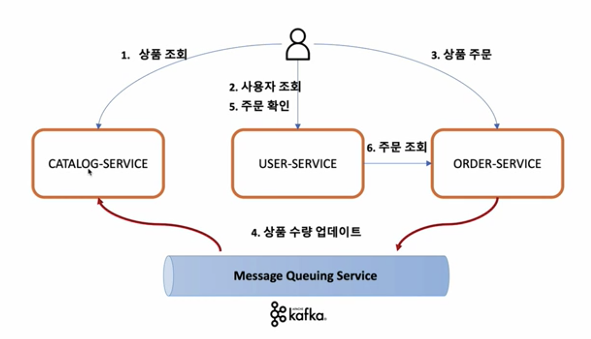
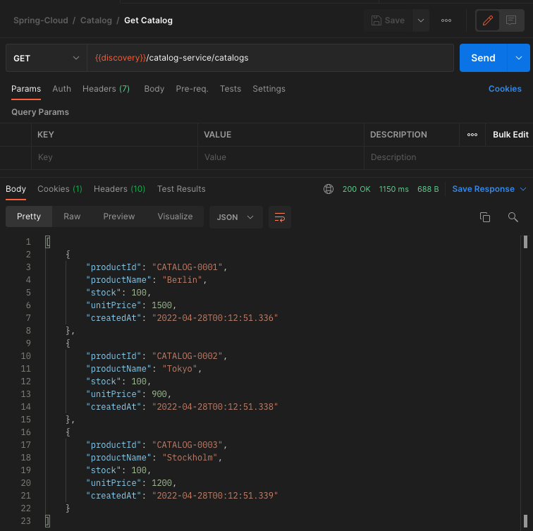
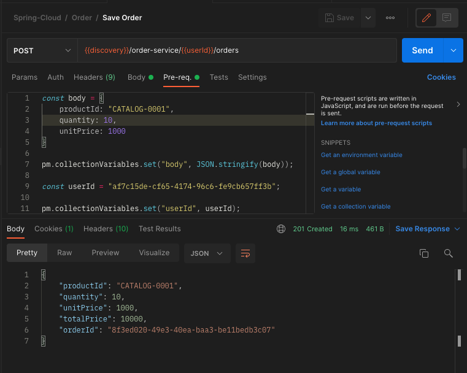
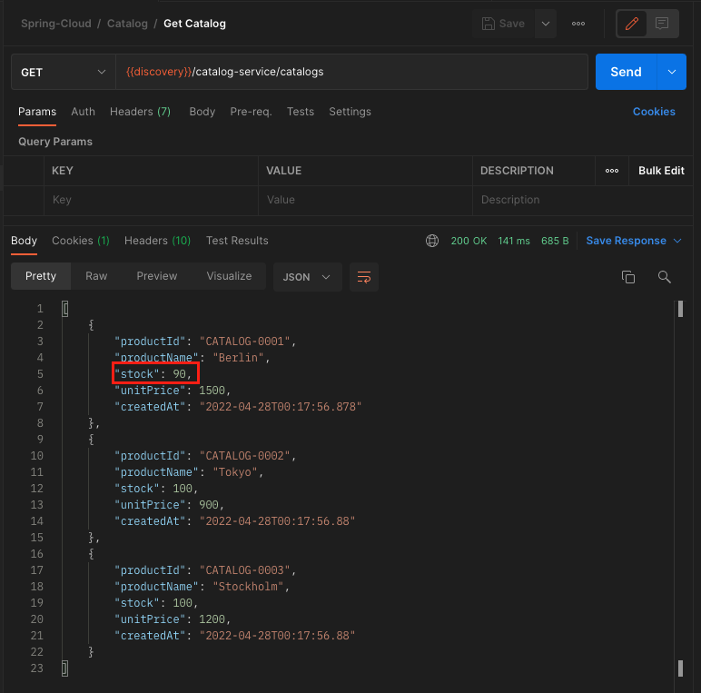

이번 장에서는 우리 서비스에서 발생하는 데이터 동기화 문제를 해결하기 위해 `Kafka`를 적용시켜본다.
모든 소스 코드는 [깃 허브 (링크)](https://github.com/roy-zz/spring-cloud) 에 올려두었다.

---

### 개요

우리는 지금까지 주문 서비스를 분산하게 되면서 DB 또한 동시에 분산되어 데이터의 동기화에 문제가 발생하는 것을 확인하였다.
이러한 문제를 해결하기 위해 `Kafka`와 추가 기능인 `Source Connect`, `Sink Connect`에 대해서 알아보았다.
이번 장에서는 우리가 학습한 `Kafka`를 활용하여 마이크로서비스 간에 발생하는 문제를 하나씩 해결해본다.



사용자는 `주문 서비스`를 통해 상품을 주문한다.
사용자는 자신의 주문 목록을 확인하기 위해 `유저 서비스`에 사용자 조회와 주문 확인 기능을 요청한다.

개선되는 구조를 확인해보면 `주문 서비스`는 주문을 요청받고 `카탈로그 서비스`의 재고 수량을 갱신하기 위해 직접 `카탈로그 서비스`를 호출하지 않는다.
상품 수량을 업데이트하라는 요청을 `Kafka`에 집어넣고 `Kafka`에 구독을 걸고 있는 `카탈로그 서비스`는 이러한 요청을 `Kafka`로 부터 전달받아 처리한다.
이러한 구조에서의 `Kafka`는 스프링에서의 `DI`처럼 마이크로서비스간의 의존성을 낮춰주어 확장에는 열려있지만 다른 서비스의 변경에는 닫혀있는 모습을 유지할 수 있게 해준다.

---

### Catalog Service 

1. `Kafka` 의존성 추가

build.gradle에 아래와 같이 `Kafka`관련 의존성을 추가한다.

```bash
implementation 'org.springframework.kafka:spring-kafka'
```

2. `Kafka` 구성 파일 추가

`KafkaConsumerConfig` 클래스 파일을 생성한다. 이름에서 알 수 있듯이 `Kafka`에 구독을 걸고 데이터를 받아오는 역할을 하는 구성 파일이다.
스프링에게 구성파일임을 알리기 위해서 `@Configuration` 애노테이션을 사용하였다.
ConsumerFactory Bean에는 `Kafka` 토픽에 접속하기 위한 정보가 포함되어 있다.
또한 우리는 JSON 형식으로 데이터를 전달하게 되며 JSON 형식은 key-value 구조로 되어 있기 때문에 key-value 구조의 serialize 되어 있는 데이터를 deserialize하기 위한 설정이 추가되어 있다.
`ConcurrentKafkaListenerContainerFactory` 빈은 구독하고 있는 토픽에 변경사항이 있는지 리스닝하는 역할을 한다.
```java
@EnableKafka
@Configuration
public class KafkaConsumerConfig {
    @Bean
    public ConsumerFactory<String, String> consumerFactory() {
        Map<String, Object> properties = new HashMap<>();
        properties.put(ConsumerConfig.BOOTSTRAP_SERVERS_CONFIG, "127.0.0.1:9092");
        properties.put(ConsumerConfig.GROUP_ID_CONFIG, "consumerGroupId");
        properties.put(ConsumerConfig.KEY_DESERIALIZER_CLASS_CONFIG, StringDeserializer.class);
        properties.put(ConsumerConfig.VALUE_DESERIALIZER_CLASS_CONFIG, StringDeserializer.class);
        return new DefaultKafkaConsumerFactory<>(properties);
    }
    @Bean
    public ConcurrentKafkaListenerContainerFactory<String, String> kafkaListenerContainerFactory() {
        ConcurrentKafkaListenerContainerFactory<String, String> kafkaListenerContainerFactory = new ConcurrentKafkaListenerContainerFactory<>();
        kafkaListenerContainerFactory.setConsumerFactory(consumerFactory());
        return kafkaListenerContainerFactory;
    }
}
```

3. `Kafka Consumer` 서비스 추가

서비스 빈으로 등록되어 `Kafka Consumer` 역할을 할 객체를 만들어내는 클래스 파일을 생성한다.
`Kafka`로 부터 주문된 상품의 아이디와 양을 전달받아 DB에 저장되어 있는 재고에서 주문된 양만큼 감소시킨 다음 다시 저장한다.
(저장하는 코드가 안보이는데요? 라는 의문이 들면 [변경 감지를 통한 수정](https://imprint.tistory.com/126) 을 참고한다.)

**KafkaConsumer**
```java
public interface KafkaConsumer {
    void processMessage(String kafkaMessage);
}
```

**KafkaConsumerImpl**
```java
@Slf4j
@Service
@RequiredArgsConstructor
public class KafkaConsumerImpl implements KafkaConsumer {
    private final CatalogRepository catalogRepository;

    @Override
    @Transactional
    @KafkaListener(topics = "example-order-topic")
    public void processMessage(String kafkaMessage) {
        log.info("Kafka Message: ======> {}", kafkaMessage);

        Map<Object, Object> map = new HashMap<>();
        ObjectMapper mapper = new ObjectMapper();
        try {
            map = mapper.readValue(kafkaMessage, new TypeReference<>() {});
        } catch (JsonProcessingException e) {
            e.printStackTrace();
        }

        String targetProduceId = (String) Optional.of(map.get("productId"))
                .orElseThrow(() -> new IllegalStateException("Not found produceId"));
        Catalog savedCatalog = catalogRepository.findByProductId(targetProduceId)
                .orElseThrow(() -> new IllegalStateException("Not found catalog"));
        Integer soldQuantity = (Integer) Optional.of(map.get("quantity"))
                .orElseThrow(() -> new IllegalStateException("Not found quantity"));
        savedCatalog.setStock(savedCatalog.getStock() - soldQuantity);
    }
}
```

---

### Order Service

1. `Kafka` 의존성 추가

build.gradle에 아래와 같이 `Kafka`관련 의존성을 추가한다.

```bash
implementation 'org.springframework.kafka:spring-kafka'
```

2. `Kafka` 구성 파일 추가

이름에서 알 수 있듯이 `주문 서비스`는 `Kafka`에 데이터를 넣는 `Producer` 역할을 한다.
데이터를 전달할 때는 객체를 Serialize하여 String 형태로 전달해야하기 때문에 `Consumer`와는 다르게 속성에 Serializer이 들어있는 것을 확인할 수 있다.
`KafkaTemplate`는 실질적으로 Serialize된 데이터를 `Kafka`로 전달하는 역할을 한다.

```java
@Configuration
public class KafkaProducerConfig {
    @Bean
    public ProducerFactory<String, String> producerFactory() {
        Map<String, Object> configProps = new HashMap<>();
        configProps.put(ProducerConfig.BOOTSTRAP_SERVERS_CONFIG, "127.0.0.1:9092");
        configProps.put(ProducerConfig.KEY_SERIALIZER_CLASS_CONFIG, StringSerializer.class);
        configProps.put(ProducerConfig.VALUE_SERIALIZER_CLASS_CONFIG, StringSerializer.class);
        return new DefaultKafkaProducerFactory<>(configProps);
    }
    @Bean
    public KafkaTemplate<String, String> kafkaTemplate() {
        return new KafkaTemplate<>(producerFactory());
    }
}
```

3. `Kafka Producer` 서비스 추가

서비스 빈으로 등록되어 `Kafka Producer` 역할을 할 객체를 만들어내는 클래스 파일을 생성한다.
파라미터로 전달받은 토픽으로 전달받은 객체를 Serialize하여 전달하는 역할을 수행한다.

```java
@Slf4j
@Service
@RequiredArgsConstructor
public class KafkaProducerImpl implements KafkaProducer {
    private final KafkaTemplate<String, String> kafkaTemplate;
    @Override
    public OrderDto send(String kafkaTopic, OrderDto orderDto) {
        ObjectMapper mapper = new ObjectMapper();
        String jsonInString = Strings.EMPTY;
        try {
            jsonInString = mapper.writeValueAsString(orderDto);
        } catch (JsonProcessingException e) {
            e.printStackTrace();
        }
        kafkaTemplate.send(kafkaTopic, jsonInString);
        log.info("Kafka producer send data from the order microservice: {}", orderDto);
        return orderDto;
    }
}
```

4. 서비스 로직 수정

주문을 생성하고 생성된 주문 정보를 Kafka Producer에게 전달하는 코드를 추가하였다.

```java
@Service
@RequiredArgsConstructor
public class OrderServiceImpl implements OrderService {
    private final KafkaProducer kafkaProducer;
    private final OrderRepository orderRepository;
    @Override
    public OrderDto createOrder(OrderDto orderDto) {
        orderDto.setOrderId(UUID.randomUUID().toString());
        orderDto.setTotalPrice(orderDto.getQuantity() * orderDto.getUnitPrice());
        Order newOrder = toObject(orderDto, Order.class);
        orderRepository.save(newOrder);
        kafkaProducer.send("example-order-topic", orderDto);
        return toObject(newOrder, OrderDto.class);
    }
    // 이하 생략...
}
```

---

### 작동 테스트

1. 상품 정보 확인

`카탈로그 서비스`의 GET /catalogs API를 호출하여 테스트를 진행하기 전의 상품 정보를 확인한다.



2. 주문 생성

`주문 서비스`의 POST /orders API를 호출하여 `CATALOG-0001`를 주문하는 주문 데이터를 생성한다.



3. 상품 정보 재고 확인

테스트를 진행하기 전에 `CATALOG-0001` 상품의 재고는 100개였고 2번 단계에서 10개를 주문하였으니 재고는 `CATALOG-0001` 상품의 재고는 90개가 되어야 한다.
우리가 예상한 결과가 맞는지 `카탈로그 서비스`의 GET /catalogs API를 호출하여 결과를 확인한다.



정상적으로 우리가 예상한대로 재고가 변경된 것을 확인할 수 있다.

---

이번 장에서는 지금까지 학습한 `Kafka`를 활용하여 마이크로서비스 간에 데이터를 동기화 하는 방법에 대해서 알아보았다.
다음 장에서는 다중 마이크로서비스(복제된)가 있고 DB도 분산되어 있는 경우에 발생하는 데이터 동기화 문제를 해결해본다.

---

**참고한 강의:**

- https://www.inflearn.com/course/%EC%8A%A4%ED%94%84%EB%A7%81-%ED%81%B4%EB%9D%BC%EC%9A%B0%EB%93%9C-%EB%A7%88%EC%9D%B4%ED%81%AC%EB%A1%9C%EC%84%9C%EB%B9%84%EC%8A%A4