[이전 장(링크)](https://imprint.tistory.com/237?category=1069520) 에서는 마이크로서비스 간의 데이터 동기화 문제를 해결하기 위하여 `Kafka Connect`를 사용해보았다.
이번 장에서는 동일한 역할을 하는 여러 서비스와 하나의 DB가 있을 때 `Kafka`를 사용하여 데이터를 동기화하는 방법에 대해서 알아본다.
모든 소스 코드는 [깃 허브 (링크)](https://github.com/roy-zz/spring-cloud) 에 올려두었다.

---

### Service Flow

전체적인 서비스 흐름을 살펴보면 아래의 이미지와 같다.

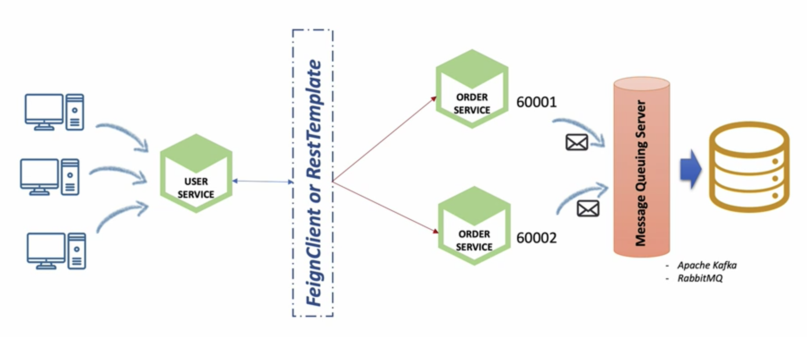

여러 클라이언트가 `유저 서비스`에게 유저 정보 API를 호출한다.
`유저 서비스`는 주문 정보를 만들기 위해서 `주문 서비스`의 API를 호출해야하고 `FeignClient` 또는 `RestTemplate`을 통해 분산되어있는 `주문 서비스`를 호출하게 된다.
`주문 서비스`는 DB에 데이터를 넣기 위해 직접 SQL을 실행하는 것이 아니라 `Kafka Sink Connect`를 사용하여 데이터를 넣게 된다.

---

### Order Service (H2 -> MariaDB)

기존의 `주문 서비스`는 실행할 때 내장 DB인 H2 DB를 실행시켜서 사용하도록 설정되어 있었다.
몇개의 `주문 서비스`가 실행되더라도 단 하나의 DB를 바라볼 수 있도록 `주문 서비스`를 수정한다.

1. 의존성 추가

MariaDB에 접속할 수 있도록 build.gradle에 아래의 의존성을 추가한다.

```bash
implementation 'org.mariadb.jdbc:mariadb-java-client:3.0.4'
```

2. application.yml 수정

H2 DB가 아닌 MariaDB를 사용할 수 있도록 `application.yml` 파일을 수정한다.

```yaml
datasource:
  driver-class-name: org.mariadb.jdbc.Driver
  url: jdbc:mariadb://localhost:3306/mydb
  username: root
  password: root
# 변경 불필요한 부분 생략
```

3. h2-console 접속

`주문 서비스`의 h2-console에 접속하여 아래의 이미지와 같이 MariaDB에 접속하기 위한 정보를 입력한다.

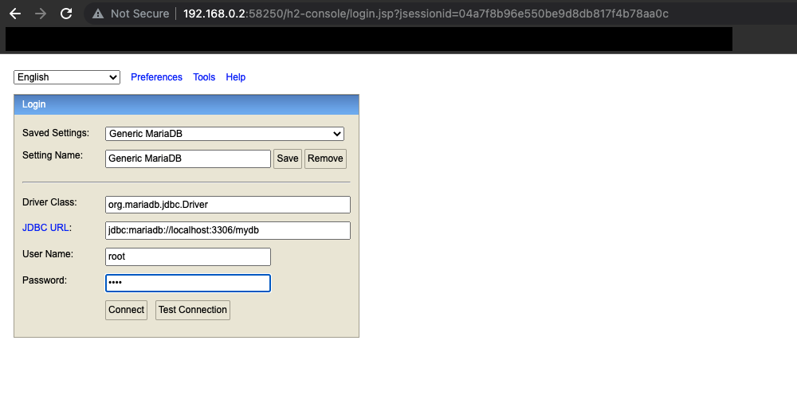

아래의 SQL을 사용하여 주문 테이블이 존재하고 데이터가 없는 것을 확인한다.

```sql
SELECT * FROM orders;
```

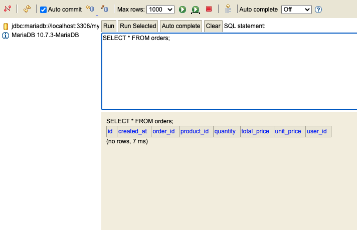

4. 주문 데이터 입력

Postman을 사용하여 새로운 주문 정보를 입력한다.

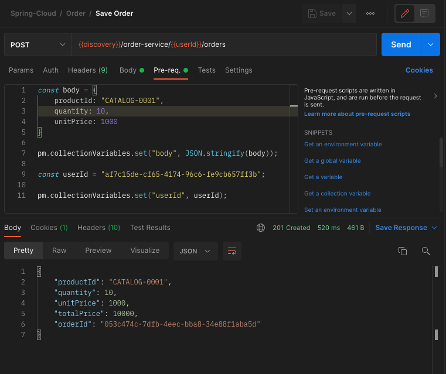

5. 데이터 입력 확인

4번 단계에서 저장한 주문 데이터가 정상적으로 DB에 입력되었는지 확인한다.

```sql
SELECT * FROM orders;
```

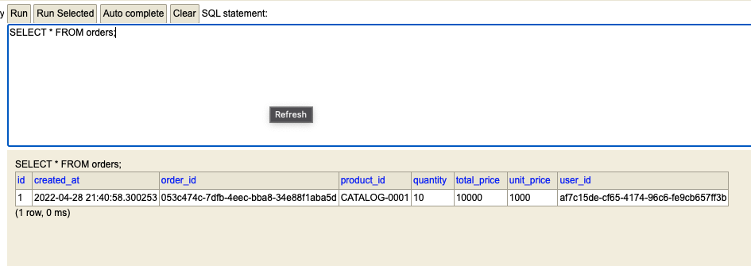

---

### Order Service (MariaDB Connector -> Kafka)

우리는 바로 위에서 `주문 서비스`가 H2 DB가 아닌 MariaDB를 바라볼 수 있도록 수정하였다.
이번에는 `MariaDB Connector`를 사용하여 바로 MariaDB에 연결하는 것이 아니라 중간에 `Kafka`를 두고 연결되도록 수정한다.

1. 데이터 형식 확인

우리는 DB에 주문 데이터를 넣기 위해 JSON 데이터를 생성하여 `Kafka` 토픽에 제공해야한다.
JSON 데이터를 만들기 전에 우리가 만들어야하는 데이터 형식을 확인해본다.

```json
{
  "schema": {
    "type": "struct",
    "fields": [
      { "type": "string", "optional": true, "field": "order_id" },
      { "type": "string", "optional": true, "field": "user_id" },
      { "type": "string", "optional": true, "field": "product_id" },
      { "type": "int32", "optional": false, "field": "quantity" },
      { "type": "int32", "optional": false, "field": "total_price" },
      { "type": "int32", "optional": false, "field": "unit_price" }
    ],
    "optional": false,
    "name": "orders" },
  "payload": {
    "order_id": "053c474c-7dfb-4eec-bba8-34e88f1aba5d",
    "user_id": "af7c15de-cf65-4174-96c6-fe9cb657ff3b",
    "product_id": "CATALOG-0001",
    "quantity": 5,
    "total_price": 6000,
    "unit_price": 1200
  }
}
```

2. 필요한 데이터 클래스 생성

`Kafka` 토픽에 직접 전송할 `KafkaOrderDto` 클래스 파일과 해당 클래스 파일을 이루고 있는 데이터 클래스 파일을 생성한다.
예시에 애노테이션 정보는 생략하며 모든 데이터 클래스 파일이 `@Data`, `@Builder`, `@AllArgsConstructor`을 사용하고 있다.

**KafkaOrderDto**
```java
public class KafkaOrderDto implements Serializable {
    private Schema schema;
    private Payload payload;
}
```

**Payload**

`Kafka` 토픽으로 전달되는 데이터는 언더스코어 형식이지만 자바에서는 카멜케이스 형식으로 변수명을 사용하고 있다.
카멜케이스 형식의 변수명을 JSON으로 변경될 때 언더스코어 방식으로 변경될 수 있도록 `@JsonNaming` 애노테이션을 사용하였다.
`@JsonProperty`, `@JsonNaming` 관련하여 정리가 잘되어있는 블로그가 있어서 글의 하단부에 링크를 첨부하였다.

```java
@JsonNaming(PropertyNamingStrategies.SnakeCaseStrategy.class)
public class Payload {
    private String orderId;
    private String userId;
    private String produceId;
    private int quantity;
    private int totalPrice;
    private int unitPrice;
}
```

**Schema**
```java
public class Schema {
    private String type;
    private List<Field> fields;
    private boolean optional;
    private String name;
}
```

**Field**
```java
public class Field {
    private String type;
    private boolean optional;
    private String fields;
}
```

3. OrderProducer 생성

`Kafka` 토픽에 데이터를 집어넣는 OrderProducer 클래스 파일을 생성한다.
파라미터로 전달받은 `OrderDto`를 토대로 `Kafka` 토픽에 전달해야하는 KafkaOrderDto를 생성하고 전달한다.

**OrderProducer**
```java
public interface OrderProducer {
    OrderDto send(String topic, OrderDto orderDto);
}
```

**OrderProducerImpl**
```java
@Slf4j
@Service
@RequiredArgsConstructor
public class OrderProducerImpl implements OrderProducer {
    private final KafkaTemplate<String, String> kafkaTemplate;

    private List<Field> fields = List.of(
            new Field("string", true, "order_id"),
            new Field("string", true, "user_id"),
            new Field("string", true, "product_id"),
            new Field("int32", true, "quantity"),
            new Field("int32", true, "unit_price"),
            new Field("int32", true, "total_price"));
    private Schema schema = Schema.builder()
            .type("struct")
            .fields(fields)
            .optional(false)
            .name("orders")
            .build();

    @Override
    public OrderDto send(String topic, OrderDto orderDto) {
        Payload payload = Payload.builder()
                .orderId(orderDto.getOrderId())
                .userId(orderDto.getUserId())
                .produceId(orderDto.getProductId())
                .quantity(orderDto.getQuantity())
                .unitPrice(orderDto.getUnitPrice())
                .totalPrice(orderDto.getTotalPrice())
                .build();
        KafkaOrderDto kafkaOrderDto = new KafkaOrderDto(schema, payload);
        ObjectMapper mapper = new ObjectMapper();
        String jsonString = Strings.EMPTY;
        try {
            jsonString = mapper.writeValueAsString(kafkaOrderDto);
        } catch (JsonProcessingException e) {
            e.printStackTrace();
        }
        kafkaTemplate.send(topic, jsonString);
        log.info("order Producer sent data from the order microservice: {}", kafkaOrderDto);
        return orderDto;
    }
}
```

4. Kafka Sink Connector 추가

3단계에서 만든 OrderProducer의 데이터를 받아서 DB에 저장할 `Sink Connector`를 생성한다.

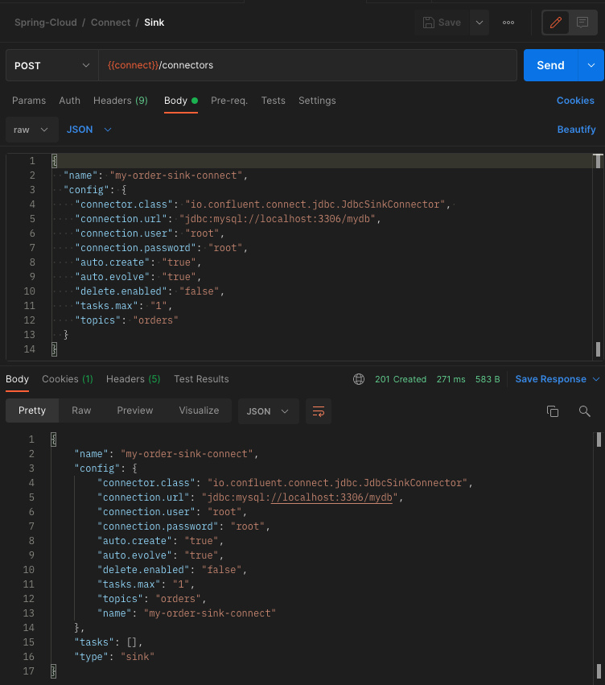

5. Controller 수정

주문 정보를 저장하는 POST /orders API를 수정하여 위에서 만든 OrderProducer를 통하여 `Kafka` 토픽에 데이터를 전송하도록 수정한다.

```java
@RestController
@RequiredArgsConstructor
@RequestMapping("/order-service")
public class OrderController {
    private final Environment environment;
    private final OrderService orderService;
    private final KafkaProducer kafkaProducer;
    private final OrderProducer orderProducer;
    // 생략
    @PostMapping("/{userId}/orders")
    public ResponseEntity<OrderResponse> createOrder(@PathVariable("userId") String userId,
                                                     @RequestBody OrderSaveRequest request) {
        OrderDto orderDto = toObject(request, OrderDto.class);
        orderDto.setUserId(userId);
        // Using MariaDB Connector
        // OrderDto savedOrder = orderService.createOrder(orderDto);
        // OrderResponse response = toObject(savedOrder, OrderResponse.class);
        // Using Kafka
        orderDto.setOrderId(UUID.randomUUID().toString());
        orderDto.setTotalPrice(request.getQuantity() * request.getUnitPrice());
        OrderResponse response = toObject(orderDto, OrderResponse.class);
        kafkaProducer.send("example-catalog-topic", orderDto);
        orderProducer.send("orders", orderDto);
        return ResponseEntity.status(HttpStatus.CREATED).body(response);
    }
    // 생략
}
```

6. 테스트

두 개의 `주문 서비스`를 실행한다.
필자의 경우 Multirun 설정을 통하여 한 번에 두개의 `주문 서비스`를 실행하였다.
필자가 Multirun 설정을 하기위해 참고한 자료는 글의 하단부에 첨부하였다.

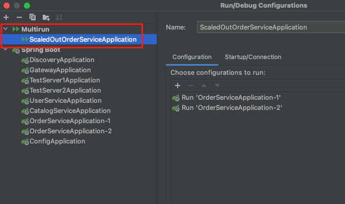

`Discovery` 서버에 접속하여 주문 서비스의 IP 주소를 확인한다.

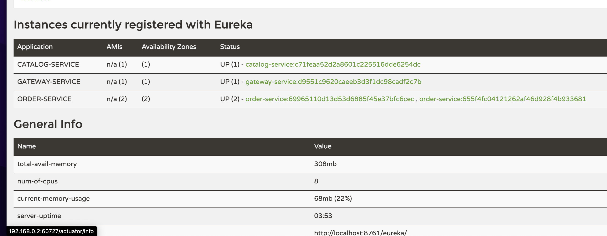

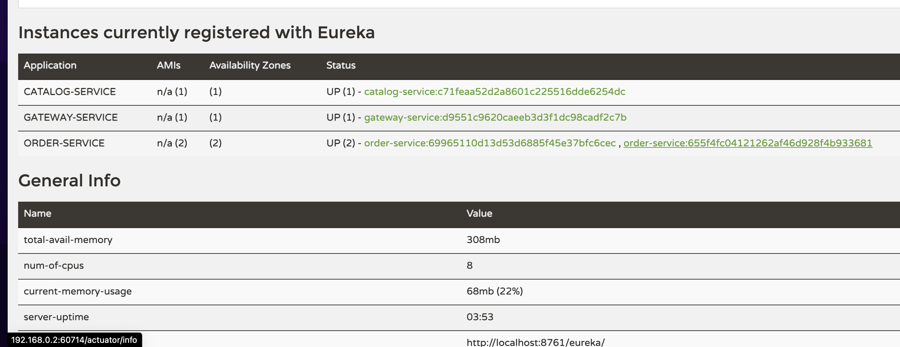

필자의 경우 `192.168.0.2:60727`과 `192.168.0.2:60714`로 확인된다.

Postman을 통해서 `Gateway`를 통하지않고 바로 `주문 서비스`의 주문 생성 API를 요청한다.

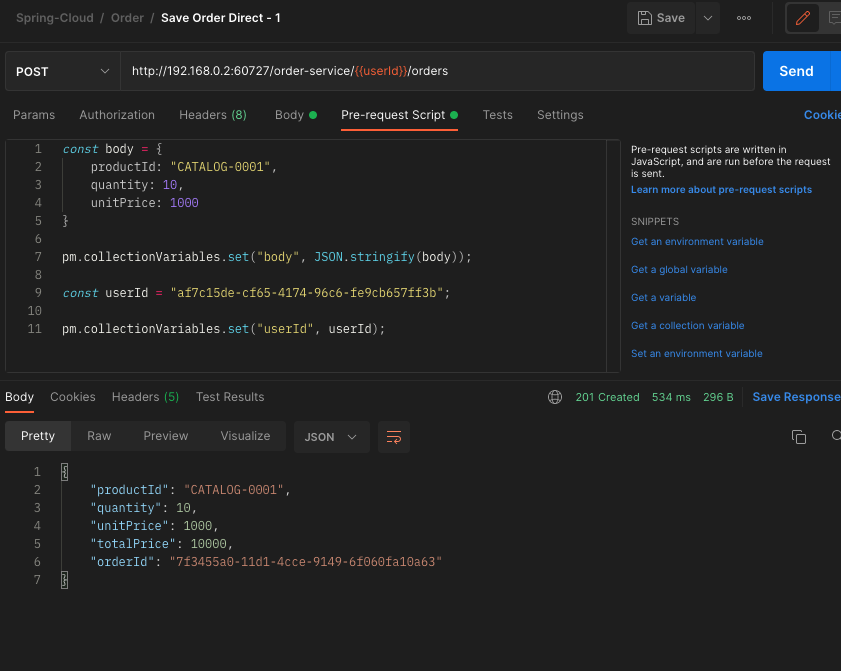

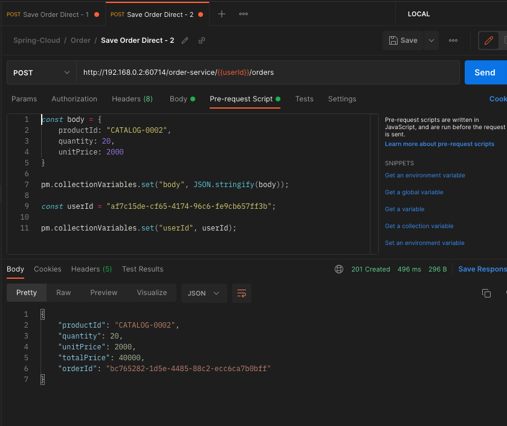

h2-console에 접속하여 정상적으로 두 개의 주문 정보가 생성되었는지 확인한다.

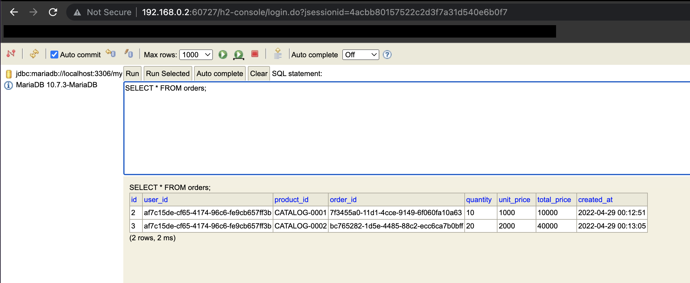

---

지금까지 `Kafka Sink Connect`를 사용하여 다중 마이크로서비스 환경에서 단일 DB에 데이터를 동기화하는 방법에 대해서 알아보았다.

---

**참고한 강의:**

- https://www.inflearn.com/course/%EC%8A%A4%ED%94%84%EB%A7%81-%ED%81%B4%EB%9D%BC%EC%9A%B0%EB%93%9C-%EB%A7%88%EC%9D%B4%ED%81%AC%EB%A1%9C%EC%84%9C%EB%B9%84%EC%8A%A4

**참고한 자료:**

- [@JsonProperty, @JsonNaming](https://zzang9ha.tistory.com/380)
- [Multirun 설정](https://jojoldu.tistory.com/510)