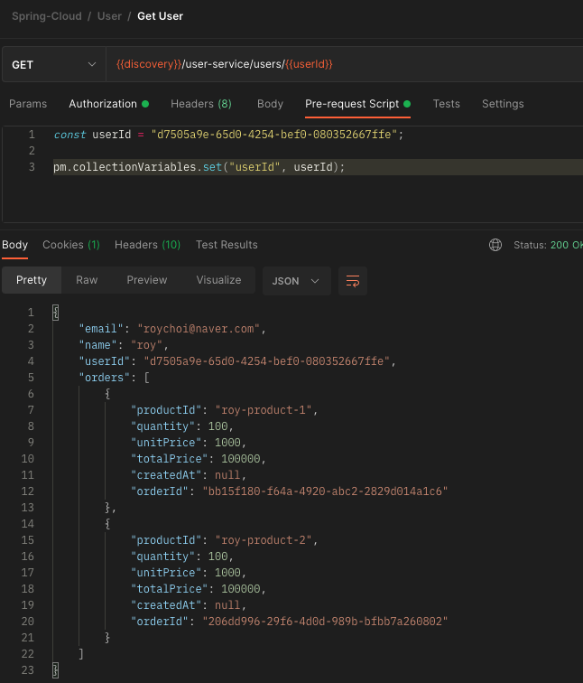
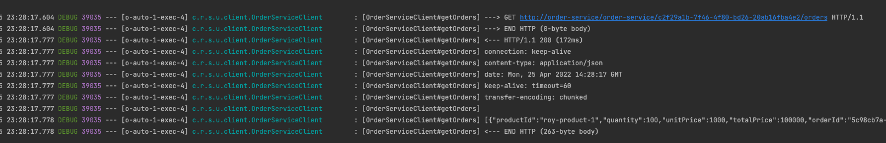
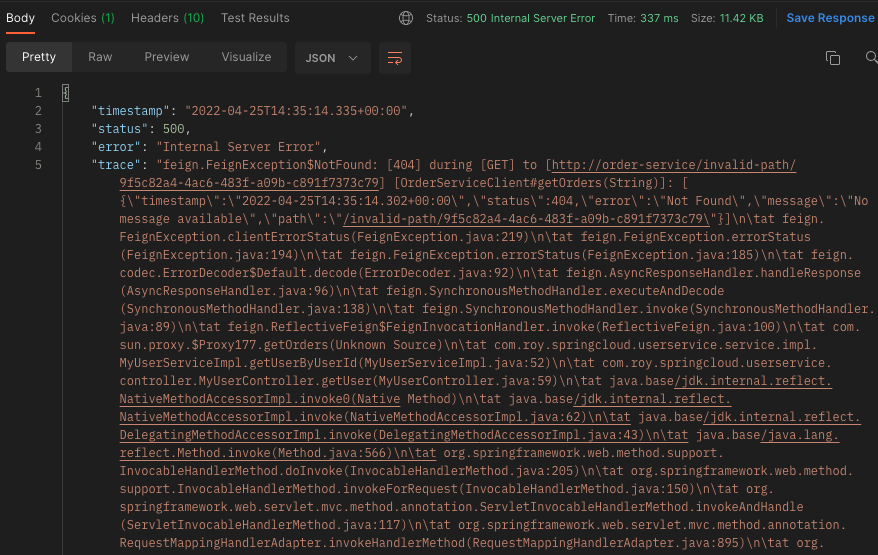
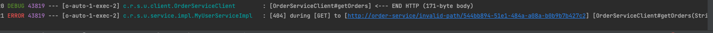
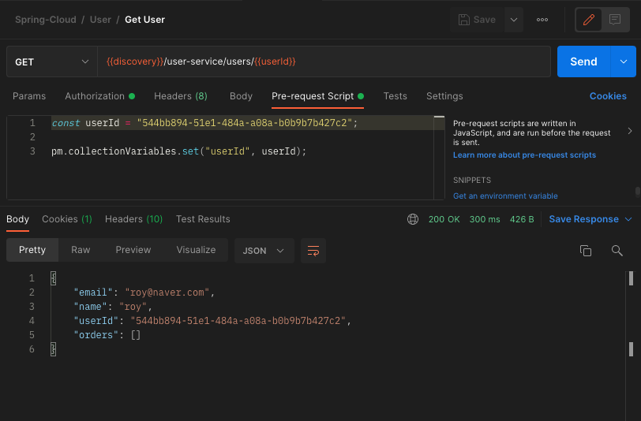
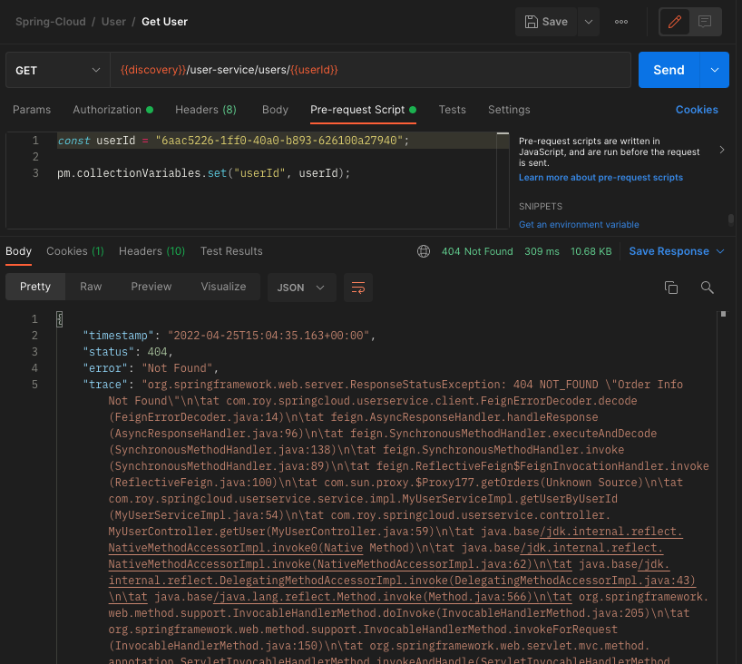

[이전 장(링크)](https://imprint.tistory.com/226?category=1069520) 에서는 Rest Template을 사용해서 마이크로서비스들 간의 통신(Communication)을 구현해보았다.
이번 장에서는 Spring Cloud Netflix의 Feign Client를 사용하여 마이크로서비스 간의 통신을 구현해본다.
모든 소스 코드는 [깃허브 (링크)](https://github.com/roy-zz/spring-cloud) 에 올려두었다.

---

### Feign Client

Feign Client는 HTTP Client로써 REST API 호출하는 기능을 추상화 한 Spring Cloud Netflix의 라이브러리다.
JPA 리포지토리를 선언하는 것과 유사하게 인터페이스를 생성하고 HTTP Endpoint를 선언하는 것만으로 구현이 완료되며 LoadBalanced를 지원한다.

---

### User Service

1. 의존성 추가

build.gradle에 아래의 의존성을 추가한다.

```bash
implementation 'org.springframework.cloud:spring-cloud-starter-openfeign'
```

2. @EnableFeignClients 애노테이션 추가

메인 메서드가 있는 메인 클래스에 @EnableFeignClients 애노테이션을 추가한다.

```java
@EnableFeignClients
@EnableDiscoveryClient
@SpringBootApplication
public class UserServiceApplication {
    public static void main(String[] args) {
        SpringApplication.run(UserServiceApplication.class, args);
    }
    // 이하 생략...
}
```

3. 인터페이스 생성

Feign Client용 인터페이스를 생성한다.
인터페이스는 @FeignClient 애노테이션을 사용해야하며 name 속성으로 마이크로서비스의 이름을 입력해야한다.
다른 부분은 일반적으로 컨트롤러의 메서드를 구현하는 방법과 동일하다.

```java
@FeignClient(name = "order-service")
public interface OrderServiceClient {
    @GetMapping("/order-service/{userId}/orders")
    List<OrderResponse> getOrders(@PathVariable String userId);
}
```

4. 서비스 레이어 수정

OrderServiceClient를 사용해야하는 부분에 의존성을 추가하고 통신하는 코드를 추가한다.
필자의 경우 @RequriedArgsConstructor과 final 조합으로 구성하였으며 각자 편한 방법으로 주입하면 된다.

```java
@Service
@RequiredArgsConstructor
public class MyUserServiceImpl implements MyUserService {
    private final Environment environment;
    private final RestTemplate restTemplate;
    private final MyUserRepository userRepository;
    private final BCryptPasswordEncoder passwordEncoder;
    private final OrderServiceClient orderServiceClient;
    // 생략
    @Override
    public MyUserDto getUserByUserId(String userId) {
        MyUser savedUser = userRepository.findByUserId(userId)
                .orElseThrow(() -> new UsernameNotFoundException("User not found"));
        List<OrderResponse> orderListResponse = orderServiceClient.getOrders(userId);
        MyUserDto response = toObject(savedUser, MyUserDto.class);
        response.setOrders(orderListResponse);
        return response;
    }
    // 생략...
}
```

5. 테스트

유저 서비스를 재실행시키고 RestTemplate을 사용했던 방식과 동일하게 테스트를 진행해본다.



우리가 원하는 결과가 정상적으로 나오는 것을 확인할 수 있다.

---

### 예외처리

#### 로그 추가

1. application.yml 수정

application.yml 파일의 logging 레벨을 DEBUG로 설정한다.

```yaml
logging:
  level:
    com.roy.springcloud.userservice: DEBUG
```

2. Logger.Level Bean 등록

메인 메서드가 있는 클래스에 아래와 같이 Logger.Level을 빈으로 등록하는 코드를 추가한다.

```java
@EnableFeignClients
@EnableDiscoveryClient
@SpringBootApplication
public class UserServiceApplication {
    public static void main(String[] args) {
        SpringApplication.run(UserServiceApplication.class, args);
    }
    // 중간 생략...
    @Bean
    public Logger.Level feignLoggerLevel() {
        return Logger.Level.FULL;
    }
}
```

3. 정상적으로 FeignClient 관련 로그가 출력되는지 확인해본다.



정상적으로 로그가 출력되는 것을 확인할 수 있다.

---

#### 예외 발생 유도

예외처리를 하기에 앞서 예외처리를 하지 않는 경우 어떠한 상황이 발생하는지 살펴본다.
아래와 같이 무효한 Path를 입력하고 이전과 동일하게 호출해본다.

```java
@FeignClient(name = "order-service")
public interface OrderServiceClient {
    @GetMapping("/invalid-path/{userId}")
    // @GetMapping("/order-service/{userId}/orders")
    List<OrderResponse> getOrders(@PathVariable String userId);
}
```

FeignClient에서 404 Not Found 예외가 발생하였고 해당 오류가 유저의 정보를 찾는 곳까지 전파된 것을 확인할 수 있다.



하지만 우리가 원하는 것은 이러한 동작이 아니다.
유저 정보를 조회하는 것이 메인 기능이기 때문에 주문 정보를 조회하지 못한다면 비어있는 주문정보와 함께 사용자의 정보를 반환해야한다.
지금부터 예외처리를 통해서 FeignClient에서 오류가 발생하더라도 기존 서비스에 전파되지 않도록 수정해본다.

---

#### try catch를 통한 예외 처리

아래의 코드와 같이 FeignClient를 사용하는 부분을 try 문으로 감싸주었다.

```java
@Slf4j
@Service
@RequiredArgsConstructor
public class MyUserServiceImpl implements MyUserService {
    private final Environment environment;
    private final RestTemplate restTemplate;
    private final MyUserRepository userRepository;
    private final BCryptPasswordEncoder passwordEncoder;
    private final OrderServiceClient orderServiceClient;
    // 생략...
    @Override
    public MyUserDto getUserByUserId(String userId) {
        MyUser savedUser = userRepository.findByUserId(userId)
                .orElseThrow(() -> new UsernameNotFoundException("User not found"));
        List<OrderResponse> orderListResponse = Collections.emptyList();
        try {
            orderListResponse = orderServiceClient.getOrders(userId);
        } catch (FeignException ex) {
            log.error(ex.getMessage());
        }
        MyUserDto response = toObject(savedUser, MyUserDto.class);
        response.setOrders(orderListResponse);
        return response;
    }
    // 생략...
}
```

로그를 확인해보면 기존과 동일하게 404 에러가 발생한 것을 확인할 수 있다.



하지만 기존과 다르게 사용자의 정보는 정상적으로 조회하는 것을 확인할 수 있다.



---

#### Error Decoder를 통한 예외 처리

try & catch를 사용하게 되면 404에러가 사용자 조회 반환 값에 전파되지 않는다.
하지만  404에러가 사용자 조회 API의 결과까지 전파되는 것을 원할 수 있다. 이러한 경우에는 ErrorDecoder를 사용하면 된다.

1. ErrorDecoder 구현체 작성

Feign 패키지의 인터페이스인 ErrorDecoder의 구현체를 작성한다.
우리가 테스트 중인 getOrders 메서드에서 404 예외가 발생하였을 때 따로 처리하도록 구현하였다.

```java
public class FeignErrorDecoder implements ErrorDecoder {
    @Override
    public Exception decode(String methodKey, Response response) {
        switch (response.status()) {
            case 404:
                if (methodKey.contains("getOrders")) {
                    return new ResponseStatusException(HttpStatus.valueOf(response.status()), "Order Info Not Found");
                }
                break;
            default:
                return new Exception(response.reason());
        }
        return null;
    }
}
```

2. ErrorDecoder 빈으로 등록

메인 메서드가 있는 클래스에 FeignErrorDecoder를 빈으로 등록하는 코드를 작성한다.

```java
@EnableFeignClients
@EnableDiscoveryClient
@SpringBootApplication
public class UserServiceApplication {
    public static void main(String[] args) {
        SpringApplication.run(UserServiceApplication.class, args);
    }
    // 중간 생략...
    @Bean
    public FeignErrorDecoder getFeignErrorDecoder() {
        return new FeignErrorDecoder();
    }
}
```

3. 서비스 코드 수정

예외처리가 없을 때와 동일하게 코드를 수정한다.

```java
@Slf4j
@Service
@RequiredArgsConstructor
public class MyUserServiceImpl implements MyUserService {
    private final Environment environment;
    private final RestTemplate restTemplate;
    private final MyUserRepository userRepository;
    private final BCryptPasswordEncoder passwordEncoder;
    private final OrderServiceClient orderServiceClient;
    // 생략...
    @Override
    public MyUserDto getUserByUserId(String userId) {
        MyUser savedUser = userRepository.findByUserId(userId)
                .orElseThrow(() -> new UsernameNotFoundException("User not found"));
        List<OrderResponse> orderListResponse = orderServiceClient.getOrders(userId);
        MyUserDto response = toObject(savedUser, MyUserDto.class);
        response.setOrders(orderListResponse);
        return response;
    }
    // 생략...
}
```

4. 정상 작동 확인



정상적으로 404에러가 사용자 정보 조회까지 전파된 것을 확인할 수 있다.

---

**참고한 강의:**

- https://www.inflearn.com/course/%EC%8A%A4%ED%94%84%EB%A7%81-%ED%81%B4%EB%9D%BC%EC%9A%B0%EB%93%9C-%EB%A7%88%EC%9D%B4%ED%81%AC%EB%A1%9C%EC%84%9C%EB%B9%84%EC%8A%A4