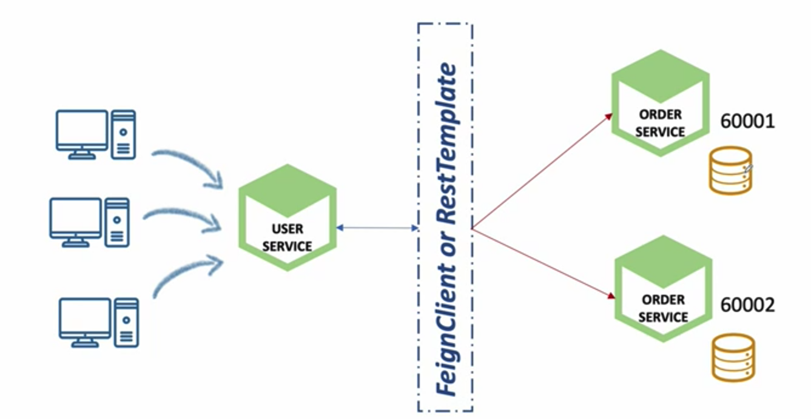
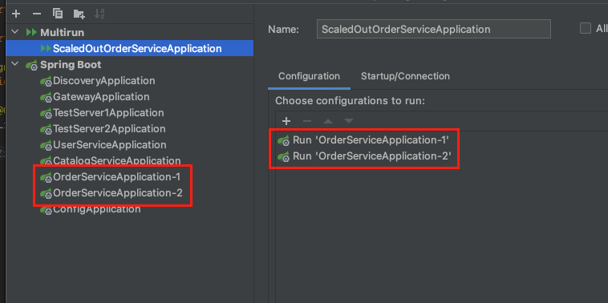
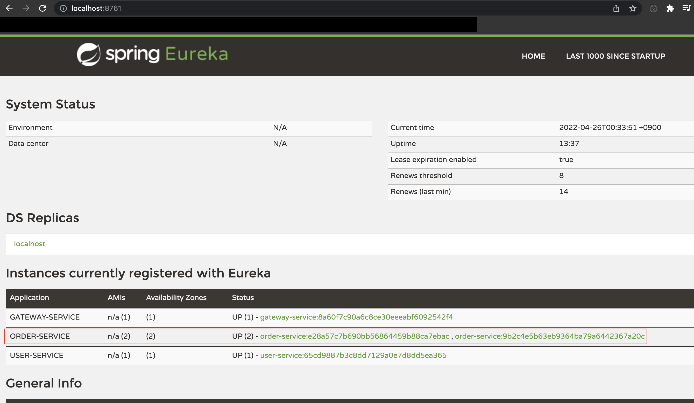
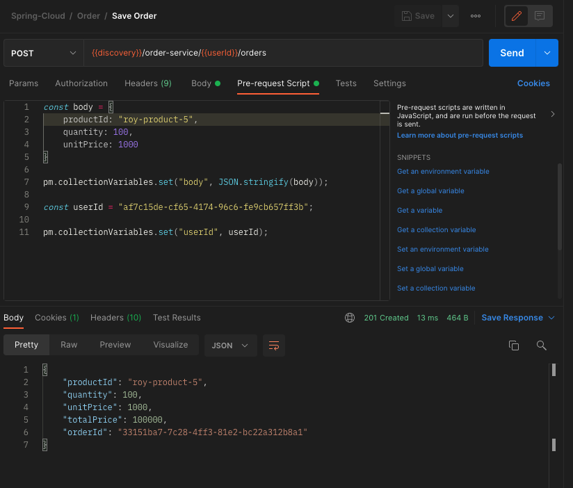
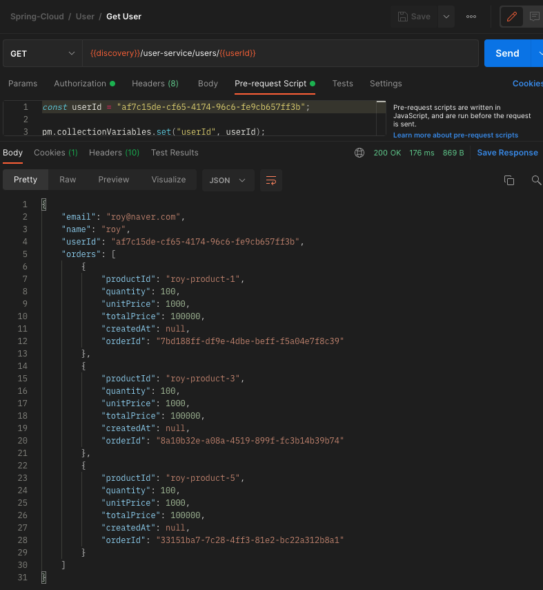
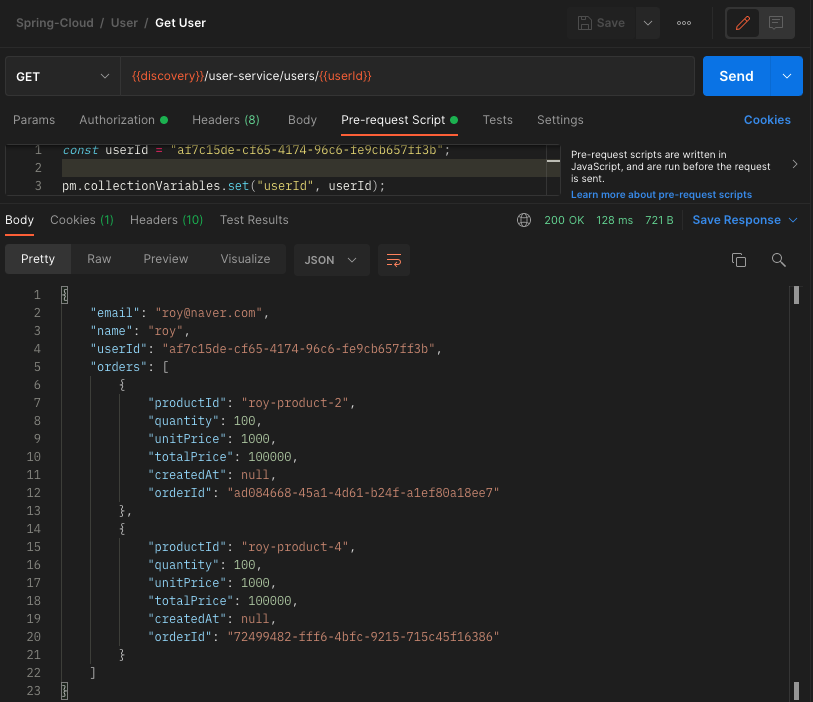
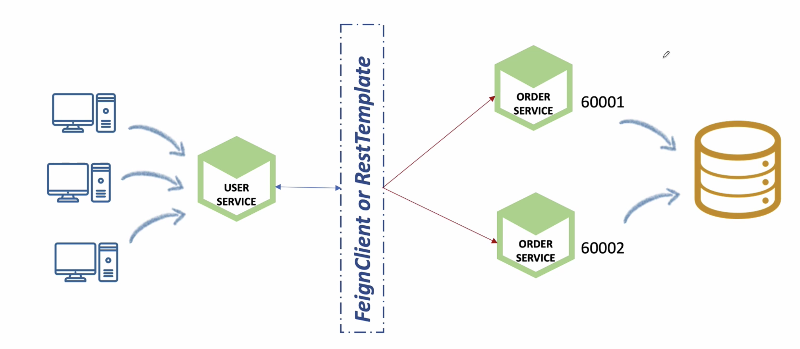
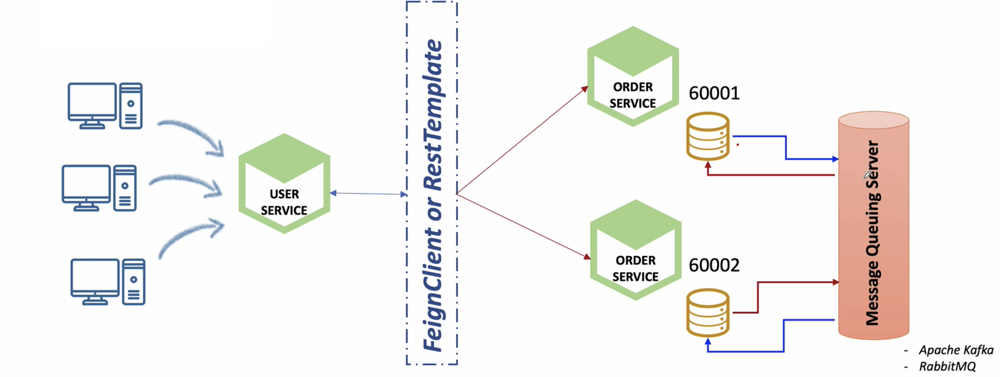
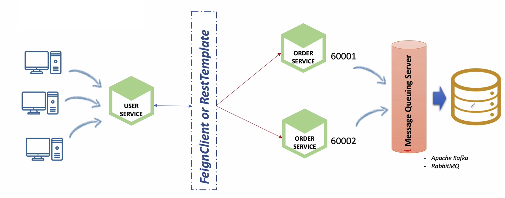

이번 장에서는 우리가 지금까지 다루었던 마이크로서비스 간 통신과 데이터 동기화의 한계에 대해서 다뤄본다.
모든 소스 코드는 [깃허브 (링크)](https://github.com/roy-zz/spring-cloud) 에 올려두었다.

---

### Scale Out Microservice

우리는 지금까지 Feign Client와 Rest Template을 사용하면서 서비스가 여러개로 분산되더라도 로드밸런싱을 통해서 분산된 서비스들에게 요청을 보낼 수 있도록 구현하였다.
하지만 Scale Out된 서비스들 간의 데이터 동기화 문제는 발생하게 된다.
예를 들어 아래와 같이 유저 서비스는 FeignClient를 사용하여 분산되어 있는 주문 서비스에게 데이터를 조회한다고 가정해본다.

우리는 따로 동기화 작업을 하지 않았기 때문에 60001 주문 서비스에 요청할 때와 60002 주문 서비스에 요청할 때 결과가 다르게 나올 수 밖에 없다.
문제가 발생하는 상황을 직접 눈으로 확인해본다.

---

#### 데이터 동기화 문제 확인

1. 다중 주문 서비스 실행

필자의 경우 한 번에 여러개의 주문 서비스를 실행시키기 위하여 Multirun 플러그인을 아래의 이미지와 같이 구성하였다.
Multirun 플러그인을 설정하는 방법은 잘정리된 글이 있어서 하단부에 첨부하도록 한다.

multirun을 사용하여 주문 서비스를 실행시키면 정상적으로 두 개의 애플리케이션이 실행되고 유레카 서버에 정상적으로 두 개의 서비스가 등록된 것을 확인할 수 있다.

2. 주문 정보 등록

사용자를 생성하고 생성된 userId를 사용하여 등록된 사용자의 주문정보를 5개 등록한다.

3. 사용자 정보 조회

2번 단계에서 사용한 userId로 사용자의 정보를 조회해본다.

기본적으로 로드밸런서가 라운드로빈 방식으로 처리되기 때문에 한번씩 번갈아가면서 데이터가 저장된 것을 확인할 수 있다.
요청할 때마다 다른 주문 정보가 나오는 것은 우리가 원하는 결과가 아니다.

---

#### 해결방법

1. 동일한 DB 사용

사실상 가장 간단한 방법이다.
우리는 앞서 마이크로서비스들은 각각 고유한 DB를 사용해야한다고 학습하였다.
주문 서비스가 두개로 Scaled-Out 되더라도 결국에는 하나의 마이크로서비스이기 때문에 하나의 DB를 공유하여도 문제가 되지 않는다.
아래의 이미지와 같이 여러개의 주문 서비스가 하나의 DB를 사용하면 문제는 해결된다.

사실 주문 서비스가 상당히 많은 숫자로 분산되면 단일 DB에서 수없이 많이 발생하는 Lock으로 인해서 성능이 저하될 수 있다.
어디까지나 필자의 추측일 뿐 아직 그렇게 많은 트래픽을 경험해보지 못했다.

2. Database간 동기화

DB 간의 동기화를 진행하는 방식이다.

분산된 마이크로서비스들은 각각의 DB를 가지고 있고 자신에게 들어온 데이터를 메시지 큐 서버(Kafka or RabbitMQ)로 전달한다.
데이터를 전달받은 메시지 큐는 자신에게 구독을 걸고 있는 또 다른 마이크로서비스의 DB를 동기화 한다.

3. Kafka Connector

1번에서 살펴보았던 하나의 데이터베이스와 2번에서 살펴보았던 Kafka를 사용하는 방법이다.
Kafka는 많은 데이터를 한 번에 처리할 수 있는 구조로 이루어져 있기 때문에 동일한 마이크로서비스들이 많아지더라도 문제없이 처리가 가능하다.
또한 큐의 특성상 선입선출이 보장되기에 DB에서도 동일한 데이터를 조회하는 많은 Connection을 다루기 위해 Lock을 사용하는 횟수가 낮아지고 성능향상으로 연결된다.

---

지금까지 마이크로서비스와 로드밸런서를 사용하였을 때 발생할 수 있는 데이터 동기화 문제를 살펴보았고 이를 해결하기 위한 해결방법에 대해서 알아보았다.
다음 장부터는 직접 Kafka를 사용하여 데이터 동기화 문제를 해결해본다.

---

**참고한 강의:**

- https://www.inflearn.com/course/%EC%8A%A4%ED%94%84%EB%A7%81-%ED%81%B4%EB%9D%BC%EC%9A%B0%EB%93%9C-%EB%A7%88%EC%9D%B4%ED%81%AC%EB%A1%9C%EC%84%9C%EB%B9%84%EC%8A%A4

**Multirun 설정**: 

- https://jojoldu.tistory.com/510