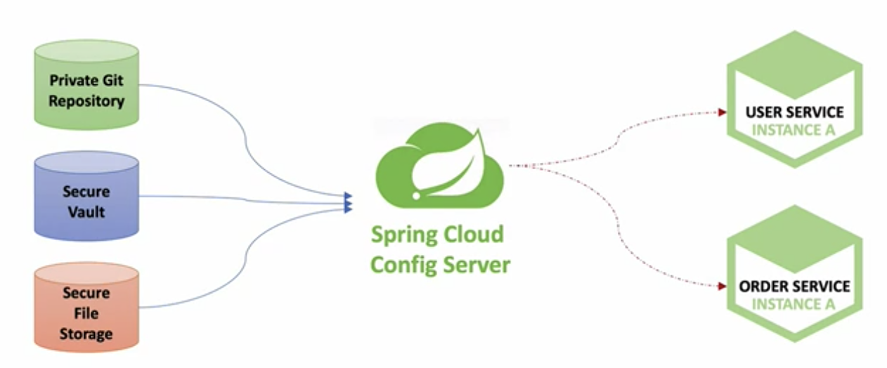

이번 장에서는 Spring Cloud Config 서버에 대해서 알아본다.
모든 소스 코드는 [깃허브 (링크)](https://github.com/roy-zz/spring-cloud) 에 올려두었다.

---

### Spring Cloud Config

Spring Cloud Config 서버란 분산 되어있는 서버, 클라이언트의 구성에 필요한 설정 정보(예. application.yml)를 외부 시스템에서 관리하는 것을 의미한다.
하나의 중앙화 된 저장소에서 구성요소를 관리할 수 있으며 각각의 마이크로서비스를 다시 빌드하지 않고 바로 적용이 가능하다.
애플리케이션의 배포 파이프라인을 통해서 운영, 개발, QA등 환경에 맞는 구성 정보를 사용할 수 있다.



Config 서버가 참고하는 설정 파일의 위치는 크게 Local Git Repository, Remote Git Repository, Native File Repository 세 가지가 있다.
Local Git Repository 부터 하나씩 알아보도록 한다.

### 공통 사항

세가지 방법을 알아보기 전에 가장 기본이 되는 config 서버를 먼저 생성한다.

1. 멀티 모듈 구조라면 config 모듈을 생성하고 그렇지 않다면 새로운 config 프로젝트를 생성한다.

[멀티 모듈 구조](https://imprint.tistory.com/206?category=1069520) 와 [스프링부트 프로젝트 생성](https://imprint.tistory.com/3?category=1067500) 은 이전에 필자가 올려두었던 글을 참고하여 생성한다.

2. Config 서버 관련 의존성을 추가한다.

build.gradle에 config 서버 관련 의존성이 추가되어 있어야 한다.

```bash
implementation 'org.springframework.cloud:spring-cloud-config-server'
```

3. main 메서드가 있는 클래스를 수정한다.

main 메서드가 있는 클래스에 아래와 같이 @EnableConfigServer 애노테이션을 붙여준다.

```java
@EnableConfigServer
@SpringBootApplication
public class ConfigApplication {
    public static void main(String[] args) {
        SpringApplication.run(ConfigApplication.class, args);
    }
}
```

4. application.yml 파일을 수정한다.

yaml 파일을 아래와 같이 수정한다.
uri를 입력하는 부분에 ${user.home} 부분은 터미널에서 pwd를 입력하였을 때 ~~~/Desktop/ 과 같이 출력될 텐데 Desktop 이전 부분을 의미한다.

```yaml
server:
  port: 8888
spring:
  application:
    name: config-service
  cloud:
    config:
      server:
        git:
          uri: file://${user.home}/Desktop/my-project/spring-cloud-config
```

설정 파일이 아직 입력되지 않았기 때문에 정상작동은 확인하기 힘들다.
Local Git Repository를 활용하는 방법을 알아볼 때 정상적으로 설치되었는지 확인해보도록 한다.

---

### Local Git Repository

1. 로컬 PC에 Git 저장소를 만든다. (다음 단계를 위하여 미리 원격 저장소도 연동 해두는 것을 추천한다.)

2. 저장소에 디렉토리 구조를 잡는다.

3. 유저 서비스의 application.yml 파일의 토큰 관련 설정을 설정 파일 저장소로 옮긴다.

아래의 사진을 보면 좌측과 같이 서비스 별로 각각 세 개(default, develop, product)의 환경에 맞는 yml 파일을 생성하였다.
먼저 유저 서비스의 기본 yml인 application.yml 파일에 토큰 관련 정보와 게이트웨이 정보를 입력하였다.


---

**참고한 강의:** 

- https://www.inflearn.com/course/%EC%8A%A4%ED%94%84%EB%A7%81-%ED%81%B4%EB%9D%BC%EC%9A%B0%EB%93%9C-%EB%A7%88%EC%9D%B4%ED%81%AC%EB%A1%9C%EC%84%9C%EB%B9%84%EC%8A%A4