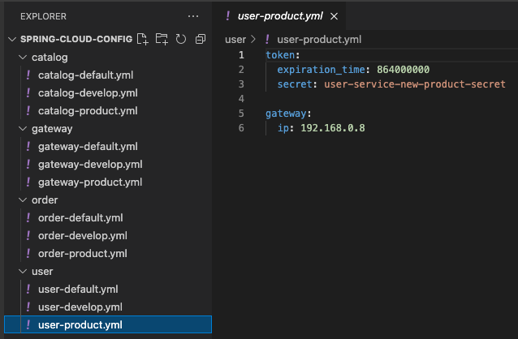
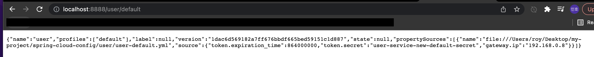
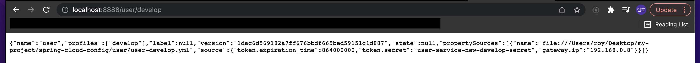
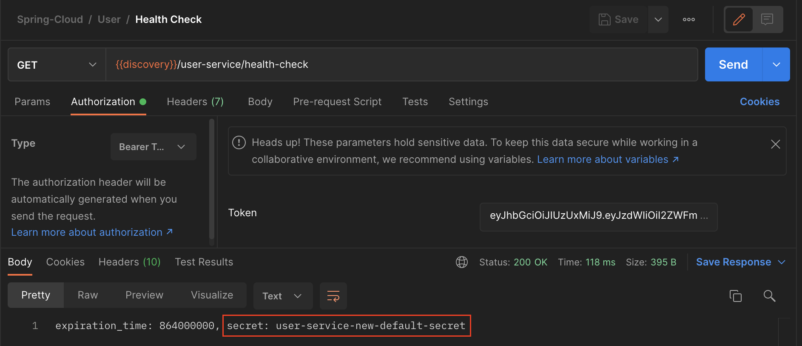
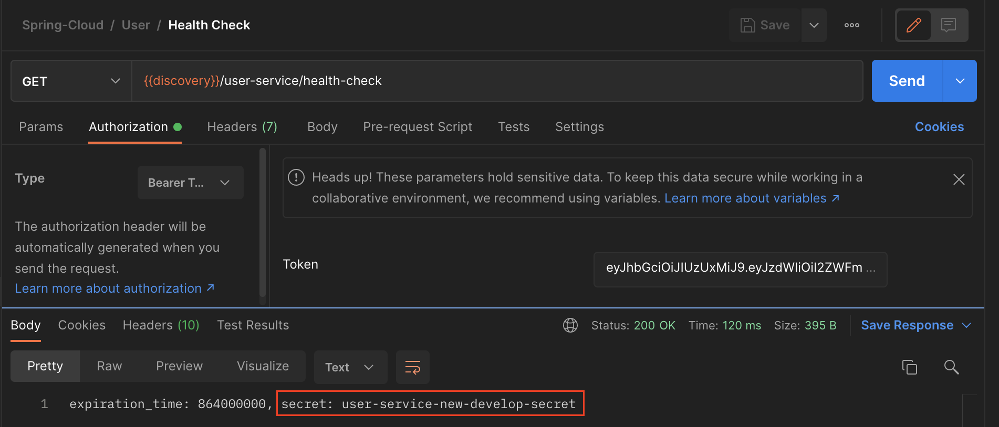

이번 장에서는 Spring Cloud Config 서버에 대해서 알아본다.
모든 소스 코드는 [깃허브 (링크)](https://github.com/roy-zz/spring-cloud) 에 올려두었다.

---

### Spring Cloud Config

Spring Cloud Config 서버란 분산 되어있는 서버, 클라이언트의 구성에 필요한 설정 정보(예. application.yml)를 외부 시스템에서 관리하는 것을 의미한다.
하나의 중앙화 된 저장소에서 구성요소를 관리할 수 있으며 각각의 마이크로서비스를 다시 빌드하지 않고 바로 적용이 가능하다.
애플리케이션의 배포 파이프라인을 통해서 운영, 개발, QA등 환경에 맞는 구성 정보를 사용할 수 있다.


애플리케이션에 설정파일을 적용하는 방법은 크게 애플리케이션 재실행, Actuator를 활용한 refresh, Spring Cloud Bus를 활용한 방법이 있다.
이번 장에서는 애플리케이션을 재실행시켜서 설정파일을 변경시켜보고 다음 장에서는 Actuator를 적용시켜서 재실행없이 설정파일을 적용시켜보도록 한다.

Config 서버가 참고하는 설정 파일의 위치는 크게 Local Git Repository, Remote Git Repository, Native File Repository 세 가지가 있다.
Local Git Repository 부터 하나씩 알아보도록 한다.

---

### 공통 사항

세가지 방법을 알아보기 전에 가장 기본이 되는 config 서버를 먼저 생성한다.

1. 멀티 모듈 구조라면 config 모듈을 생성하고 그렇지 않다면 새로운 config 프로젝트를 생성한다.

[멀티 모듈 구조](https://imprint.tistory.com/206?category=1069520) 와 [스프링부트 프로젝트 생성](https://imprint.tistory.com/3?category=1067500) 은 이전에 필자가 올려두었던 글을 참고하여 생성한다.

2. Config 서버 관련 의존성을 추가한다.

build.gradle에 config 서버 관련 의존성이 추가되어 있어야 한다.

```bash
implementation 'org.springframework.cloud:spring-cloud-config-server'
```

3. main 메서드가 있는 클래스를 수정한다.

main 메서드가 있는 클래스에 아래와 같이 @EnableConfigServer 애노테이션을 붙여준다.

```java
@EnableConfigServer
@SpringBootApplication
public class ConfigApplication {
    public static void main(String[] args) {
        SpringApplication.run(ConfigApplication.class, args);
    }
}
```

4. application.yml 파일을 수정한다.

yaml 파일을 아래와 같이 수정한다.
uri를 입력하는 부분에 ${user.home} 부분은 터미널에서 pwd를 입력하였을 때 ~~~/Desktop/ 과 같이 출력될 텐데 Desktop 이전 부분을 의미한다.
search-paths를 입력한 이유는 리포지토리 내부에 마이크로서비스 별로 총 네개의 디렉토리가 있고 config 서버가 디렉토리 내부까지 찾도록 유도하기 위해서다.

```yaml
server:
  port: 8888

spring:
  application:
    name: config-service
  cloud:
    config:
      server:
        git:
          uri: file://${user.home}/Desktop/my-project/spring-cloud-config
          search-paths:
            - user
            - order
            - gateway
            - catalog
```

설정 파일이 아직 입력되지 않았기 때문에 정상작동은 확인하기 힘들다.
Local Git Repository를 활용하는 방법을 알아볼 때 정상적으로 설치되었는지 확인해보도록 한다.

---

### Local Git Repository

모든 예시는 User Service로 진행한다.
각각의 마이크로서비스와 Config 서비스를 연동하기 위해서는 마이크로서비스들도 작업이 필요하다.

1. 의존성 추가

build.gradle 파일에 아래와 같이 bootstrap과 config와 관련된 의존성을 추가한다.

```bash
implementation 'org.springframework.cloud:spring-cloud-starter-config'
implementation 'org.springframework.cloud:spring-cloud-starter-bootstrap'
```

2. bootstrap.yml 파일 생성

기존 application.yml파일이 위치한 곳과 동일한 위치에 bootstrap.yml 파일을 생성하고 필요한 정보를 입력한다.

```yaml
spring:
  cloud:
    config:
      uri: http://127.0.0.1:8888
      name: user
      profile: default
```

3. 로컬 PC에 Git 저장소를 만든다. (다음 단계를 위하여 미리 원격 저장소도 연동 해두는 것을 추천한다.)

4. 저장소에 디렉토리 구조를 잡는다.

5. Config 저장소의 yml 파일을 수정한다.

아래의 사진을 보면 좌측과 같이 서비스 별로 각각 세 개(default, develop, product)의 환경에 맞는 yml 파일을 생성하였다.
먼저 유저 서비스의 기본 yml인 user-default.yml 파일에 토큰 관련 정보와 게이트웨이 정보를 입력하였다.



6. 정상 작동 확인용 컨트롤러 수정

실행 중인 애플리케이션이 참고하고 있는 설정 파일의 정보를 출력하는 API를 작성한다.

```java
@RestController
@RequestMapping("")
@RequiredArgsConstructor
public class MyUserController {
    private final Environment environment;
    private final MyUserService userService;
    @GetMapping("/health-check")
    public String healthCheck() {
        return String.format("expiration_time: %s, secret: %s",
                environment.getProperty("token.expiration_time"),
                environment.getProperty("token.secret")
        );
    }
}
```

7. Config 페이지 접속을 통한 작동확인

브라우저를 켜고 localhost:8888/user/default로 접속하면 아래와 같이 설정파일 정보가 나오는 것을 확인할 수 있다.



이번에는 develop 환경의 설정파일을 확인하기 위해 localhost:8888/user/develop으로 접속해본다.



정상적으로 develop 환경의 설정파일 정보가 출력되는 것을 확인할 수 있다.
~~(강의에서는 json 포멧으로 이쁘게 나오더만 내 브라우저는 왜 이러는지...)~~

8. 유저 서비스의 API를 통한 작동확인

7번 단계에서는 Config 서버가 정상적으로 설정파일을 읽어왔는지 테스트를 진행하였다.
하지만 우리의 유저 서비스가 정상적으로 설정파일을 가져왔는지는 검증하지 못했다.

유저 서비스의 bootstrap.yml을 아래와 같이 설정하고 애플리케이션을 재실행하고 API를 호출해본다.

```yaml
spring:
  cloud:
    config:
      uri: http://127.0.0.1:8888
      name: user
      profile: default
```



정상적으로 default 설정 파일을 읽은 것을 확인할 수 있다.
이번에는 bootstrap.yml을 아래와 같이 develop 환경의 설정파일을 조회하도록 수정하고 애플리케이션을 재실행한 뒤 API를 호출해본다.



정상적으로 develop 설정 파일을 읽은 것을 확인할 수 있다.

---

### Remote Git Repository

Local Git Repository에서 Remote Git Repository로 변경하는 방법은 간단히 Config 서버의 설정만 변경하면 된다.

Config 서버의 application.yml 파일을 아래와 같이 수정한다.

```yaml
server:
  port: 8888
spring:
  application:
    name: config-service
  cloud:
    config:
      server:
        git:
          uri: https://github.com/roy-zz/spring-cloud-config.git
```

Local Git Repository를 검증할 때와 동일하게 7번, 8번 단계를 확인해보면 정상적으로 작동하는 것을 확인할 수 있다.

---

### Native File Repository

Local Git Repository에서 Remote Git Repository로 변경하는 것과 동일하게 Config 서버의 설정만 변경하면 된다.

Config 서버의 application.yml 파일을 아래와 같이 수정한다.

```yaml
server:
  port: 8888
spring:
  application:
    name: config-service
  profile:
    active: native
  cloud:
    config:
      server:
        native:
          search-locations: file://${user.home}/Desktop/my-project/spring-cloud-config
```

Local Git Repository를 검증할 때와 동일하게 7번, 8번 단계를 확인해보면 정상적으로 작동하는 것을 확인할 수 있다.

---

지금까지 Spring Cloud 서버를 구축하고 애플리케이션을 재실행시켜서 설정파일을 적용시키는 방법에 대해서 알아보았다.

---

**참고한 강의:** 

- https://www.inflearn.com/course/%EC%8A%A4%ED%94%84%EB%A7%81-%ED%81%B4%EB%9D%BC%EC%9A%B0%EB%93%9C-%EB%A7%88%EC%9D%B4%ED%81%AC%EB%A1%9C%EC%84%9C%EB%B9%84%EC%8A%A4