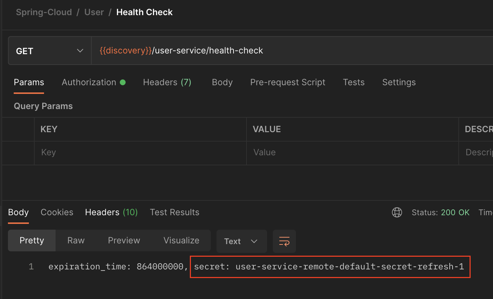

[이전 장(링크)](https://imprint.tistory.com/221?category=1069520) 에서는 Config 서버를 만들고 애플리케이션을 재실행하여 설정을 적용시키는 방법에 대해서 알아보았다. 
이번 장에서는 애플리케이션을 재실행시키지 않고 Spring Actuator를 사용하여 변경된 설정파일을 적용하는 방법에 대해서 알아본다.
모든 소스 코드는 [깃허브 (링크)](https://github.com/roy-zz/spring-cloud) 에 올려두었다.

---

### Actuator 설치

이전 장에서 설정파일을 저장하는 저장소는 Local, Remote Git Repository와 Native File Repository가 있다고 학습하였다.
이번 장에서 저장소는 Remote Git Repository로 고정시키고 Actuator를 통한 설정파일 적용 방법을 집중적으로 알아본다.

1. 게이트웨이 서비스 의존성 추가

게이트웨이 서비스의 build.gralde에 actuator 의존성을 추가한다.

```bash
implementation 'org.springframework.boot:spring-boot-starter-actuator'
```

2. application.yml 파일 수정

게이트웨이 서비스와 유저 서비스의 application.yml 파일에 actuator를 활성화 시키기 위한 설정 정보를 추가한다.
여기서 include는 활성화 기능을 의미한다.
우리가 가장 필요로 하는 기능은 애플리케이션의 설정 정보를 갱신 시켜줄 refresh다.

```yaml
management:
  endpoints:
    web:
      exposure:
        include: refresh,health,beans,httptrace
```

추가로 route 정보의 하단의 내용을 추가한다.
유저 서비스의 actuator를 접속할 때 인증 필터를 거치지 않고 바로 접속 가능하게 하기 위해서다.

```yaml
    - id: user-service
      uri: lb://USER-SERVICE
      predicates:
        - Path=/user-service/actuator/**
        - Method=GET,POST
      filters:
        - RemoveRequestHeader=Cookie
        - RewritePath=/user-service/(?<segment>.*), /$\{segment}
```

3. HttpTraceRepository 빈 등록

게이트웨이의 메인 클래스에 아래와 같이 코드를 추가하여 HttpTraceRepository 빈을 등록시킨다.
2단계에서 활성화 시킨 httptrace를 사용하기 위한 설정이다.

```java
@Bean
public HttpTraceRepository httpTraceRepository() {
    return new InMemoryHttpTraceRepository();
}
```

4. 접속 정상 접속 확인

192.168.0.2:8000/user-service/actuator/health 에 접속하여 정상적으로 애플리케이션의 상태가 출력되는지 확인해본다.
아래의 이미지와 같이 나온다면 정상적으로 actuator가 연동된 것이다.


---

### Refresh 테스트

actuator까지 정상적으로 연동되었다.
이제 actuator의 refresh를 활용하여 정상적으로 설정파일이 적용되는지 확인해본다.

1. 설정 파일 확인

설정을 변경 테스트를 진행하기 전의 상태는 아래와 같다.
좌측의 설정 파일은 유저 서비스의 bootstrap.yml 파일이며 우측은 Git의 설정파일 저장소 상태다.


이런 상태에서 설정 정보를 조회하는 API를 호출하면 결과는 아래와 같이 정상적으로 출력된다.


2. Git 원격 저장소 수정

변경하려는 secret 값을 수정하고 원격 저장소에 push 한다.


3. refresh API 호출

Postman을 사용하여 유저 서비스의 actuator/refresh API를 호출한다.


4. 정상 반영 확인

다시 설정 정보를 조회하는 API를 호출하면 정상적으로 변경된 설정이 반영된 것을 확인할 수 있다.



---

지금까지 스프링의 Actuator를 사용하여 애플리케이션 재실행없이 설정파일을 적용시키는 방법에 대해서 알아보았다.
확실히 애플리케이션을 재실행 시켜서 적용시키는 것 보다 훨씬 간단하고 빠르게 적용이 가능하였다.
다음 장에서는 이보다 더 편리한 Spring Cloud Bus를 사용하여 설정파일을 적용시켜 본다.

---

**참고한 강의:** 

- https://www.inflearn.com/course/%EC%8A%A4%ED%94%84%EB%A7%81-%ED%81%B4%EB%9D%BC%EC%9A%B0%EB%93%9C-%EB%A7%88%EC%9D%B4%ED%81%AC%EB%A1%9C%EC%84%9C%EB%B9%84%EC%8A%A4