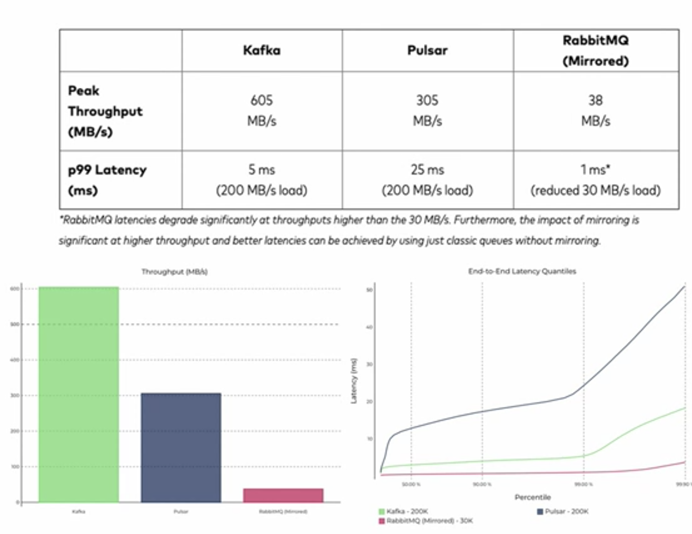

[이전 장(링크)](https://imprint.tistory.com/222) 에서는 Spring Actuator의 Refresh 기능을 통해서 설정파일을 갱신하는 방법에 대해서 알아보았다.
각각의 마이크로서비스들의 Actuator를 모두 찾아서 Refresh를 해주는 것도 사실 간단한 방법은 아니다.
이번 장에서는 Spring Actuator보다 더 간편한 Spring Cloud Bus라는 기능을 사용하여 설정파일을 갱신하는 방법에 대해서 알아본다.
모든 소스 코드는 [깃허브 (링크)](https://github.com/roy-zz/spring-cloud) 에 올려두었다.

---

### Spring Cloud Bus

Spring Cloud Bus는 분산 시스템에서의 각각의 노드를 경량 메시지 브로커와 연결하고 상태 및 구성 정보에 대한 변경 사항을 연결된 노드에게 전달하는 것을 의미한다.
우리는 MSA라는 분산 시스템에서 각각의 마이크로서비스들에게 RabbitMQ라는 메시지 브로커를 사용하여 새로운 변경사항을 전파할 것이다.

이번 장에서 사용하게 될 AMQP(Advanced Message Queuing Protocol)은 메시지 지향 미들웨어를 위한 개방형 표준 응용 계층 프로토콜이다.
메시지 지향, 큐잉, 라우팅, 신뢰성, 보안이라는 키워드를 가지고 있으며 Erlang 언어로 작성된 RabbitMQ에서 사용된다.

RabbitMQ를 얘기할 때 Kafka도 같이 많이 언급된다. 추후에 Kafka도 사용할 것이기 때문에 간단하게 알아본다.
Kafka는 Apache Software Foundation이 Scalar 언어로 개발한 오픈 소스 메시지 브로커 프로젝트다.
분산형 스트리밍 플랫폼에 적합하며 대용량 데이터 처리가 가능한 메시징 시스템이다.

단순 RabbitMQ와 Kafka의 처리 성능만을 비교하면 Kafka가 10배 이상 압도적으로 빠르다.



물론 처리 성능도 중요하지만 두 시스템은 서로 지향하는 점이 다르다.
**RabbitMQ**는 메시지 전달을 보장하며 시스템 간 메시지 전달에 주로 사용된다. 브로커, 소비자 중심의 Message Queue.
**Kafka**는 Pub/Sub 구조로 Topic에 메시지를 전달한다. 소비자의 Ack를 기다리지 않고 전달 가능하며 생산자 중심의 Message Queue.

---

### Flow

Spring Cloud Bus(이하 Bus)를 통한 전체적인 시스템 흐름은 아래의 이미지와 같게 될 것이다.


이전에 actuator의 refresh 기능을 사용할 때는 각각의 마이크로서비스들의 actuator의 refresh를 호출했어야 했다.

Bus를 사용하면 각각의 마이크로서비스들에게 refresh를 요청할 필요없고 Bus에 연결되어 있는 마이크로서비스 중 하나에게만 요청을 하면 Bus에 연결되어 있는 모든 마이크로서비스에 전파된다.
물론 서비스간 다이렉트로 통신하는 것은 아니고 Bus가 구성 정보 업데이트를 감지하고 자신이 관리하는 마이크로서비스에게 구성 젖ㅇ보를 업데이트 시켜주는 방식이다.

---

### RabbitMQ 설치

1. ```bash brew update```


2. ```bash brew install rabbitmq```


3. ```bash brew services start rabbitmq```


4. 127.0.0.1:15672 접속

기본 계정정보는 guest/guest다.


5. 로그인을 진행하고 아래와 같은 화면이 나온다면 정상적으로 설치가 완료된 것이다.


---

### Spring Cloud Bus 연동

1. 의존성 추가

Config 서버의 build.gradle에 아래와 같이 필요한 의존성을 추가해준다.

```bash
implementation 'org.springframework.boot:spring-boot-starter-actuator'
implementation 'org.springframework.cloud:spring-cloud-starter-bus-amqp'
```

User 서비스와 Gateway 서비스의 build.gradle 파일에 아래와 같이 Spring Cloud Bus 관련 의존성을 추가해준다.

```bash
```

2. application.yml 수정

Config, User, Gateway 서비스의 application.yml 파일에 아래의 내용을 추가한다.
management 부분의 경우 기존에는 없던 busrefresh를 추가해야한다.

```yaml
spring:
  rabbitmq:
    host: 127.0.0.1
    port: 5672
    username: guest
    passowrd: guest
# 중간 생략
management:
  endpoint:
    web:
      exposure:
        include: refresh,health,beans,httptrace,busrefresh
```

3. bootstrap.yml 추가

아마 이전 장을 진행했다면 유저 서비스는 아래와 같은 bootstrap.yml 파일이 있을 것이다.

```yaml
spring:
  cloud:
    config:
      uri: http://127.0.0.1:8888
      name: user
      profile: default
```

게이트웨이도 아래와 같은 bootstrap.yml 파일을 추가해준다.

```yaml
spring:
  cloud:
    config:
      uri: http://127.0.0.1:8888
      name: gateway
      profile: default
```

4. 서비스 기동

이제 Spring Cloud Bus를 통한 설정 파일 적용을 위한 준비가 완료되었다.
아래의 순서로 서비스를 재실행 시킨다.

1. RabbitMQ Server
2. Config Service
3. Discovery Service
4. Gateway Service
5. User Service

---

### 테스트

정상적으로 연동이 되었는지 테스트를 진행한다.
Config 서버가 참고하는 저장소는 Git 원격 리포지토리로 설정되어 있다.

1. Spring Cloud Bus를 적용하지 않은 상태에서 데이터 확인

Bus가 적용되기 전의 원격 깃 저장소의 최신 secret 값은 아래의 이미지와 같다.


설정 정보를 확인하는 API를 호출하여 확인해보면 유저 서비스에 최신정보가 정상적으로 반영되어 있는 것을 확인할 수 있다.


2. 원격 깃 저장소 최신 상태 변경

테스트를 위하여 Remote Git Repository의 유저 설정 정보를 변경한다.

```yaml
token:
  expiration_time: 864000000
  secret: user-bus-apply
gateway:
  ip: 192.168.0.8
```

3. 게이트웨이 busrefresh 호출

유저 서비스가 아닌 게이트웨이 서버의 busrefresh를 호출한다.
아래의 이미지와 같이 204 No Content가 나온다면 정상적으로 호출이 완료된 것이다.


아래는 busrefresh를 호출하였을 때 게이트웨이와 유저 서비스의 출력결과다.
우리는 유저 서비스의 busrefresh를 호출한 적이 없지만 전파된 것을 확인할 수 있다.

**Gateway Service**
```bash
DiscoveryClient_GATEWAY-SERVICE/gateway-service:d8af08b3e5a86ac8cfd7ecf406a4456d - registration status: 204
```

**User Service**
```bash
Retrieving cached binder: rabbit
DiscoveryClient_USER-SERVICE/user-service:04ed8db614fc9f25948c8344e6f2fdcd - registration status: 204
```

4. 정상 반영 확인

health-check API를 사용하여 정상적으로 반영이 되었는지 확인해본다.


정상적으로 최신 설정 정보가 반영된 것을 확인할 수 있다.

---

**참고한 강의:**

- https://www.inflearn.com/course/%EC%8A%A4%ED%94%84%EB%A7%81-%ED%81%B4%EB%9D%BC%EC%9A%B0%EB%93%9C-%EB%A7%88%EC%9D%B4%ED%81%AC%EB%A1%9C%EC%84%9C%EB%B9%84%EC%8A%A4