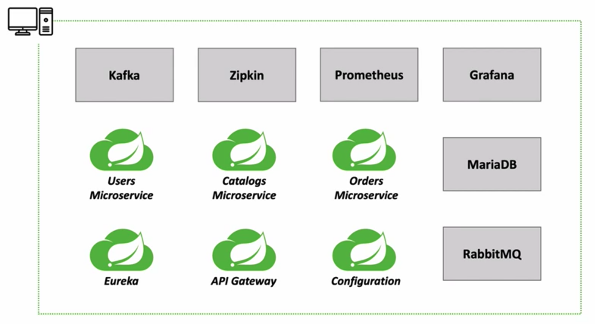
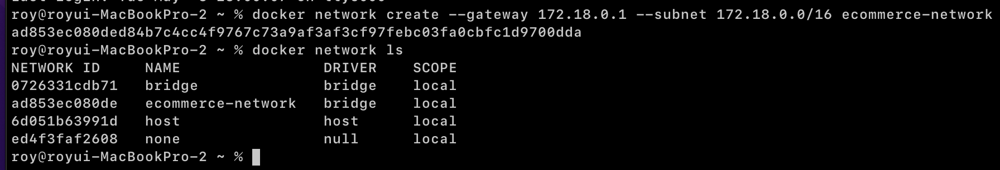
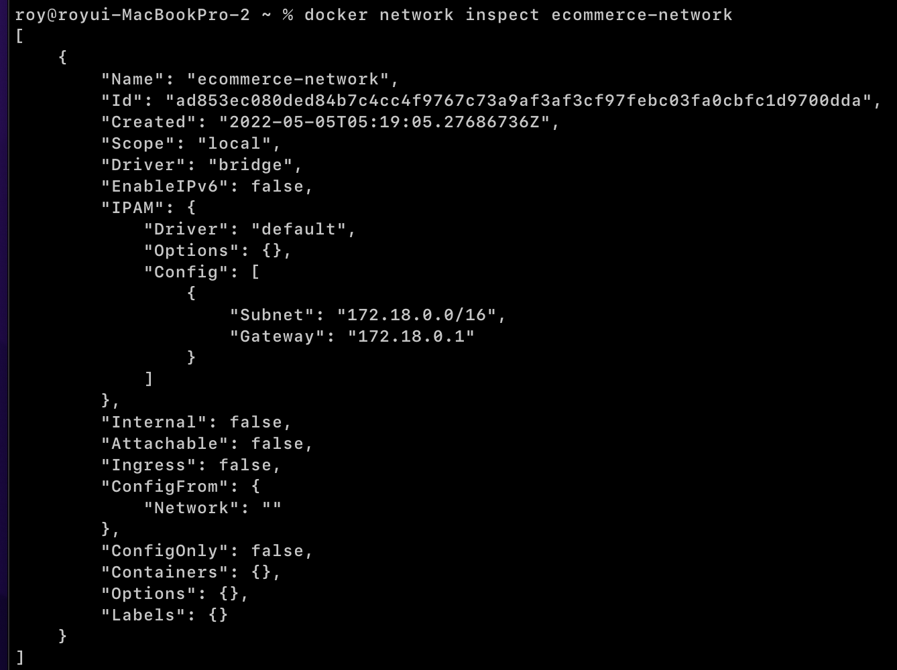
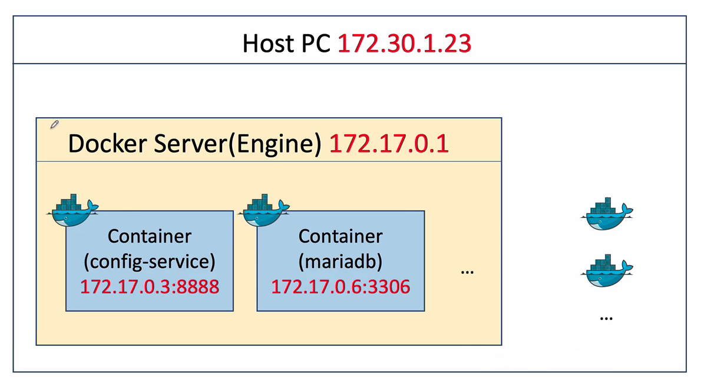
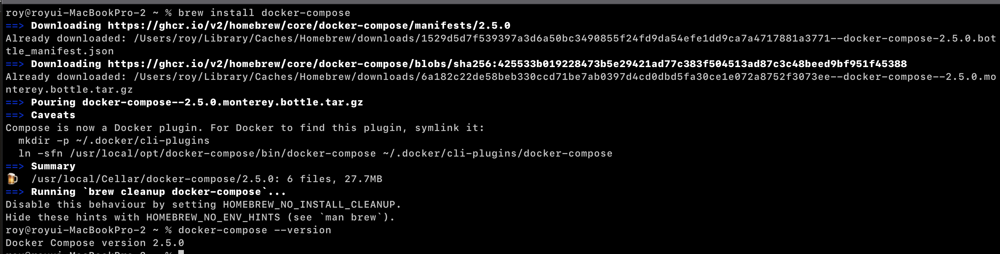
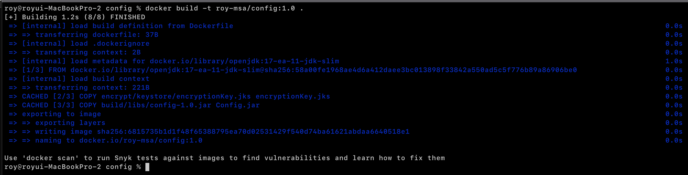
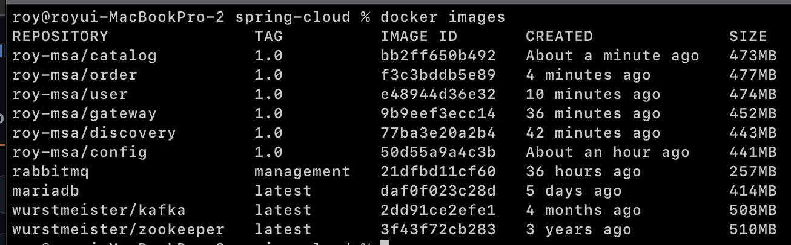
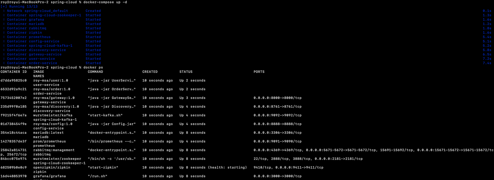

[이전 장(링크)](https://imprint.tistory.com/254) 에서는 도커에 대해서 알아보았다.
이번 장에서는 우리의 마이크로서비스들을 도커 이미지로 생성하고 실행시키는 방법에 대해서 알아본다.
모든 소스 코드는 [깃 허브 (링크)](https://github.com/roy-zz/spring-cloud) 에 올려두었다.

---

### 개요

우리는 `IntelliJ` 또는 `Gradle 커맨드`를 통해서 `jar` 파일을 수동으로 생성할 것이다.
생성된 `jar` 파일을 도커 이미지로 생성하여 `Docker Container`를 실행시키는 방법에 대해서 알아본다.

필자의 경우 도커 환경에서의 실행을 위해 설정과 코드를 수정하고 `jar`파일을 생성하는 과정은 수동으로 진행하고 컨테이너를 실행시키는 단계는 `docker-compose`를 통해서 진행할 예정이다.
`docker-compose`를 설치하는 방법은 아래서 다루도록 한다.

우리의 마이크로서비스들은 개발자의 PC에서 아래의 이미지와 같이 독립적으로 실행되고 있다.



도커 컨테이너에서 실행되기 전에는 동일한 PC에서 실행되어 같은 내부 IP 대역폭에서 실행되어 내부 IP로 통신할 수 있었다.
하지만 도커의 경우 가상화된 머신이며 설정없이는 같은 망으로 인식하지 못하기 때문에 내부 IP로 통신할 수 없다.

컨테이너 환경에서 실행시키기 이전에 `Docker Network`를 설정하는 방법에 대해서 알아본다.

---

### Docker Network

- **Bridge Network**: 도커의 기본 네트워크라고 불리며 네트워크 세그먼트 간에 트래픽을 전달하는 링크 계층 장치다.
도커 측면에서 동일한 `Bridge Network`에 연결된 컨테이너가 통신할 수 있도록 하는 소프트웨어 `Bridge`를 사용하는 동시에 해당 `Bridge Network`에 연결되어 있지 않은 컨테이너로부터 격리를 제공한다.
동일한 도커 데몬 호스트에서 실행되는 컨테이너에 적용된다. 다른 도커 데몬 호스트에서 실행되는 컨테이너간의 통신을 위해 OS 수준에서 라우팅을 관리하거나 `Overray Network`를 사용해야 한다.

- **Host Network**: 도커 데몬 호스트를 실행하는 호스트의 네트워크 환경을 그대로 사용한다. 포트 포워딩 없이 내부 애플리케이션을 사용할 수 있다.
- NAT(네트워크 주소 변환)이 필요하지 않고 각 포트에 대해 "userland-proxy"가 생성되지 않기 때문에 컨테이너가 광범위한 포트를 처리해야 하는 상황에서 성능을 최적화하는 데 유용하다.

- **None Network**: I/O를 제외한 네트워크를 사용하지 않으며 외부와 단절되어 있다.

우리는 `Bridge Network`를 사용하여 네트워크 한경을 구축해본다.

#### 네트워크 생성

1. 네트워크 생성

아래의 커맨드를 입력하여 `gateway`와 `subnet`을 지정하여 도커 네트워크를 생성한다.

```bash
$ docker network create --gateway 172.18.0.1 --subnet 172.18.0.0/16 ecommerce-network
```



2. 네트워크 상태 확인

아래의 커맨드를 입력하여 네트워크의 상태를 확인한다.

```bash
$ docker network inspect ecommerce-network
```



`"Containers"`부분을 확인해보면 아직 네트워크에 등록된 컨테이너가 없기 때문에 비어있는 것을 확인할 수 있다.

우리는 이렇게 도커 컨테이너를 `ecommerce-network`를 통해서 통신하게 만들었기 때문에 `172.17.*.*`와 같은 내부 IP로 통신할 수 있다.



---

### Docker Compose 설치

아래의 커맨드를 입력하여 `Homebrew`를 통해 도커 컴포즈를 설치한다.
~~(`Windows`와 `Linux`는 도커 공식문서를 참고하여 설치한다.)~~

```bash
$ brew install docker-compose
```



---

### 프로젝트 수정

컨테이너 환경에서 실행하기 위해 수정이 필요한 부분을 수정한다.
수정이 필요없는 프로젝트의 경우 내용을 생략하고 하단부에서 완성된 `docker-compose.yml`파일을 보면서 확인해보도록 한다.

**1. Rabbitmq**
수정사항 없음.

**2. Config Service**

- Dockerfile 생성

`Config Service` 내부에 아래와 같이 `Dockerfile`을 생성한다.
생성할 때 이전에 만들었던 암호화키가 컨테이너 안으로 복사하도록 구현해야한다.

```dockerfile
FROM openjdk:17-ea-11-jdk-slim
VOLUME /tmp
COPY encrypt/keystore/encryptionKey.jks encryptionKey.jks
COPY build/libs/config-1.0.jar Config.jar
ENTRYPOINT ["java", "-jar", "Config.jar"]
```

- application.yml 수정
`rabbitmq` 호스트를 지정할 때 IP가 아닌 컨테이너 이름으로 찾을 수 있도록 `application.yml` 파일을 수정한다.

```yaml
spring:
  application:
    name: config-service
  rabbitmq:
    host: rabbitmq
    port: 5672
    username: guest
    passowrd: guest
```

- bootstrap.yml 수정
컨테이너에서 실행되는 Config 서버가 복사된 암호화 키를 참조할 수 있도록 `bootstrap.yml`파일을 수정한다.

```yaml
encrypt:
  key-store:
    localtion: file:/encryptionKey.jks
    password: 1q2w3e4r
    alias: encryptionKey
```

- jar 파일 생성

```bash
$ gradle build
```

- docker image 생성

```bash
docker build -t roy-msa/config:1.0 .
```



**3. Discovery Service**

- Dockerfile 생성

`Discovery Service` 내부에 아래와 같이 `Dockerfile`을 생성한다.

```dockerfile
FROM openjdk:17-ea-11-jdk-slim
VOLUME /tmp
COPY build/libs/discovery-1.0.jar DiscoveryService.jar
ENTRYPOINT ["java", "-jar", "DiscoveryService.jar"]
```

- application.yml 수정

```yaml
spring:
  application:
    name: discovery
  cloud:
    config:
      uri: http://config:8888
      name: discovery
```

- jar 파일 생성

```bash
$ gradle build
```

- docker image 생성

```bash
$ docker build -t roy-msa/discovery:1.0 .
```

**4. Gateway Service**

- Dockerfile 생성

`Discovery Service` 내부에 아래와 같이 `Dockerfile`을 생성한다.

```dockerfile
FROM openjdk:17-ea-11-jdk-slim
VOLUME /tmp
COPY build/libs/gateway-1.0.jar GatewayService.jar
ENTRYPOINT ["java", "-jar", "GatewayService.jar"]
```

- jar 파일 생성

```bash
$ gradle build
```

- docker image 생성

```bash
$ docker build -t roy-msa/gateway:1.0 .
```

**5. MariaDB**
수정사항 없음.

**6. Zookeeper & Kafka**
수정사항 없음.

**7. Zipkin**
수정사항 없음.

**8. Prometheus & Grafana**

- prometheus.yml 수정

도커 컨테이너 내부로 복사할 `prometheus.yml`파일을 수정한다.
기존에 `localhost:{port}`로 등록되어 있는 targets 부분을 `{container-name}:{port}`형식으로 변경한다.

```yaml
scrape_configs:
  - job_name: "prometheus"
    static_configs:
      - targets: ["prometheus:9090"]
  - job_name: "user-service"
    scrape_interval: 15s
    metrics_path: "/user-service/actuator/prometheus"
    static_configs:
      - targets: ["user-service:8000"]
```

**9. User Service**

- Dockerfile 생성

`User Service` 내부에 아래와 같이 `Dockerfile`을 생성한다.

```dockerfile
FROM openjdk:17-ea-11-jdk-slim
VOLUME /tmp
COPY build/libs/user-service-1.0.jar UserService.jar
ENTRYPOINT ["java", "-jar", "UserService.jar"]
```

- jar 파일 생성

```bash
$ gradle build
```

- docker image 생성

```bash
$ docker build -t roy-msa/user:1.0 .
```

**10. Order Service**

- Dockerfile 생성

`Order Service` 내부에 아래와 같이 `Dockerfile`을 생성한다.

```dockerfile
FROM openjdk:17-ea-11-jdk-slim
VOLUME /tmp
COPY build/libs/order-service-1.0.jar OrderService.jar
ENTRYPOINT ["java", "-jar", "OrderService.jar"]
```

- jar 파일 생성

```bash
$ gradle build
```

- docker image 생성

```bash
$ docker build -t roy-msa/order:1.0 .
```

**11. Catalog Service**

- Dockerfile 생성

`Catalog Service` 내부에 아래와 같이 `Dockerfile`을 생성한다.

```dockerfile
FROM openjdk:17-ea-11-jdk-slim
VOLUME /tmp
COPY build/libs/catalog-service-1.0.jar CatalogService.jar
ENTRYPOINT ["java", "-jar", "OrderService.jar"]
```

- jar 파일 생성

```bash
$ gradle build
```

- docker image 생성

```bash
$ docker build -t roy-msa/catalog:1.0 .
```

---

### 프로젝트 실행

지금까지 컨테이너 환경에서 실행시키기 위해 수정되어야하는 부분은 전부 수정되었다.
이미지가 정상적으로 생성되었는지 아래의 커맨드를 입력하여 확인해본다.

```bash
$ docker images
```



이렇게 많은 프로젝트를 `docker run ~~`과 같이 하나하나 실행시키는 것은 현실적으로 불가능하다.
간편하게 실행시키는 방법이 많이 있지만 필자는 `docker-compose`를 선택하였다.
아래는 모든 서비스를 실행시키기 위한 `docker-compose.yml` 파일이다.

```yaml
version: "3.6"
services:

  rabbitmq:
    container_name: rabbitmq
    image: rabbitmq:management
    environment:
      RABBITMQ_DEFAULT_USER: "guest"
      RABBITMQ_DEFAULT_PASS: "guest"
    networks:
      - ecommerce-network
    ports:
      - "15672:15672"
      - "5672:5672"
      - "15671:15671"
      - "5671:5671"
      - "4369:4369"

  config-service:
    container_name: config-service
    image: roy-msa/config:1.0
    environment:
      spring.profiles.active: "default"
    ports:
      - "8888:8888"
    networks:
      - ecommerce-network
    depends_on:
      - rabbitmq

  discovery-service:
    container_name: discovery-service
    image: roy-msa/discovery:1.0
    environment:
      spring.cloud.config.uri: "http://config-service:8888"
    ports:
      - "8761:8761"
    networks:
      - ecommerce-network
    depends_on:
      - config-service

  gateway-service:
    container_name: gateway-service
    image: roy-msa/gateway:1.0
    environment:
      spring.cloud.config.uri: "http://config-service:8888"
      spring.rabbitmq.host: "rabbitmq"
      eureka.client.serviceUrl.defaultZone: "http://discovery-service:8761/eureka/"
    ports:
      - "8000:8000"
    networks:
      - ecommerce-network
    depends_on:
      - discovery-service

  user-service:
    container_name: user-service
    image: roy-msa/user:1.0
    environment:
      spring.cloud.config.uri: "http://config-service:8888"
      spring.rabbitmq.host: "rabbitmq"
      spring.zipkin.base-url: "http://zipkin:9411"
      eureka.client.serviceUrl.defaultZone: "http://discovery-service:8761/eureka/"
      logging.file: "/api-logs/users-ws.log"
    depends_on:
      - gateway-service
      - zipkin
      - rabbitmq

  order-service:
    container_name: order-service
    image: roy-msa/order:1.0
    environment:
      spring.zipkin.base-url: "http://zipkin:9411"
      eureka.client.serviceUrl.defaultZone: "http://discovery-service:8761/eureka/"
      spring.datasource.url: "jdbc:mariadb://mariadb:3306/mydb"
      logging.file: "/api-logs/orders-ws.log"
    depends_on:
      - gateway-service
      - zipkin
      - rabbitmq

  # third-party
  zipkin:
    container_name: zipkin
    image: openzipkin/zipkin
    ports:
      - "9411:9411"
    networks:
      - ecommerce-network

  prometheus:
    container_name: prometheus
    image: prom/prometheus
    ports:
      - "9090:9090"
    networks:
      - ecommerce-network
    volumes:
      - ./thirdparty/prometheus/prometheus.yml:/etc/prometheus/prometheus.yml

  grafana:
    container_name: grafana
    image: grafana/grafana
    ports:
      - "3000:3000"
    networks:
      - ecommerce-network

  mariadb:
    container_name: mariadb
    image: mariadb:latest
    environment:
      MYSQL_ROOT_PASSWORD: "root"
      MYSQL_DATABASE: "mydb"
    ports:
      - "3306:3306"
    networks:
      - ecommerce-network

  zookeeper:
    image: wurstmeister/zookeeper
    ports:
      - "2181:2181"
    networks:
      ecommerce-network:
        ipv4_address: 172.18.0.100

  kafka:
    image: wurstmeister/kafka
    ports:
      - "9092:9092"
    environment:
      KAFKA_ADVERTISED_HOST_NAME: 172.18.0.101
      KAFKA_CREATE_TOPICS: "test:1:1"
      KAFKA_ZOOKEEPER_CONNECT: zookeeper:2181
    volumes:
      - /var/run/docker.sock:/var/run/docker.sock
    depends_on:
      - zookeeper
    networks:
      ecommerce-network:
        ipv4_address: 172.18.0.101

networks:
  ecommerce-network:
    external: true
```

`docker run ~~` 을 통해서 실행시켜야하는 부분을 대부분 `yml` 파일로 변경시켰다.
따로 설정을 하지않으면 한 번에 모든 서비스가 실행되기 때문에 `depends_on` 설정을 통하여 자신이 실행되기 전에 실행되어야 하는 서비스를 지정하였다.

`docker-compose.yml` 파일이 위치한 경로에서 아래의 커맨드를 입력하여 프로젝트를 실행시킨다.

```bash
$ docker-compose up -d
```



정상적으로 모든 서비스들이 실행된 것을 확인할 수 있다.

---

**참고한 강의:**

- https://www.inflearn.com/course/%EC%8A%A4%ED%94%84%EB%A7%81-%ED%81%B4%EB%9D%BC%EC%9A%B0%EB%93%9C-%EB%A7%88%EC%9D%B4%ED%81%AC%EB%A1%9C%EC%84%9C%EB%B9%84%EC%8A%A4