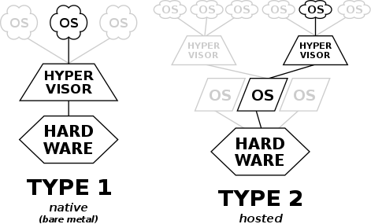
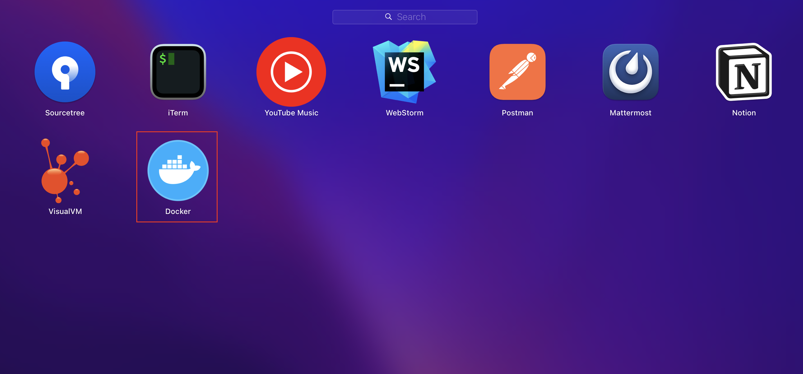
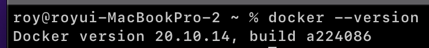

이번 장부터는 우리가 만든 마이크로서비스들을 컨테이너화 하는 방법에 대해서 알아본다.
이번 장에서는 컨테이너화를 하기 위한 기술 중에 대표적으로 사용되는 `Docker`에 대해서 알아본다.
모든 소스 코드는 [깃 허브 (링크)](https://github.com/roy-zz/spring-cloud) 에 올려두었다.

---

### 개요

#### 가상화(Virtualization)

> 가상화(假像化, virtualization)는 컴퓨터에서 컴퓨터 리소스의 추상화를 일컫는 광범위한 용어이다. 
> "물리적인 컴퓨터 리소스의 특징을 다른 시스템, 응용 프로그램, 최종 사용자들이 리소스와 상호 작용하는 방식으로부터 감추는 기술"로 정의할 수 있다.
<center>위키백과</center>

간략하게 물리적인 컴퓨터 리소스를 다른 시스템이나 애플리케이션에서 사용할 수 있도록 제공하는 기술을 의미하며 대표적으로 `플랫폼 가상화`와 `리소스 가상화`가 있다.

---

#### 하이퍼바이저(Hypervisor)

> 하이퍼바이저(영어: hypervisor)는 호스트 컴퓨터에서 다수의 운영 체제(operating system)를 동시에 실행하기 위한 논리적 플랫폼(platform)을 말한다. 
> 가상화 머신 모니터 또는 가상화 머신 매니저(영어: virtual machine monitor 또는 virtual machine manager, 줄여서 VMM)라고도 부른다.
<center>위키백과</center>

`하이퍼바이저`는 일반적으로 2가지로 분류된다.

- **native or bare-metal**: 운영 체제가 프로그램을 제어하듯이 `하이퍼바이저`가 해당 하드웨어에서 직접 실행되며 게스트 운영 체제는 하드웨어 위에서 두번째 수준으로 실행된다.
**`하이퍼바이저`가 하드웨어에 설치되어 운영 체제를 제어하는 방식**이다.

- **hosted**: `하이퍼바이저`는 일반 프로그램과 같이 호스트 운영 체제에서 실행되며 VM 내부에서 동작되는 게스트 운영 체제는 하드웨어에서 3번째 수준으로 실행된다.
**운영체제가 `하이퍼바이저`를 제어하고 `하이퍼바이저`는 또 다른 운영체제를 제어하는 방식**이다.



---

#### OS Level Virtualization

> 운영 체제 수준 가상화(operating-system-level virtualization)는 운영 체제의 커널이 하나의 사용자 공간 인스턴스가 아닌, 여러 개의 격리된 사용자 공간 인스턴스를 갖출 수 있도록 하는 서버 가상화 방식이다.
> 이러한 인스턴스들은 종종 컨테이너(container), 소프트웨어 컨테이너(software container), 가상화 엔진(VE), jail(FreeBSD jail, chroot jail)이라고도 부르며 소유자와 사용자의 관점에서 실제 서버인 것처럼 보이게 한다.
<center>위키백과</center>

`Host OS`위에 Guest OS 전체를 가상화하는 방식이며 대표적으로 VMWare, VirtualBox가 있다.
자유도가 높으나 시스템에 부하가 많고 느려진다.

반면 `Container Virtualization`은 `Host OS`가 가진 리소스를 적게 사용하며 필요한 프로세스를 실행하는 방식이다.
최소한의 라이브러리와 도구만을 포함하므로 `Container`의 생성속도가 빠르고 실행속도 또한 빠르다.


WindowPC에 LinuxOS를 설치했다고 가정하고 Host OS는 WindowPC가 될 것이고 하이퍼바이저가 설치될 것이다.
Guest OS로 LinuxOS가 설치될 것이고 가상머신을 실행시키기 위해서 LinuxOS를 실행시키는 과정이 전부 포함되어야 한다.

컨테이너 가상화는 하이퍼바이저의 위치에 우리가 사용하는 컨테이너 솔루션의 엔진이 위치하게 된다.
그림에서와 같이 Guest OS가 설치되거나 실행되는 것이 아니라 우리가 사용하는 `Docker Engine`이 설치되어 가상화를 위해 필요한 것들만 설치되고 실행된다.

이러한 차이를 보았을 때 가상화를 위해 Host OS의 리소스를 공유하는 것은 동일하다.
하지만 OS 레벨의 가상화의 경우 Guest OS에 Linux OS를 설치(불필요한 파일까지 같이)해야하고 Linux OS를 실행(불필요한 파일까지 같이)되어야한다.
반면 컨테이너 가상화의 경우 실행에 필요한 부분만 설치되고 실행되기 때문에 Host OS의 리소스를 공유하더라도 OS 레벨의 가상화보다 가벼울 수 밖에 없다.

---

#### Container Image

컨테이너를 실행시키기 위한 설정 값을 `Container Image`(이하 이미지)라고 하며 이러한 이미지를 실체화 한 것이 컨테이너라고 한다.
예를 들어 `Ubuntu Image`라는 것은 `Ubuntu`를 실행시키기 위한 파일과 설정정보, 실행시키기 위한 커맨드를 가지고 있는 모음이라고 생각하면 된다.
컨테이너를 실행(실체화)하기 위한 모든 설정파일을 가지고 있기 때문에 부수적인 의존성없이 하나의 서버나 애플리케이션을 실행시킬 수 있다.

우리는 `Docker Hub`라는 도커 이미지 저장소에 우리의 도커 이미지를 저장하고 필요할 때에 다운받아 사용할 것이다.
다운받은 파일은 `Docker Host`에서 `Docker Container`로 실행되고 클라이언트는 `Container`에서 열어둔 포트를 통해서 서비스에 접근하게 된다.


---

#### Dockerfile

`Dockerfile`은 `Docker Image`를 생성하기 위한 스크립트 파일로 자체 `DSL(Domain-Specific Language)`언어를 사용한다.


---

#### Docker 설치

`Homebrew`를 사용하여 `macOS` 환경에 도커를 설치한다. ~~(Windows 또는 Linux의 경우 공식문서를 참고하도록 한다.)~~

```bash
$ brew install --cask docker
```

아래와 같이 오류없이 진행되었다면 정상적으로 도커가 설치는 완료가 된 것이다.


설치는 완료가 된 것이고 정상적으로 사용하기 위해서는 수동으로 한 번 실행시켜 주어야한다.
`Lounchpad`에 있는 도커를 수동으로 실행시켜주도록 한다.



아래와 같은 화면이 표시된다면 정상적으로 도커가 설치된 것이다.


아래의 커맨드를 입력하여 도커의 버전 정보를 확인해본다.

```bash
$ docker --version
```



---

이번 장에서는 도커란 무엇인지에 대해서 알아보았고 도커를 설치하는 방법에 대해서 알아보았다.
다음 장에서는 도커 이미지를 생성하는 방법과 실행시키는 방법 그리고 이미지 저장소에 이미지를 Push하고 Pull하는 방법에 대해서 알아본다.

---

**참고한 강의:**

- https://www.inflearn.com/course/%EC%8A%A4%ED%94%84%EB%A7%81-%ED%81%B4%EB%9D%BC%EC%9A%B0%EB%93%9C-%EB%A7%88%EC%9D%B4%ED%81%AC%EB%A1%9C%EC%84%9C%EB%B9%84%EC%8A%A4