[이전 장(링크)](https://imprint.tistory.com/254) 에서는 `도커란 무엇인가`와 `도커 설치 방법`에 대해서 알아보았다. 
이번 장에서는 `도커 이미지`를 생성하고 실행하는 방법에 대해서 알아본다.
모든 소스 코드는 [깃 허브 (링크)](https://github.com/roy-zz/spring-cloud) 에 올려두었다.

---

### Docker 실행

우리의 마이크로서비스가 사용하고 있는 `MariaDB`를 도커 이미지로 실행하는 방법에 대해서 알아본다.

1. 이미지 확인

`hub.docker.com`에 접속하여 우리가 사용하려는 이미지 파일을 확인한다.

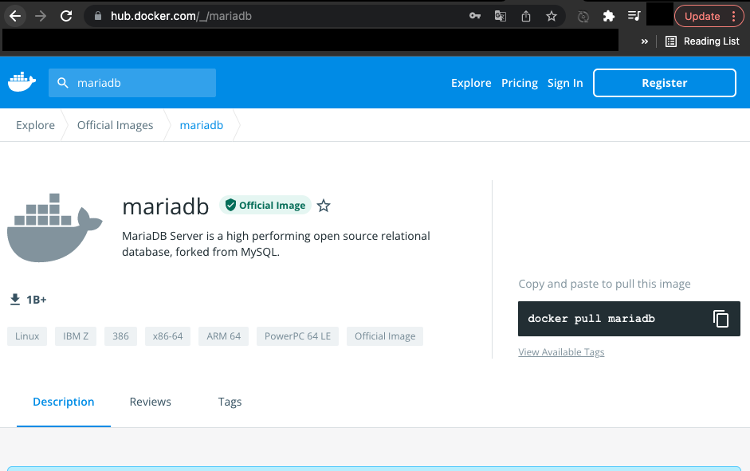

2. 이미지 다운로드(생략 가능)

아래의 커맨드를 입력하여 도커 이미지를 다운로드 한다.
컨테이너를 실행할 때 PC가 없다면 자동으로 다운로드 하지만 이번에는 단계를 나누어 진행한다.

```bash
$ docker pull mariadb
```

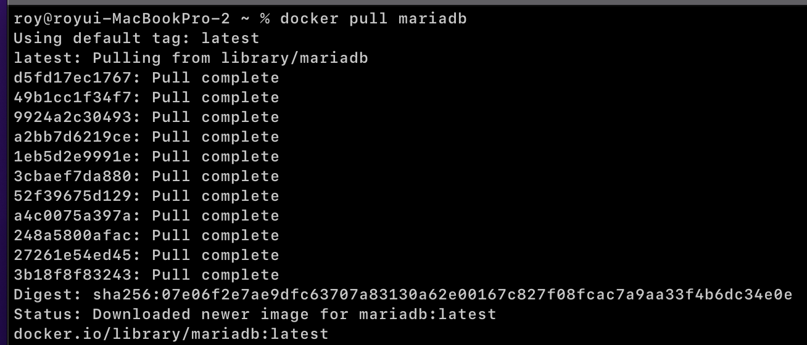

아래의 커맨드를 입력하여 도커 이미지 목록을 확인한다.

```bash
$ docker images
```

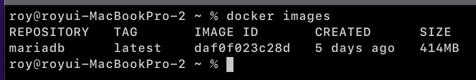

3. 컨테이너 실행

아래의 커맨드를 입력하여 도커 컨테이너를 실행한다.

```bash
$ docker run -d -p 3306:3306 -e MYSQL_ALLOW_EMPTY_PASSWORD=true --name mariadb mariadb
```

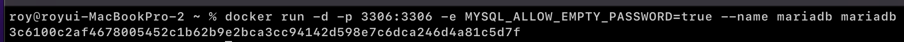

아래의 커맨드를 입력하여 컨테이너 목록을 확인한다.

```bash
$ docker ps
```

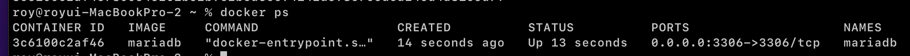

도커를 실행할 때 사용하는 옵션에 대한 정보는 공식 홈페이지나 아래의 이미지를 참고한다.

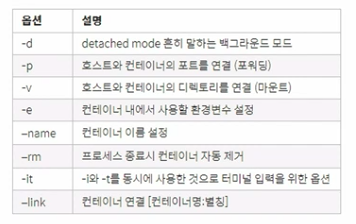

4. 컨테이너 접속 (단순 접속 확인, 실행 과정과 무관)

아래의 커맨드를 입력하여 도커 컨테이너에 접속하여 정상적으로 실행되었는지 DB 클라이언트를 통해 접속해본다.

```bash
$ docker exec -it mariadb bash
```

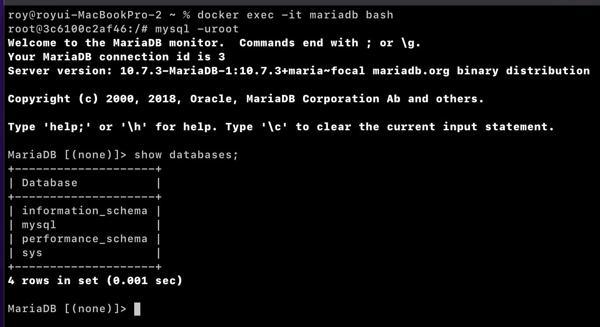

5. 도커 로그 확인 (단순 로그 확인, 실행 과정과 무관)

아래의 커맨드를 실행하여 도커의 로그를 확인해본다.

```bash
$ docker logs -f mariadb
```

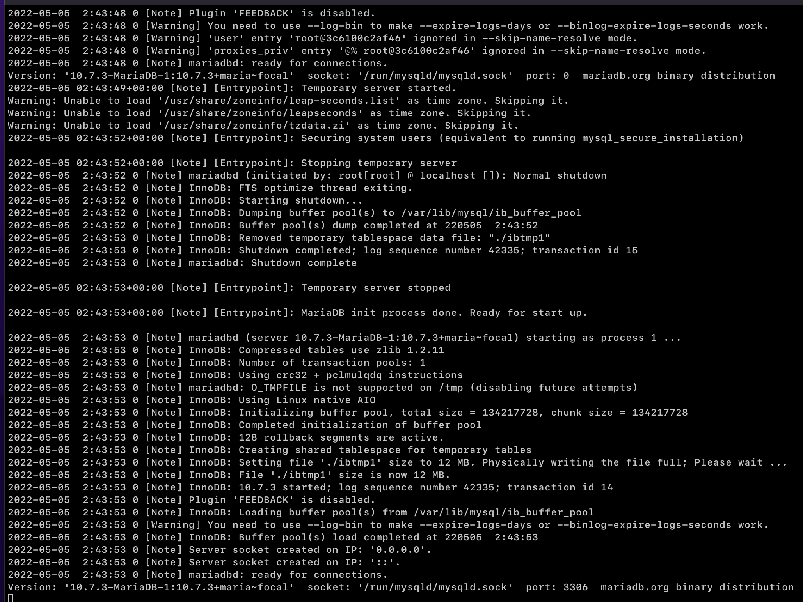

---

### 이미지 생성

우리의 마이크로서비스중 `유저 서비스`를 도커 이미지로 만드는 방법에 대해서 알아본다.

1. Dockerfile 생성

`target` 디렉토리가 있는 경로에 아래와 같이 `Dockerfile`을 생성한다.

```dockerfile
FROM openjdk:17-ea-11-jdk-slim
VOLUME /tmp
COPY build/libs/user-service-1.0.jar UserService.jar
ENTRYPOINT ["java", "-jar", "UserService.jar"]
```

2. jar build

유저 서비스 디렉토리에서 아래의 커맨드를 입력하여 `jar`파일을 생성한다.

```bash
$ gradle build
```

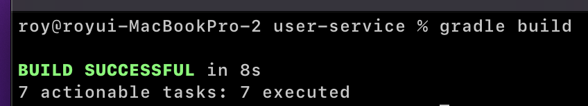

`~/user-service/build/lib` 경로에 `user-service-1.0.jar` 파일이 생성된 것을 확인한다.
여기서 버전 정보는 `build.gradle`에 있는 버전 정보를 따라가므로 설정 정보에 따라 다를 수 있다.

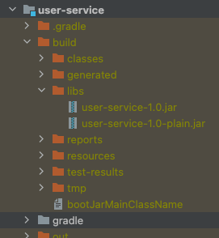

3. docker build

아래의 커맨드를 입력하여 도커 이미지를 생성한다.

```bash
$ docker build --tag roy-msa/user-service:1.0 .
```

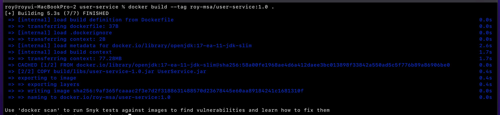

아래의 커맨드를 입력하여 이미지 목록에 우리가 생성한 이미지가 있는지 확인한다.

```bash
$ docker images
```

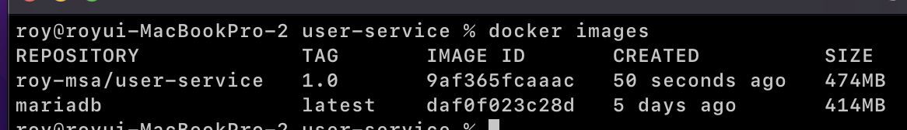

---

이번 장에서는 `docker-hub`에 업로드 되어 있는 `mariadb` 이미지 파일을 다운받아서 실행시키는 방법과 우리의 `유저 서비스`를 도커 이미지로 만들고 실행시키는 방법에 대해서 알아보았다.

---

**참고한 강의:**

- https://www.inflearn.com/course/%EC%8A%A4%ED%94%84%EB%A7%81-%ED%81%B4%EB%9D%BC%EC%9A%B0%EB%93%9C-%EB%A7%88%EC%9D%B4%ED%81%AC%EB%A1%9C%EC%84%9C%EB%B9%84%EC%8A%A4