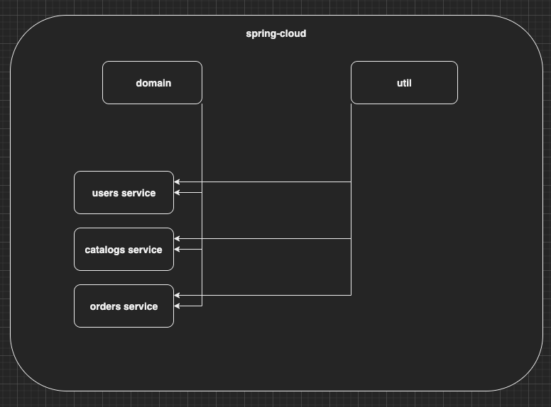
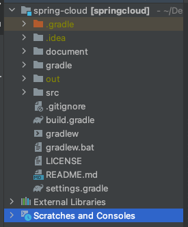
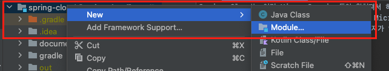
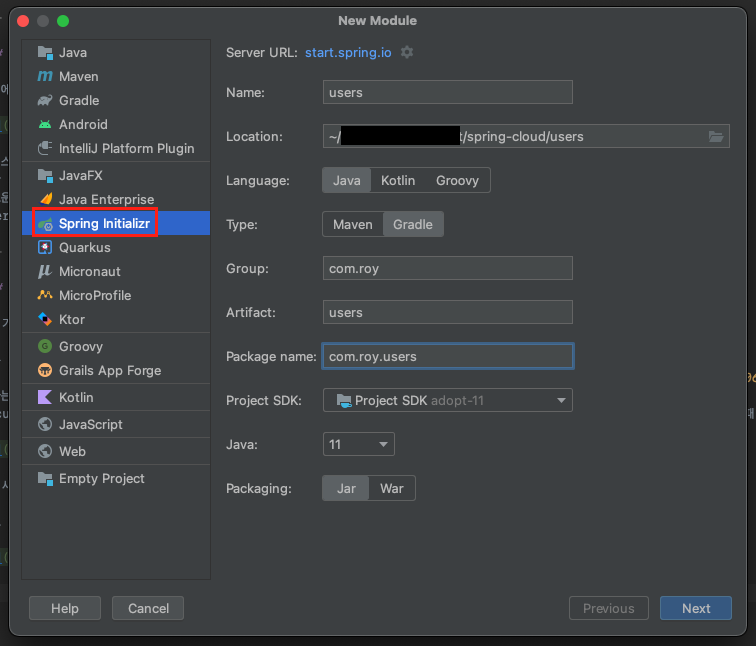
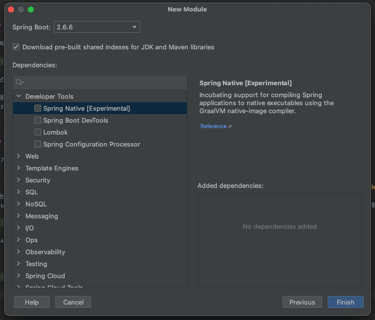
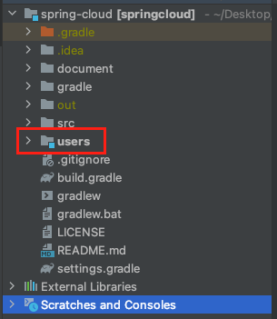
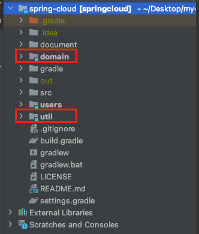
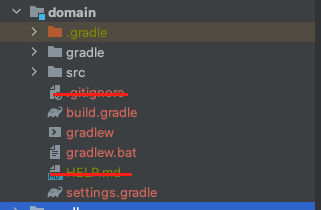
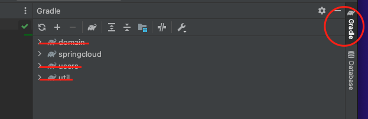
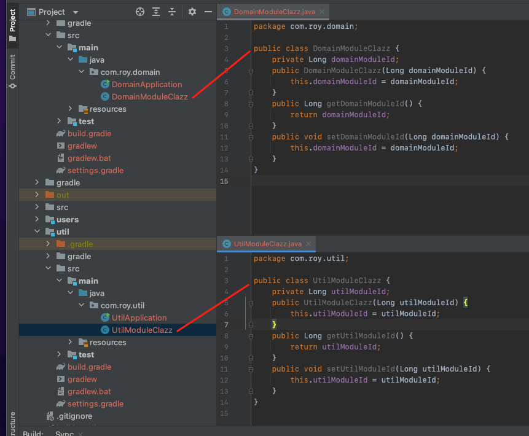

Spring Cloud는 여러 Micro Service들이 합쳐져서 하나의 서비스로 작동한다.
Spring Cloud를 알아보기 전에 이번 장에서는 여러 Micro Service들을 관리하기 위한 Multi Module을 설정하는 방법에 대해서 알아본다.
Multi Module로 프로젝트를 생성하는 방법은 여러가지가 있으며 필자가 주로 사용했던 방법에 대해서 기록도 할겸 작성해본다.

---

### Project Structure

이번에 필자가 구현하고자 하는 Multi Module 프로젝트의 구조는 아래와 같다.



서비스 레이어 모듈들이 공통적으로 사용하는 도메인 정보를 가지고 있는 domain 모듈이 있다.
또한 공통 함수와 같은 공통 처리 로직을 가지고 있는 util 모듈이 있다.
새로운 서비스 레이어 모듈이 추가되면 domain, util 모듈을 사용할 수 있도록 구성한다.
users, orders, catalogs 서비스들은 domain, util 의존성을 가지고 있다.

---

### Multi Module 구성

#### 1. 기본 프로젝트 생성

기본 프로젝트를 생성하는 방법은 [spring initializr](https://start.spring.io)을 통해 쉽게 생성 가능하다.
혹시 스프링 부트가 친숙하지 않다면 이전에 필자가 작성한 [스프링 부트 프로젝트 생성](https://imprint.tistory.com/3?category=1067500) 을 확인하도록 한다.
필자는 기본 프로젝트의 이름을 spring-cloud로 생성하였다. 기본 프로젝트만 생성되었을 때의 구조는 아래와 같다.
document 디렉토리는 필자가 글을 쓰기위하여 따로 추가한 디렉토리이며 이외의 out 디렉토리는 프로젝트가 정상적으로 설정되었는지 실행하였을 때 생성된 디렉토리이다.



#### 2. 새로운 모듈 추가 선택

루트 프로젝트를 우클릭 -> New -> Module을 선택한다.



#### 3. Users 프로젝트 정보 입력

Spring Intializr를 선택하고 필요한 정보를 입력한다.




#### 4. Users 의존성 선택

기본적으로 추가할 의존성을 선택한다.
필자의 경우 추후 수동으로 선택하기 위해 의존성을 선택하지 않았다.



의존성 선택을 마치면 새로운 모듈이 추가될 것이다.



#### 5. 2,3,4 과정을 반복하여 domain과 util 모듈을 추가한다.



#### 6. Root 디렉토리의 build.gradle 파일 수정

sourceCompatibility와 group은 프로젝트를 생성할 때 선택한 자바 버전과 group 명을 입력한다.
Root 디렉토리는 의존성 관리를 하지 않기 때문에 의존성 관련 부분을 전부 제거하였다.

```bash
plugins {
	id 'org.springframework.boot' version '2.6.6'
	id 'io.spring.dependency-management' version '1.0.11.RELEASE'
}

apply plugin: 'java-library'
apply plugin: 'org.springframework.boot'
apply plugin: 'io.spring.dependency-management'

allprojects {
	sourceCompatibility = 11.0

	apply plugin: 'java-library'
	apply plugin: 'org.springframework.boot'
	apply plugin: 'io.spring.dependency-management'

	group = 'com.roy'
	version = '0.0.1-SNAPSHOT'

	repositories {
		mavenLocal()
		mavenCentral()
	}

	jar {
		enabled(false)
	}
}
```

#### 7. Root 디렉토리의 settings.gradle을 수정한다.

우리가 생성한 모듈들을 등록시켜 두었다.

```bash
rootProject.name = 'springcloud'
include("domain")
include("util")
include("users")
```

#### 8. 불필요 파일을 삭제한다.

모듈을 생성하면 기본적으로 .gitignore와 HELP.md 파일이 생성된다.
.gitignore는 루트 디렉토리에서 관리하므로 전부 제거해주도록 한다.
domain 모듈과 users, util 모듈 모두 제거해주도록 한다.



#### 9. gradle 수정

IntelliJ 우측에 gradle 버튼을 누르고 domain, users, util을 지워주도록 한다.
Root 디렉토리의 settings.gradle에 추가했기 때문에 불필요하다.



#### 9. 모듈 내의 build.gradle 수정

수정하기 전에 모든 내용을 지우고 아래의 내용만 추가한다.

domain 프로젝트의 build.gradle을 아래와 같이 수정한다.

```bash
jar {
    enabled = true
    archivesBaseName = 'domain'
}
```

util 프로젝트의 build.gradle을 아래와 같이 수정한다.

```bash
jar {
    enabled = true
    archivesBaseName = 'util'
}
```

#### 10. users 모듈 build.gradle 수정

users가 domain 모듈과 util 모듈의 의존성을 가질 수 있도록 users의 build.gradle을 수정한다.
모든 내용을 지우고 아래의 내용만 추가하도록 한다.
정상적으로 설정이 완료되었는지 확인하기 위해 test를 위한 라이브러리를 추가하였다.

```bash
dependencies {
    implementation(project(":domain"))
    implementation(project(":util"))

    implementation("org.springframework.boot:spring-boot-starter")
    testImplementation("org.springframework.boot:spring-boot-starter-test")
}
```

#### 11. 정상작동 확인

domain과 util 모듈에 테스트를 위한 클래스를 생성한다.
Domain과 Util 모듈은 실행되는 모듈이 아닌 공통 관심사를 모아두는 모듈이므로 실행될 필요는 없다.
DomainApplication과 UtilApplication파일을 삭제해주도록 한다.



users 모듈에 테스트 코드를 작성한다.

```java
class DependencyTest {
    @Test
    @DisplayName("멀티 모듈 정상작동 테스트")
    void multiModuleTest() {
        assertDoesNotThrow(() -> {
            DomainModuleClazz domainModuleClazz = new DomainModuleClazz(1L);
            UtilModuleClazz utilModuleClazz = new UtilModuleClazz(1L);
            assertNotNull(domainModuleClazz);
            assertNotNull(utilModuleClazz);
        });
    }
}
```

Domain 모듈과 Util 모듈의 객체를 생성할 때 예외가 발생하지 않아야하며 생성된 객체는 Null이 아니라는 테스트 코드를 만들었고 결과는 성공이다.

---

지금까지 Multi Module 프로젝트를 생성하는 방법에 대해서 알아보았다.
글이 길어져서 라이브러리 관련된 부분은 작성하지 않았다. 이 부분은 다음 장에서 다루도록 한다.

---

**참고한 자료**
- https://techblog.woowahan.com/2637/