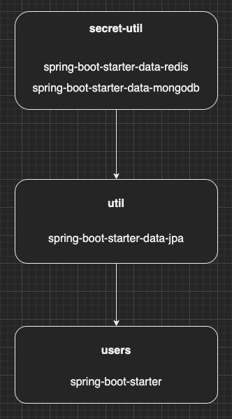
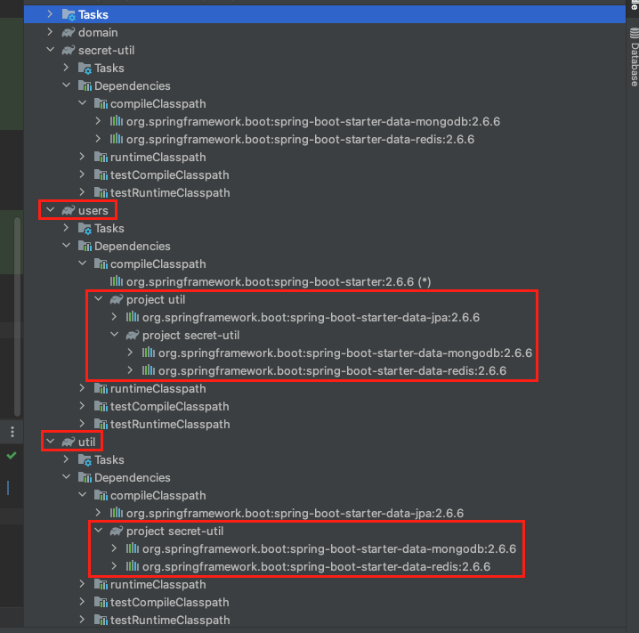
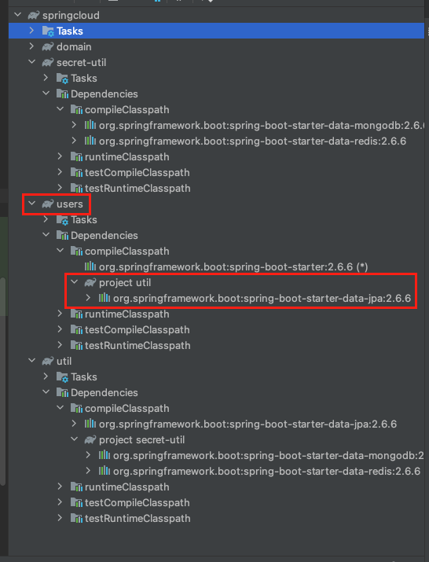
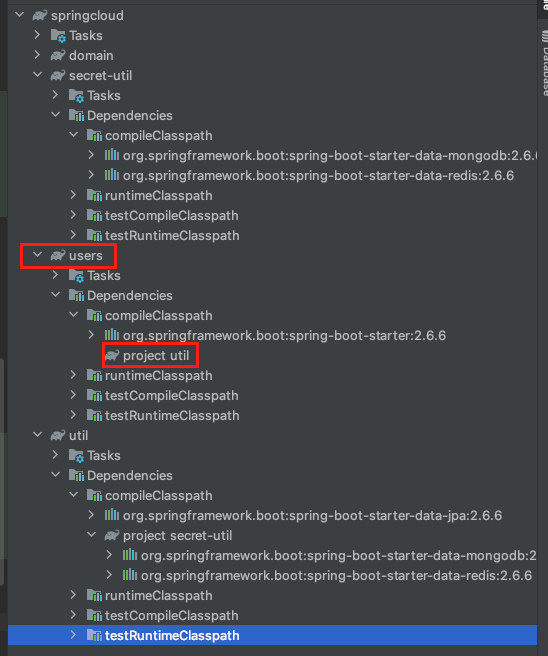

[이전 장(링크)](https://imprint.tistory.com/206)에서는 멀티 모듈 프로젝트를 구성하는 방법에 대해서 알아보았다.
실제로 현업에서 프로젝트를 진행하다보면 생각보다 복잡한 의존관계를 많이 접하게 된다.
모듈에 라이브러리를 추가하고 의존관계를 어떻게 설정해야하는지 알아보도록 한다.

---

예시를 위해서 이전 장에는 없던 secret-util을 추가했고 module간의 관계는 아래와 같다.



secret-util은 data-redis, data-mongodb 라이브러리의 의존성을 가지고 있다.
util은 secret-util을 의존하고 있으며 data-jpa 라이브러리의 의존성을 가지고 있다.
users는 util 모듈에 의존하고 있으며 spring-boot-starter 라이브러리의 의존성을 가지고 있다.

각 모듈들의 build.gradle은 아래와 같다.

**Secret Util**
```bash
jar {
    enabled = true
    archivesBaseName = 'secret-util'
}

dependencies {
    api("org.springframework.boot:spring-boot-starter-data-redis")
    api("org.springframework.boot:spring-boot-starter-data-mongodb")
}
```

**Util**
```bash
jar {
    enabled = true
    archivesBaseName = 'util'
}
dependencies {
    api(project(":secret-util"))
    api("org.springframework.boot:spring-boot-starter-data-jpa")
}
```

**Users**
```bash
dependencies {
    api(project(":util"))
    api("org.springframework.boot:spring-boot-starter")
    testImplementation("org.springframework.boot:spring-boot-starter-test")
}
```

이렇게 의존관계를 설정하면 Util 모듈은 Secret-Util 모듈이 의존하고 있는 data-mongodb, data-redis 라이브러리에 의존하게 된다.
Users 모듈은 Secret-Util 모듈이 의존하고 있는 data-mongodb, data-redis와 Util 모듈이 의존하고 있는 data-jpa 모듈 모두에 의존하게 된다.



이러한 구조는 좋은 구조라고 볼 수 없다.
1. Users모듈은 Utils모듈이 의존하고 있는 Secret-Util모듈의 존재를 알고 있다.
2. Users모듈은 Utils모듈이 의존하고 있는 data-jpa 라이브러리에 의존하고 있다.
1번 문제부터 하나씩 해결해본다.

의존관계를 변경하기 위해서는 gradle의 api와 implementation에 대해서 알아야한다.
**api**는 java의 public 접근제한자와 유사하게 제약없이 접근이 가능하다.
하지만 **implementation**의 경우 하위 의존 관계를 숨겨주어 접근이 불가능하도록 만들어준다.

Util의 build.gradle을 아래와 같이 수정하여 1번 문제를 해결해본다.
secret-util을 사용할 때 api대신 implementation을 사용하였다.

```bash
jar {
    enabled = true
    archivesBaseName = 'util'
}
dependencies {
    implementation(project(":secret-util"))
    api("org.springframework.boot:spring-boot-starter-data-jpa")
}
```

이렇게 수정하면서 Utils는 자신을 의존하는 모듈들에게 자신이 Secret-Utils를 의존하고 있다는 사실을 숨기게 된다.



Users모듈은 Util모듈이 Secret-Module에 의존하고 있는 것을 알지못하며 Secret-Module이 의존하고 있는 라이브러리에도 의존하지 않는다.

2번 문제를 해결하기 위해 Util의 build.gradle을 다시 한 번 수정한다.

```bash
jar {
    enabled = true
    archivesBaseName = 'util'
}
dependencies {
    implementation(project(":secret-util"))
    implementation("org.springframework.boot:spring-boot-starter-data-jpa")
}
```



이제 Users모듈은 Util모듈을 의존하고 있지만 Util모듈이 의존하고 있는 라이브러리에는 의존하지 않는다.

---

#### 번외

Util의 build.gradle를 수정하지않고 Users가 필요없는 라이브러리에 대한 의존성만 빼고 의존하려면 어떻게 수정해야할까
다시 2번 문제가 발생하도록 Util의 build.gradle을 롤백한다.

```bash
jar {
    enabled = true
    archivesBaseName = 'util'
}
dependencies {
    implementation(project(":secret-util"))
    api("org.springframework.boot:spring-boot-starter-data-jpa")
}
```

Users의 build.gradle을 아래와 같이 수정한다.

```bash
dependencies {
    api(project(":util")) {
      exclude module: "org.springframework.boot:spring-boot-starter-data-jpa"
    }
    api("org.springframework.boot:spring-boot-starter")
    testImplementation("org.springframework.boot:spring-boot-starter-test")
}
```

이러한 방식으로 모듈을 사용하는 쪽에서 필요없는 모듈을 제외하고 선택적으로 사용 가능하다.

---

**참고한 자료**
- https://techblog.woowahan.com/2637/