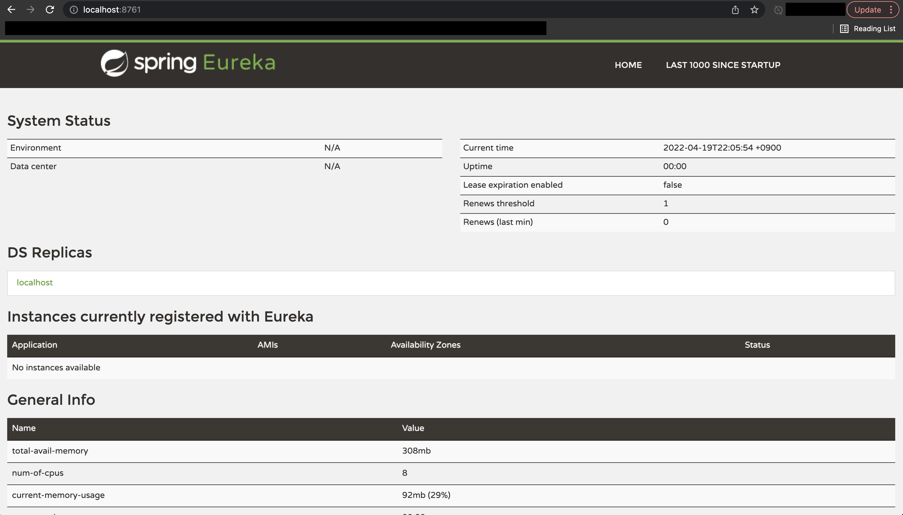

이번 장에서는 [Spring Cloud Netflix Eureka - 이론](https://imprint.tistory.com/212?category=1069520) 에 이어 직접 디스커버리(유레카) 서버를 구축해본다.
모든 소스 코드는 [깃허브 (링크)](https://github.com/roy-zz/spring-cloud) 에 올려두었다.

---

### 기본 프로젝트 구성

마이크로서비스의 특성상 한 번에 많은 프로젝트를 실행시켜야한다.
수많은 프로젝트를 위해 IDE를 여러개 실행시키기에는 무리가 있으므로 멀티 모듈로 구성하여 진행하도록 한다.
멀티 모듈 프로젝트 구성은 필자가 이전에 [작성해놓은 글 (링크)](https://imprint.tistory.com/206?category=1069520) 를 참고하도록 한다.

---

**1. 의존성 추가**

유레카 서버를 구축하기 위해 필요한 의존성이므로 전부 추가하도록 한다.

```bash
ext {
    set('springCloudVersion', "2021.0.1")
}

dependencies {
    implementation 'org.springframework.cloud:spring-cloud-starter-netflix-eureka-server'
    testImplementation 'org.springframework.boot:spring-boot-starter-test'
}

dependencyManagement {
    imports {
        mavenBom "org.springframework.cloud:spring-cloud-dependencies:${springCloudVersion}"
    }
}
```

**2. MainClass 수정**

main 메서드가 있는 클래스에 @EnableEurekaServer 애노테이션을 작성해준다.

```java
@EnableEurekaServer
@SpringBootApplication
public class DiscoveryApplication {
    public static void main(String[] args) {
        SpringApplication.run(DiscoveryApplication.class, args);
    }
}
```

**3. application.yml 수정**

서버가 사용할 포트를 8761로 지정하였다.
애플리케이션의 이름을 discovery로 지정하였다.
eureka.client.register-with-eureka와 eureka.client.fetch-registry는 기본값이 true다.
유레카 서버의 경우 두 기능이 필요없으므로 false 처리한다.

```yaml
server:
  port: 8761

spring:
  application:
    name: discovery

eureka:
  client:
    register-with-eureka: false
    fetch-registry: false
```

**4. 정상작동 확인**

애플리케이션을 실행시키고 브라우저로 이동하여 localhost:8761으로 접속한다.
아래의 이미지와 같은 화면이 나온다면 정상적으로 유레카 서버 구축이 완료된 것이다.



---

참고한 강의: https://www.inflearn.com/course/%EC%8A%A4%ED%94%84%EB%A7%81-%ED%81%B4%EB%9D%BC%EC%9A%B0%EB%93%9C-%EB%A7%88%EC%9D%B4%ED%81%AC%EB%A1%9C%EC%84%9C%EB%B9%84%EC%8A%A4