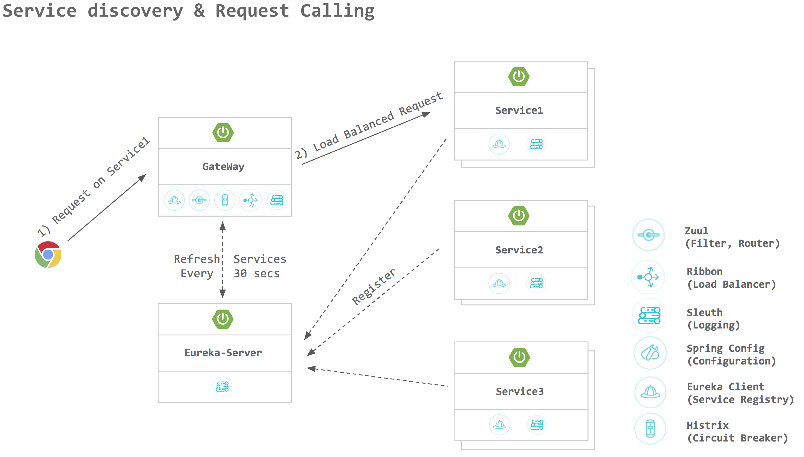

이번 장에서는 Spring Cloud Netflix Eureka(이하 유레카)에 대해서 알아보고 직접 유레카 서버를 구축해본다.

### Spring Cloud Netflix Eureka

마이크로서비스 아키텍처에서 유레카란 client-side service discovery라고 할 수 있다.
시스템은 트래픽에 따라 동적으로 늘어날 수도 줄어들 수도 있다. 
이러한 환경에서 서비스의 host와 port가 동적으로 변하더라도 서비스 인스턴스를 호출할 수 있도록 해주는 Service Registry를 제공 및 관리해준다.

#### 설계 목적

유레카는 middle-tier load balancer로 정의된다.
middle-tier load balancer는 로드밸런싱과 장애복구(failover)가 가능한 middle-tier 서비스 환경을 구성 했을 때 클라이언트(추후에 살펴볼 API Gateway 또는 서비스간 통신)에게 사용 가능한 서비스의 위치 정보를 동적으로 제공할 수 있어야 한다.
전통적인 로드밸런싱의 경우 서비스의 위치가 고정되어 있었지만 AWS와 같은 클라우드 환경에서는 서버의 위치가 동적으로 변동되기 때문에 개발자가 직접 이를 컨트롤 하기는 쉽지 않다.
AWS에서는 middle-tier load balancer를 제공하지 않기 때문에 유레카는 더 많은 관심을 받고 있다.

#### 잘 설계된 유레카 서버 구조

AWS 기준으로 가용지역마다 유레카 서버가 복제되어 있다.
서버가 복제되어 있기 때문에 일부 유레카 서버가 중지되더라도 서비스 전체가 중지되는 현상은 발생하지 않는다.

#### 용어 정리

**Eureka 행동 및 구성 요소**

* Service Registration: Client(마이크로서비스)가 자신의 정보를 유레카에 등록하는 행동을 의미한다.

* Service Registry: Client의 정보들(목록, 가용 Client의 위치)을 저장하는 위치를 의미한다.

* Service Discovery: 클라이언트가 Service Registry에서 요청을 보내야하는 대상을 찾는 과정을 의미한다.

* Eureka Client: 다른 서비스의 위치 정보를 알아내기 위해 유레카 서버에 질의하는 서비스를 말한다.
                 유레카 입장에서는 자신에게 등록되어 있는 서비스를 소비하는 입장(정확히는 사용)이기 때문에 Service Consumer로 볼 수 있다.

* Eureka Service: 유레카 Client가 요청하였을 때 발견의 대상이 되는 서비스 즉, 유레카에 등록되어 있는 Service라고 볼 수 있다. 
                  유레카 입장에서는 서비스를 제공(자신에게 등록)하는 입장이기 때문에 Service Provider로 볼 수 있다.

* Eureka Server: 유레카 서비스가 자기 자신을 등록(Service Registration)하고 Eureka Client가 Eureka Service를 찾기 위해 가용 서비스 목록(Service Registry)를 요청하는 서버다.

* Eureka Instance: 유레카에 등록되어 Service Registry에서 조회 가능한 Eureka Service를 의미한다.

* Renew:
  * Client는 유레카에 등록된 이후 설정된 주기마다 heartbeat를 전송하여 자신의 존재를 알린다. (eureka.instance.lease-renewal-interval-in-seconds(default: 30))
  * 유레카 서버는 설정된 시간동안 heartbeat를 받지 못하면 heartbeat를 전송하지 않은 Eureka Instance를 Service Registry에서 제거한다. (eureka.instance.lease-expiration-duration-in-seconds(default: 90))
  * Renew Interval은 서버 내부적으로 유레카 클라이언트를 관리하는 로직이 있기 때문에 변경하는 것을 권장하지 않는다.

* Fetch Registry: Client는 Server로 부터 Service Registry 정보를 가져와서 로컬 캐시로 저장해두고 일정 주기마다 업데이트 한다. (eureka.client.registryFetchIntervalSeconds(default: 30))

* Cancel: Client가 종료될 때 유레카 서버로 Cancel 요청을 보내서 Service Registry에서 즉시 제거되도록 한다.

* Time Lag: 유레카 서버의 Service Registry가 변경되어도 Client가 새로 Fetch 하기 전까지는 데이터의 차이가 있을 수 있다. 이러한 차이를 Time Lag라고 부른다.

---

#### Peering

여러대의 유레카 서버를 사용하면 서로 통신할 수 있도록 구성해야하는데 이것을 Peering 구성이라고 한다.
여러대의 유레카 서버는 설정에 정의되어 있는 Peering 노드를 찾아서 Service Registry 정보의 Sync를 맞춘다.

* eureka.client.register-with-eureka: Peering을 사용할 것인지 Standalone으로 구성할 것인지 설정한다.
* eureka.server.registry-sync-retrires: Peering된 노드로부터 registry를 갱신할 수 없을 때 재시도할 횟수를 지정한다.
* eureka.server.wait-time-in-ms-when-sync-empty: Peering된 노드로 부터 service registry의 정보를 갱신할 수 없을 때 대기하는 시간을 지정한다.

---

#### Self-Preservation Mode(자가보존모드)

유레카 서버는 Service Registry에 등록된 유레카 인스턴스로 부터 주기적으로 Heartbeat를 전송받는다.
만약 Heartbeat를 받을 수 없는 경우 일반적으로 Service Registry에서 인스턴스를 제거한다.
유레카 인스턴스가 요청을 처리할 수는 있지만 단순 Heartbeat를 전송하지 못하는 상황을 대비하여 self-preservation을 사용하여 registry에서 문제된 인스턴스를 지정한 시간동안 제거하지 않을 수 있다.

EvictionTask가 매분 예상한 Heartbeats수와 실제 Heartbeats의 수를 비교하여 self-preservation모드의 여부를 결정한다.
eureka.server.eviction-interval-timer-in-ms(default: 60 * 1000)

* Expected heartbeats updating scheduler: 기본적으로 매 15분(renewal-threshold-update-interval-ms)마다 수행되며 preservation mode로 가기위한 임계값을 계산한다.
예를 들어 인스턴스의 개수가 N이고 renewal-percent-threshold값이 0.85이면 계산식은 아래와 같다.

최소 1분 이내에 받아야 할 heartbeat의 총 수는 2(분당 2번의 heartbeat) * N * 0.85

---

### Eureka Client와 Eureka Server간 Communication

* Self-Identification & Registration
  * Instance 실행 시점
    * eureka.instance/client 설정값으로 Server Registry에 등록하기 위한 Eureka Instance 정보를 생성한다.
    * Heartbeat Scheduler를 통해 Eureka Server에 heartbeat를 전송한다.
    * Server Registry에 Instance 정보를 등록한다.
  * 등록 결과 확인
    * 유레카 접속주소/eureka/apps의 경로에서 Service Registry에 등록되어 있는 인스턴스의 정보를 확인할 수 있다.
    * Eureka Instance가 요청을 처리할 준비가 되면 Status가 STARTING에서 UP으로 변경된다.
  * 등록 이후 Heartbeat 전송
    * eureka.instance.lease-renewal-interval-in-seconds(Default: 30)에 설정된 주기마다 스케쥴러가 작동하여 Heartbeat를 실행한다.
    * Eureka Server는 Heartbeat의 전송 주기에 따라 Service의 Status를 판단한다. 
      만약 마지막 Heartbeat 이후에 전송 시점이 되어도 Heartbeat를 받지 못한다면 eureka.instance.lease-expiration-duration-in-seconds에 설정된 시간만큼 대기하고 해당 인스턴스를 Registry에서 제거한다.
  * Instance Info Replication
    * Instance 등록 이후 정보가 변경되면 Service Registry의 정보를 갱신하기 위한 API를 eureka.client.instance-info-replication-interval-seconds에 설정된 주기마다 호출한다.
  * Eureka server info refresh
    * Eureka Client는 eureka.client.eureka-service-url-poll-interval-seconds에 설정된 시간마다 Eureka Server의 상태를 갱신한다.

* Service Discovery(Gateway)
  * Instance 실행 및 등록 시점에 Eureka Server로 부터 Service Registry를 fetch 한다.
  * Instance 등록 이후 eureka.client.registry-fetch-interval-seconds(default: 30)에 설정된 주기마다 로컬에 저장되어 있는 Registry의 정보를 갱신한다.

---

### Peering 구성되어 있는 Eureka Server Node간의 통신

* Self-Identification & Registration
  * Instance 실행 시점
    * Peering node를 찾아서 Service Registry의 Sync를 맞추는 작업을 한다.
    * eureka.server.registry-sync-retrires 값을 통해 Peering node의 Service Registry 정보를 얻기 위한 재시도 횟수를 조정할 수 있다.
    * eureka.server.wait-time-in-ms-when-sync-empty 값을 통해 Peering node로 부터 Service Registry 정보를 얻기 위해 얼마나 대기할 것인지 조정할 수 있따.
    * Eureka Server 또한 Eureka Client이기 때문에 동일한 방식으로 작동한다.

---

지금까지 Spring Cloud Netflix Eureka에 대해서 알아보았다.
다음 장에서는 직접 유레카 서버를 구축하는 방법에 대해서 알아본다.

Spring Cloud Netflix Eureka에 대한 설명의 아래의 글을 재해석 하였음.

**참고한 자료:** 
- https://coe.gitbook.io/guide/service-discovery/eureka
- https://coe.gitbook.io/guide/service-discovery/eureka_2