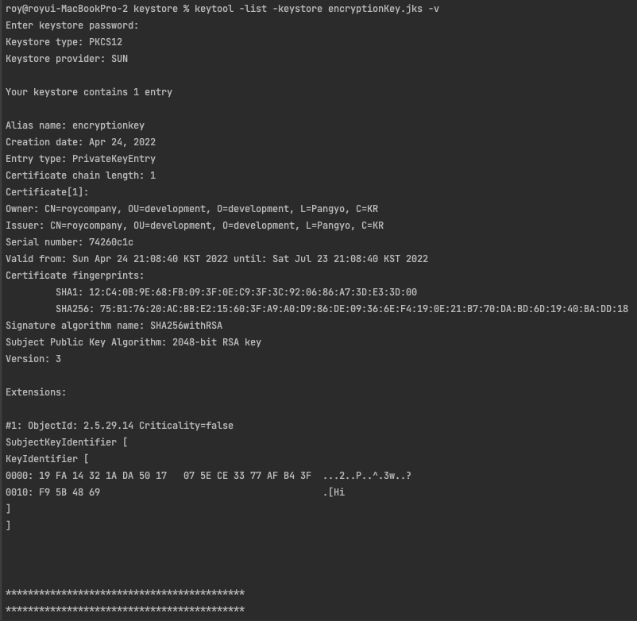

[이전 장 (링크)](https://imprint.tistory.com/224) 에서는 대칭키를 통해서 Config 서버의 정보를 암호화하는 방식에 대해서 알아보았다.
이번 장에서는 Config 서버의 정보를 비대칭키를 사용하여 암호화하는 방식에 대해서 알아본다.
모든 소스 코드는 [깃허브 (링크)](https://github.com/roy-zz/spring-cloud) 에 올려두었다.

---

### Asymmetric Encryption (비대칭키)

#### 적용 및 테스트

1. Key를 저장할 디렉토리 생성

필자는 Config 서버의 resource 디렉토리에 생성하였다.


2. 비대칭키 생성

1단계에서 생성한 디렉토리로 이동하여 아래의 커맨드를 입력하여 키를 생성한다.
- CN: Company Name
- OU: Organization Unit
- O: Organization
- L: Location
- C: Country

```bash
$ keytool -genkeypair -alias encryptionKey -keyalg RSA -dname "CN=roycompany, OU=development, O=development, L=Pangyo, C=KR" \
  -keypass "1q2w3e4r" -keystore encryptionKey.jks -storepass "1q2w3e4r"
```


3. Config 서버 bootstrap.yml 파일 수정

Config 서버에서 생성된 key 파일을 참조 할 수 있도록 bootstrap.yml 파일을 수정한다.
classpath는 src/main/resources/ 를 의미한다.

```yaml
encrypt:
  key-store:
    location: classpath:keystore/encryptionKey.jks
    password: 1q2w3e4r
    alias: encryptionKey
```

4. 암호화 테스트

Postman을 사용하여 Config 서버의 encrypt API를 호출한다.
대칭키를 통한 암호화보다 훨씬 길어진 암호화된 비밀번호를 확인할 수 있다.


5. 복호화 테스트

decrypt API를 호출하여 정상적으로 복호화가 되는지 확인한다.


---

#### User Service 적용

유저 서비스의 application.yml 파일에서 DB 접속 정보를 Config 용 원격 깃 저장소의 yml 파일로 옮기는 과정은 [이전 장(링크)](https://imprint.tistory.com/224) 에서 다루었으므로 생략한다.
혹시라도 분리되어 있지 않다면 대칭키 암호화를 다루었던 이전 장을 먼저 확인하고 다시 이 글로 돌아오는 것을 추천한다.

1. Config 용 원격 깃 저장소 수정

encrypt API를 호출하여 암호화된 문자열을 DB 접속정보 중 비밀번호 부분에 입력한다.
이때 비밀번호는 암호화된 비밀번호로 변경하고 암호화된 비밀번호임을 표시하기 위해 비밀번호 앞에 {cipher}라는 접두사를 붙인다.


변경된 설정 정보를 원격 저장소로 Push하고 [Spring Cloud Bus(링크)](https://imprint.tistory.com/223?category=1069520) 를 사용하여 서버에 반영한다.

2. 정상 반영 확인

- Config 서버를 통한 확인
  localhost:8888/user/default 로 접속하여 정상적으로 복호화(decrypt)되는지 확인해본다.


- 유저 서비스에서 API로 확인
  health-check API를 아래와 같이 DB 설정 정보를 반환하도록 수정한다


정상적으로 반영된 것을 확인할 수 있다.

---

#### Keytool 살펴보기

우리는 keytool을 사용하여 비대칭 암호화 키를 생성하였다.
몇가지 기능들을 추가로 알아보도록 한다.

1. 키 상세정보 보기

아래의 커맨드를 입력하면 비밀번호를 입력하라는 문구가 출력된다.
키를 생성할 때 입력한 비밀번호를 입력하면 된다.

```bash
$ keytool -list -keystore encryptKey.jks -v
```



2. 공개 인증서 생성

아래의 커맨드를 입력하면 키 상세정보 보기와 동일하게 비밀번호 입력하라는 문구가 출력된다.
키를 생성할 때 입력한 비밀번호를 입력한다.

```bash
$ keytool -export -alias encryptionKey -keystore encryptionKey.jks -rfc -file trustServer.cer
```


3. 공개 인증서로 공개키 생성

아래의 커맨드를 입력하여 공개 인증서를 통해서 공개키를 생성한다.

```bash
$ keytool -import -alias trustServer -file trustServer.cer -keystore publicEncryptionKey.jks
```

비밀번호 입력과 새로운 비밀번호 입력하라고 나오면 키를 생성할 때 입력한 비밀번호를 입력한다.
비밀번호가 정상적으로 입력되면 인증서를 신뢰하냐는 질문(Trust this certificate)이 나오는데 `yes`를 입력해준다.


4. 공개 키와 비공개키 비교

아래의 두 개의 커맨드를 입력하여 공개 키와 비공개 키의 내용을 확인해본다.

```bash
$ keytool -list -keystore encryptionKey.jks
$ keytool -list -keystore publicEncryptionKey.jks 
```


우리가 비대칭키로 Config 서버를 구축할 때 공개키는 사용하지 않았지만 만약 우리 서버에서 만든 키를 외부 서비스에서 복호화 해야한다면 지금처럼 생성된 공개키를 제공해야한다.

---

**참고한 강의**:

- https://www.inflearn.com/course/%EC%8A%A4%ED%94%84%EB%A7%81-%ED%81%B4%EB%9D%BC%EC%9A%B0%EB%93%9C-%EB%A7%88%EC%9D%B4%ED%81%AC%EB%A1%9C%EC%84%9C%EB%B9%84%EC%8A%A4