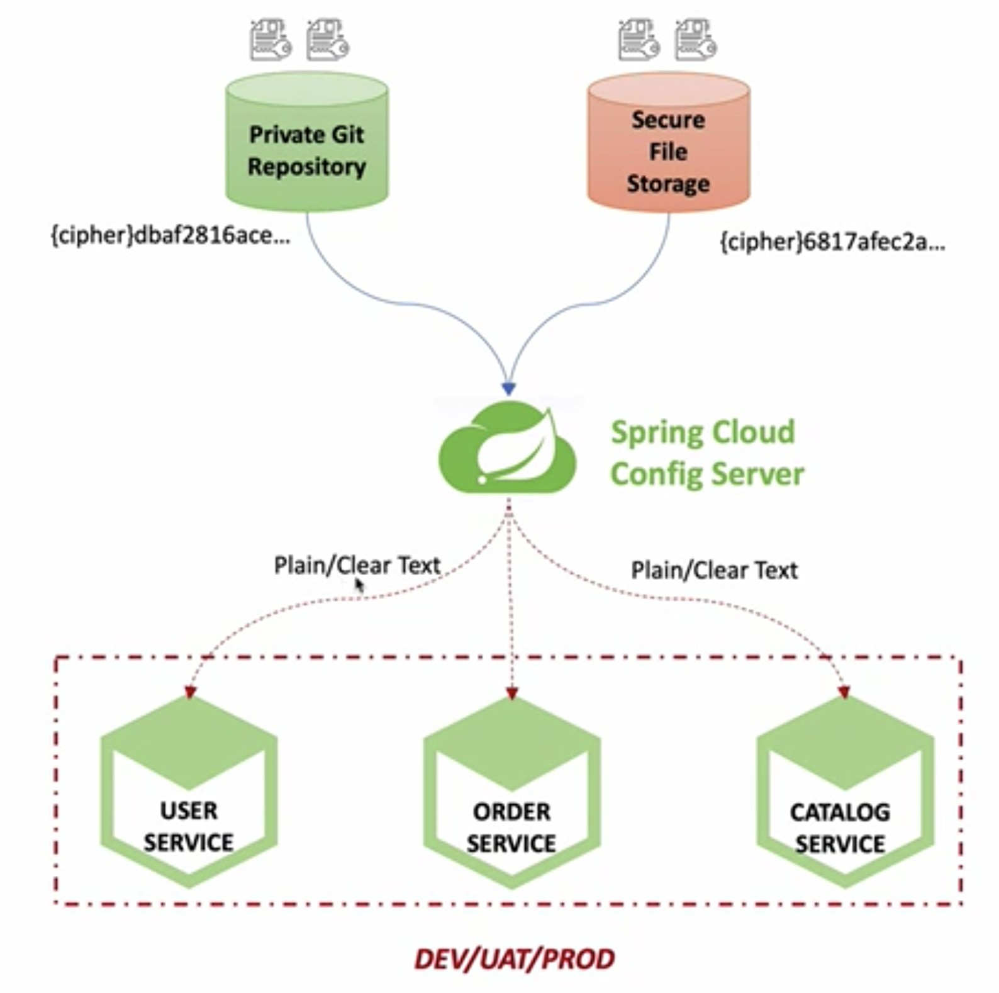
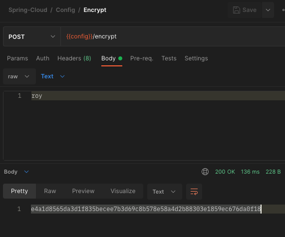
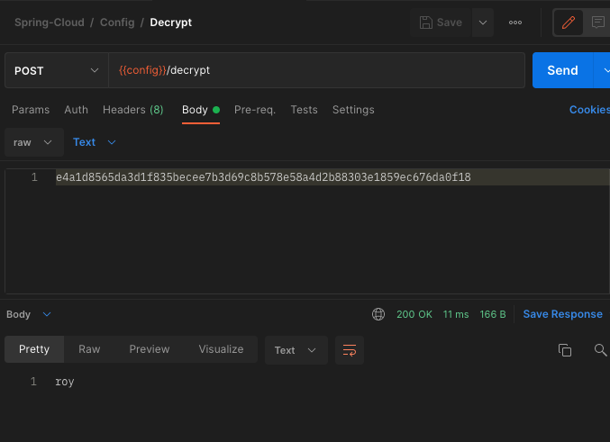

이번 장에서는 대칭키와 비대칭키를 통한 암호화에 대해서 알아본다.
모든 소스 코드는 [깃허브 (링크)](https://github.com/roy-zz/spring-cloud) 에 올려두었다.

---

### 개요

우리는 [이전 장](https://imprint.tistory.com/221?category=1069520) Spring Cloud Config를 구축하는 방법에 대해서 알아보았다.
여기서 우리가 생각해야하는 부분은 Config 서버가 참조하는 설정 정보가 Config 서버와 같은 사설망에 있다면 큰 문제가 되지 않지만 외부에 있는 경우를 보안적인 측면을 생각해보아야 한다.
대부분의 설정 파일에는 데이터베이스 접속 정보, 메시지 큐 접속정보 등이 포함되어 있다. 
이렇게 민감한 정보들이 원격 깃 저장소와 같은 곳에 저장되어 있다고 가정할 때 암호화 없이 설정정보를 읽고 쓰는 것은 상당히 위험한 일이다.

이번 장에서는 설정 정보를 암호화하여 저장하고 사용하는 시점에 복호화하여 사용하는 방법에 대해서 알아본다.



암호화에는 크게 두가지 방식이 있다.

- Symmetric Encryption (Shared): 대칭키 암호화 방식으로 암호화할 때 사용하는 키와 복호화할 때 사용하는 키가 동일한 방식이다.
- Asymmetric Encryption (RSA Keypair): 비대칭키 암호화 방식으로 암호화할 때 사용하는 키와 복호화할 때 사용하는 키가 동일하지 않은 방식이다. 
Private Key와 Public Key가 있으며 이름과 다르게 암호화할 때 사용하는 키와 복호화할 때 사용하는 키가 나누어져 있지는 않고 암호화할 때 Private Key를 사용하였으면 복호화할 때는 다른 키인 Public Key를 사용하면 된다.
일반적으로 암호화할 때 Private Key를 사용하고 복호화할 때 Public Key를 사용한다. 우리는 비대칭 암호화키를 만들기 위해서 Java의 Keytool 을 사용할 것이다.

---

### Symmetric Encryption (대칭키 암호화)

#### 적용 및 테스트

1. Config Server에 의존성 추가

bootstrap.yml 파일을 사용하기 위해 build.gradle 의존성을 추가한다

```bash
implementation 'org.springframework.cloud:spring-cloud-starter-bootstrap'
```

2. bootstrap.yml파일을 생성한다.

application.yml 파일이 위치한 곳에 bootstrap.yml 파일을 생성하고 아래와 같이 원하는 암호화 키를 입력한다.

```yaml
encrypt:
  key: secretkey123456789
```

3. 암호화 테스트

아래의 주소와 같이 원하는 텍스트를 입력하고 Config 서버의 주소에 encrypt API를 호출하여 정상적으로 암호화 되는지 확인한다.



다시 한 번 정리하면 2번 단계에서 적어 놓은 키는 암호화를 할 때 사용하는 키이며 3번 단계에서 API의 응답 값은 roy라는 문자열을 2번 단계에서 지정한 암호화 키로 암호화를 한 결과다.

4. 복호화 테스트

3번 단계에서 생성한 암호화된 문자열을 Body에 넣어서 Config 서버의 decrypt API를 호출해본다.



정상적으로 roy로 복호화 되는 것을 확인할 수 있다.

---

#### User Service 적용
