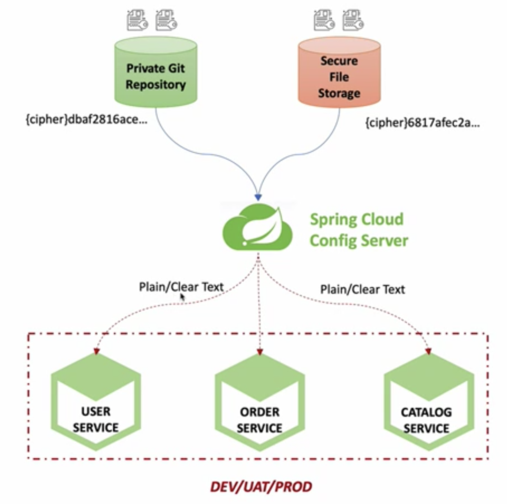
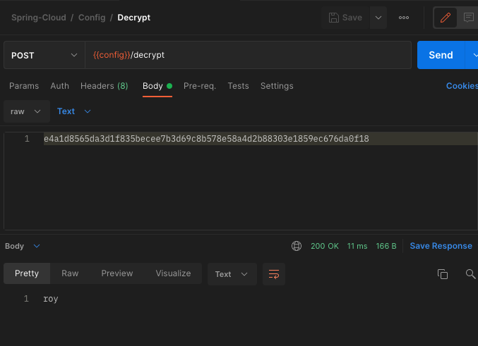
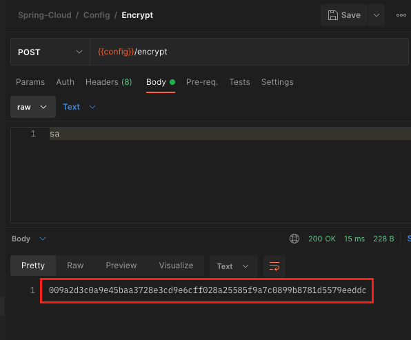
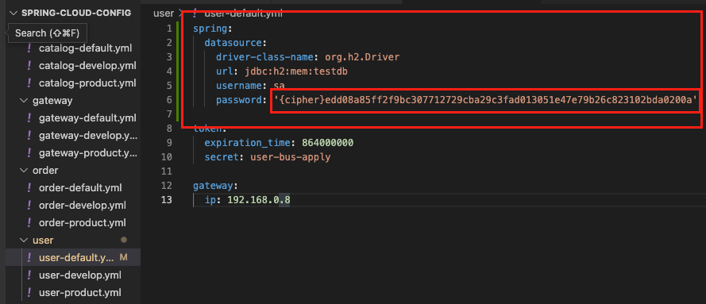
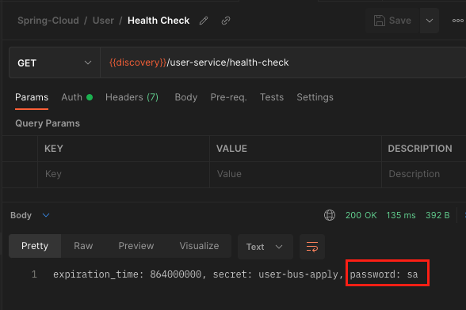

이번 장에서는 Config 서버의 정보를 대칭키를 사용하여 암호화하는 방식에 대해서 알아본다.
모든 소스 코드는 [깃허브 (링크)](https://github.com/roy-zz/spring-cloud) 에 올려두었다.

---

### 개요

우리는 [이전 장](https://imprint.tistory.com/221?category=1069520) Spring Cloud Config를 구축하는 방법에 대해서 알아보았다.
여기서 우리가 생각해야하는 부분은 Config 서버가 참조하는 설정 정보가 Config 서버와 같은 사설망에 있다면 큰 문제가 되지 않지만 외부에 있는 경우를 보안적인 측면을 생각해보아야 한다.
대부분의 설정 파일에는 데이터베이스 접속 정보, 메시지 큐 접속정보 등이 포함되어 있다. 
이렇게 민감한 정보들이 원격 깃 저장소와 같은 곳에 저장되어 있다고 가정할 때 암호화 없이 설정정보를 읽고 쓰는 것은 상당히 위험한 일이다.

이번 장에서는 설정 정보를 암호화하여 저장하고 사용하는 시점에 복호화하여 사용하는 방법에 대해서 알아본다.



암호화에는 크게 두가지 방식이 있다.

- Symmetric Encryption (Shared): 대칭키 암호화 방식으로 암호화할 때 사용하는 키와 복호화할 때 사용하는 키가 동일한 방식이다.
- Asymmetric Encryption (RSA Keypair): 비대칭키 암호화 방식으로 암호화할 때 사용하는 키와 복호화할 때 사용하는 키가 동일하지 않은 방식이다. 
Private Key와 Public Key가 있으며 이름과 다르게 암호화할 때 사용하는 키와 복호화할 때 사용하는 키가 나누어져 있지는 않고 암호화할 때 Private Key를 사용하였으면 복호화할 때는 다른 키인 Public Key를 사용하면 된다.
일반적으로 암호화할 때 Private Key를 사용하고 복호화할 때 Public Key를 사용한다. 우리는 비대칭 암호화키를 만들기 위해서 Java의 Keytool 을 사용할 것이다.

---

### Symmetric Encryption (대칭키 암호화)

#### 적용 및 테스트

1. Config Server에 의존성 추가

bootstrap.yml 파일을 사용하기 위해 build.gradle 의존성을 추가한다

```bash
implementation 'org.springframework.cloud:spring-cloud-starter-bootstrap'
```

2. bootstrap.yml파일을 생성한다.

application.yml 파일이 위치한 곳에 bootstrap.yml 파일을 생성하고 아래와 같이 원하는 암호화 키를 입력한다.

```yaml
encrypt:
  key: secretkey123456789
```

3. 암호화 테스트

아래의 주소와 같이 원하는 텍스트를 입력하고 Config 서버의 주소에 encrypt API를 호출하여 정상적으로 암호화 되는지 확인한다.


다시 한 번 정리하면 2번 단계에서 적어 놓은 키는 암호화를 할 때 사용하는 키이며 3번 단계에서 API의 응답 값은 roy라는 문자열을 2번 단계에서 지정한 암호화 키로 암호화를 한 결과다.

4. 복호화 테스트

3번 단계에서 생성한 암호화된 문자열을 Body에 넣어서 Config 서버의 decrypt API를 호출해본다.



정상적으로 roy로 복호화 되는 것을 확인할 수 있다.

---

#### User Service 적용

유저 서비스의 application.yml 파일을 확인해보면 DB 접속 정보 중 비밀번호가 평범한 텍스트 파일로 저장되어 있는 것을 확인할 수 있다.

```yaml
  datasource:
    driver-class-name: org.h2.Driver
    url: jdbc:h2:mem:testdb
    username: sa
    password: sa
```

우리의 목표는 DB 접속정보를 Config 서버로 옮기는 것과 동시에 DB 접속정보 중 비밀번호를 암호화하여 저장하는 것이다.

1. 유저 서비스의 application.yml 수정

목표에서 살펴보았던 DB 접속 정보를 지워준다.


2. DB 접속 비밀번호 암호화

적용 및 테스트에서 했던 것과 동일하게 Config 서버의 encrypt API를 호출하여 DB 접속 비밀번호를 암호화 한다.



3. Config 용 원격 깃 저장소 수정

[Config 서버 적용](https://imprint.tistory.com/221?category=1069520) 에서 생성했던 Config 용 원격저장소의 유저 서비스를 위한 yml 파일을 수정해야한다.
1번 단계에서 삭제한 DB 접속 정보를 적어준다. 이때 비밀번호는 암호화된 비밀번호로 변경하고 암호화된 비밀번호임을 표시하기 위해 비밀번호 앞에 {cipher}라는 접두사를 붙인다.



4. 정상 반영 확인

- Config 서버를 통한 확인
  localhost:8888/user/default 로 접속하여 정상적으로 복호화(decrypt)되는지 확인해본다.


    
- 유저 서비스에서 API로 확인
  health-check API를 아래와 같이 DB 설정 정보를 반환하도록 수정한다

```java
@RestController
@RequestMapping("")
@RequiredArgsConstructor
public class MyUserController {
    private final Environment environment;
    private final MyUserService userService;
    @GetMapping("/health-check")
    public String healthCheck() {
        return String.format("expiration_time: %s, secret: %s, password: %s",
                environment.getProperty("token.expiration_time"),
                environment.getProperty("token.secret"),
                environment.getProperty("spring.datasource.password")
        );
    }
}
```

서버를 재실행하고 우리가 원하는 비밀번호가 반환되는지 확인한다.



---

지금까지 대칭키 암호화(Symmetric Encryption)를 적용하는 방법에 대해서 알아보았다.
다음 장에서는 비대칭키 암호화(Asymmetric Encryption)에 대해서 알아본다.

---

**참고한 강의**: 

- https://www.inflearn.com/course/%EC%8A%A4%ED%94%84%EB%A7%81-%ED%81%B4%EB%9D%BC%EC%9A%B0%EB%93%9C-%EB%A7%88%EC%9D%B4%ED%81%AC%EB%A1%9C%EC%84%9C%EB%B9%84%EC%8A%A4