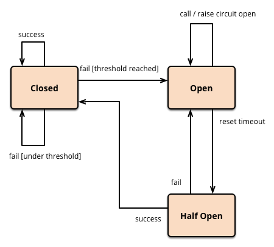
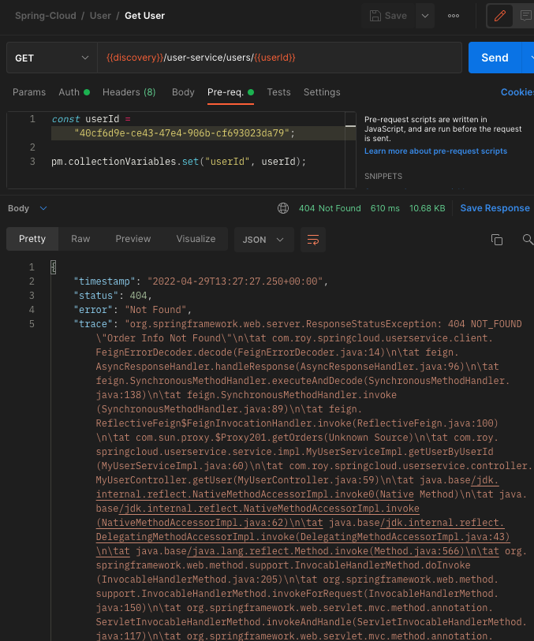

이번 장에서는 `장애 처리`을 위해 `CircuitBreaker`와 `Resilience4J`에 대해서 학습한다.
모든 소스 코드는 [깃 허브 (링크)](https://github.com/roy-zz/spring-cloud) 에 올려두었다.

---

### 개요

우리의 마이크로서비스들은 HTTP 요청 하나를 처리하기 위해 필요한 다른 서비스의 API를 호출하면서 필요한 데이터를 만든다.
만약 우리가 장애에 대한 처리를 따로 하지 않는다면 아래의 이미지와 같이 하나의 서비스에서 장애가 발생하면 다른 서비스까지 장애가 전파된다.


하지만 우리가 원하는 결과는 이러한 그림이 아닐 것이다.
하나의 서비스가 문제가 있더라도 아래의 이미지와 같이 다른 서비스에서 만든 데이터는 정상적으로 클라이언트에게 전달하고 싶을 것이다.


이렇게 작동하도록 유도해주는 것이 `CircuitBreaker`다.
`CircuitBreaker`의 경우 장애가 발생하는 서비스에 반복적인 호출이 되지 못하게 차단한다.
특정 서비스가 정상적으로 동작하지 않을 경우 다른 기능으로 대체 수행하여 장애를 회피할 수 있게 해준다.


`CircuitBreaker`에는 `Closed`와 `Open`이라는 두 가지 개념이 있다.



이름만 들으면 혼란이 올 수 있으므로 잘 이해해야한다.
`Closed`는 `CircuitBreaker`의 기능이 닫혀있다는 의미로 서비스가 정상작동하고 있어서 `CircuitBreaker`가 작동하고 있지 않음을 의미한다.
`Open`는 서비스에 문제가 생겨서 `CircuitBreaker`의 기능이 열려있음을 의미한다.
`CircuitBreaker`에 대한 자세한 정보가 더 필요하다면 글의 하단부에 `MartinFowler`가 작성한 글의 링크를 남겨두었으므로 참고하도록 한다.

---

### Hystrix vs Resilience4J

우리는 이전 장에서 Netflix의 Zuul이 `Spring Cloud Gateway`로 대체되었고 Ribbon이 `Spring Cloud Loadbalancer`로 대체되었다고 학습하였다.
`CircuitBreaker` 또한 기존에는 Netflix 사의 Hystrix가 사용되었지만 최근에는 `Resilience4J`로 대체되고 있다.
우리도 이러한 변화에 따라 Hystrix가 아닌 `Resilience4J`를 서비스에 연동해볼 것이다.


---

### Resilience4J 적용 (Default)

`Resilience4J`를 유저 서비스에 적용해보도록 한다.

1. 의존성 추가

유저 서비스의 `build.gradle`에 아래와 같이 `resilience4j` 관련 의존성을 추가하도록 한다.

```bash
implementation 'org.springframework.cloud:spring-cloud-starter-circuitbreaker-resilience4j'
```

2. UserService 수정

`CircuitBreakerFactory`를 스프링으로 부터 주입받는다.
`CircuitBreakerFactory`로 부터 `CircuitBreaker` 객체를 제공받고 장애 처리가 필요한 코드가 `CircuitBreaker`에 의해 실행되도록 코드를 작성한다.
코드에서 보면 알 수 있듯이 서비스에 장애가 발생하면 에러를 전파하는 것이 아니라 비어있는 리스트를 반환하도록 구현되어 있다.

```java
@Slf4j
@Service
@RequiredArgsConstructor
public class MyUserServiceImpl implements MyUserService {
    private final Environment environment;
    private final RestTemplate restTemplate;
    private final MyUserRepository userRepository;
    private final BCryptPasswordEncoder passwordEncoder;
    private final OrderServiceClient orderServiceClient;
    private final CircuitBreakerFactory circuitBreakerFactory;

    @Override
    public void createUser(MyUserDto userDto) {
        userDto.setUserId(UUID.randomUUID().toString());
        MyUser user = toObject(userDto, MyUser.class);
        user.setEncryptedPassword(passwordEncoder.encode(userDto.getPassword()));
        userRepository.save(user);
    }

    @Override
    public MyUserDto getUserByUserId(String userId) {
        MyUser savedUser = userRepository.findByUserId(userId)
                .orElseThrow(() -> new UsernameNotFoundException("User not found"));
        CircuitBreaker circuitBreaker = circuitBreakerFactory.create("circuitbreaker");
        List<OrderResponse> orderListResponse = circuitBreaker.run(
                () -> orderServiceClient.getOrders(userId),
                throwable -> Collections.emptyList());
        MyUserDto response = toObject(savedUser, MyUserDto.class);
        response.setOrders(orderListResponse);
        return response;
    }
}
```

3. 테스트

`주문 서비스`를 호출할 때 오류가 발생할 수 있도록 OrderServiceClient 에서 유효하지 않은 API 경로를 호출한다.

```java
@FeignClient(name = "order-service")
public interface OrderServiceClient {
    // @GetMapping("/order-service/{userId}/orders")
    @GetMapping("/order-service/for-not-found/{userId}")
    List<OrderResponse> getOrders(@PathVariable String userId);
}
```

**CircuitBreaker 적용 전**

CircuitBreaker를 적용하기 전에는 404 오류가 전파되어 클라이언트에게 전달되는 것을 확인할 수 있다.



**CircuitBreaker 적용 후**


---

### Resilience4J 적용 (Custom)

이번에는 우리가 직접 구성파일을 생성하여 CircuitBreakerFactory를 통해서가 아니라 우리가 정의한 `Resilience4JCircuitBreakerFactory`를 통해 `CircuitBreaker` 객체를 제공받도록 구현해본다.
이렇게 구현하는 경우 기본 값을 사용하는 것보다 더 우리의 서비스 환경에 맞도록 유연하게 사용이 가능하다.

1. 구성(Configuration) 파일 생성

```java
@Configuration
public class Resilience4JConfiguration {
    @Bean
    public Customizer<Resilience4JCircuitBreakerFactory> globalCustomConfiguration() {
        CircuitBreakerConfig circuitBreakerConfig = CircuitBreakerConfig.custom()
                .failureRateThreshold(4)
                .waitDurationInOpenState(Duration.ofMillis(1000))
                .slidingWindowType(CircuitBreakerConfig.SlidingWindowType.COUNT_BASED)
                .slidingWindowSize(2)
                .build();

        TimeLimiterConfig timeLimiterConfig = TimeLimiterConfig.custom()
                .timeoutDuration(Duration.ofSeconds(4))
                .build();

        return factory -> factory.configureDefault(id -> new Resilience4JConfigBuilder(id)
                .timeLimiterConfig(timeLimiterConfig)
                .circuitBreakerConfig(circuitBreakerConfig)
                .build());
    }
}
```

여기서 각 항목이 의미하는 것은 아래와 같다.

- **failureRateThreshold**: CircuitBreaker의 Open 여부를 결정하는 에러율이다. 예제의 경우 4로 설정되어 있으므로 100번의 요청 중 4번의 오류가 발생하면 CircuitBreaker가 Open 된다.
- **waitDurationInOpenState**: CircuitBreaker를 Open한 상태를 유지하는 시간을 의미한다. 예제를 기준으로 CircuitBreaker는 1초간 Open되며 1초가 지나는 경우 다시 한 번 요청하여 CircuitBreaker의 작동 여부를 결정한다.
- **slidingWindowType**: 요청이 정상적으로 처리되어 CircuitBreaker가 Closed될 때 Open되어 있는 동안의 기록을 남기는 것 기준을 시간으로 할 것인지 카운트로 할 것인지를 결정한다.
- **slidingWindowSize**: CircuitBreaker가 Closed될 때 호출되었던 기록을 저장하기 위해서 어느정도 사이즈를 저장할 것인지 결정한다. 입력 값은 WindowType이 Count 기반이면 횟수가 될 것이며 Time 기반이면 시간이 될 것이다.
- **timeoutDuration**: TimeLimiter는 Supplier(우리가 작성한 로직)가 어느정도 시간동안 문제가 생겼을 때 어느정도가 넘어야 오류로 간주하여 CircuitBreaker가 Open될지를 결정하는 한다.

---

지금까지 마이크로서비스의 장애 처리를 위한 `CircuitBreaker`와 `Resilience4J`에 대해서 알아보았다.

---

**참고한 강의:**

- https://www.inflearn.com/course/%EC%8A%A4%ED%94%84%EB%A7%81-%ED%81%B4%EB%9D%BC%EC%9A%B0%EB%93%9C-%EB%A7%88%EC%9D%B4%ED%81%AC%EB%A1%9C%EC%84%9C%EB%B9%84%EC%8A%A4

**참고한 자료:**

- [CircuitBreaker author Martinfowler](https://martinfowler.com/bliki/CircuitBreaker.html)