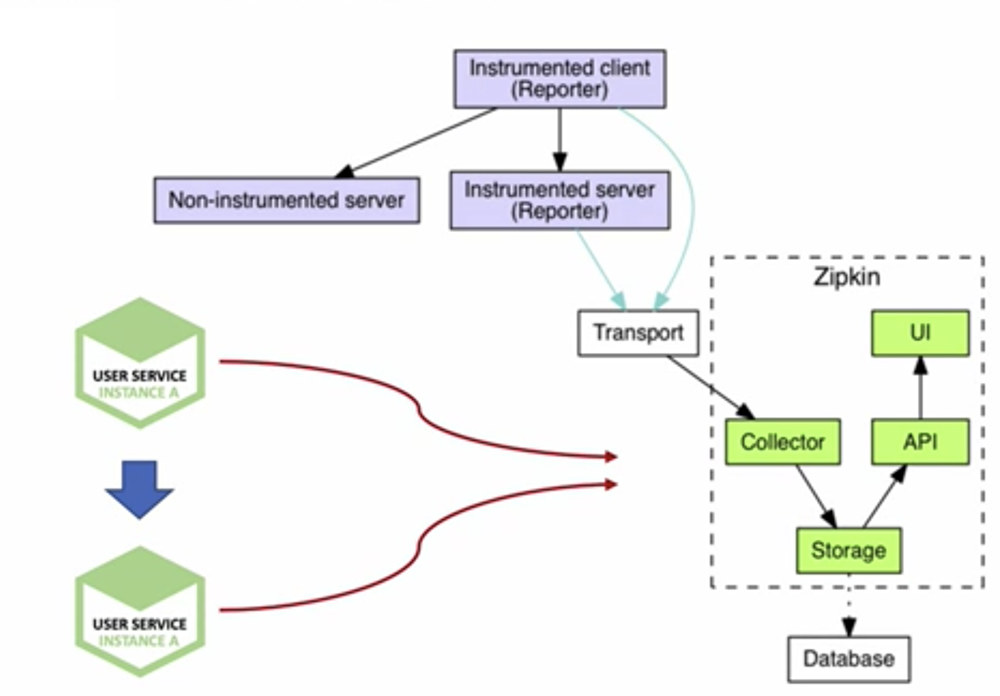
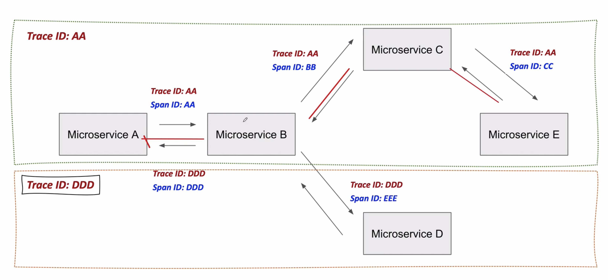
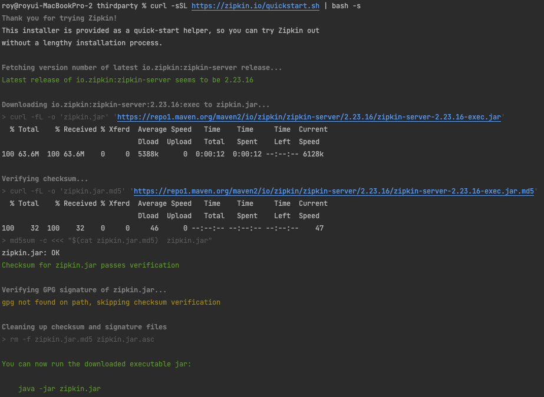
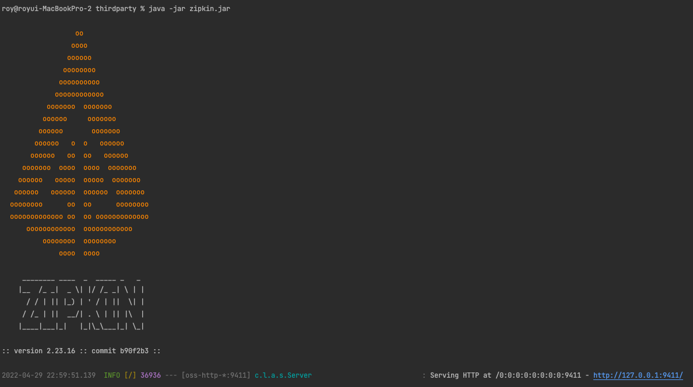
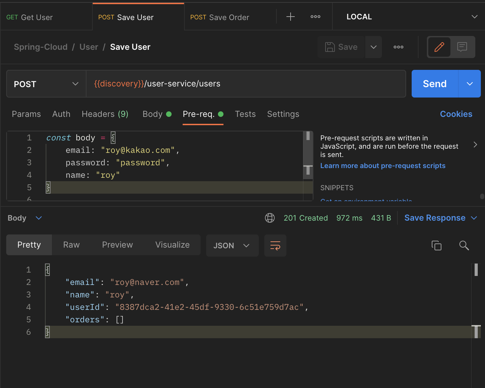
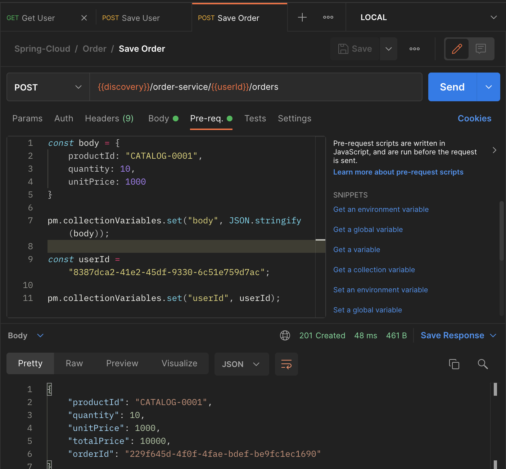
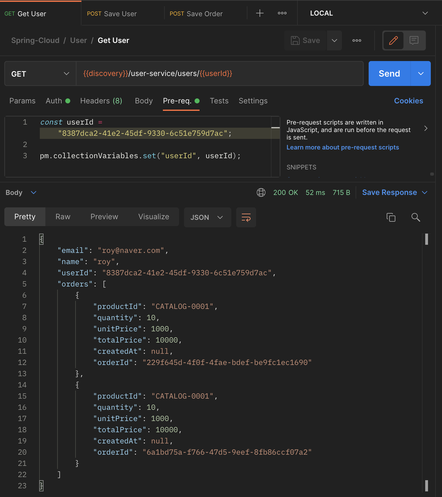
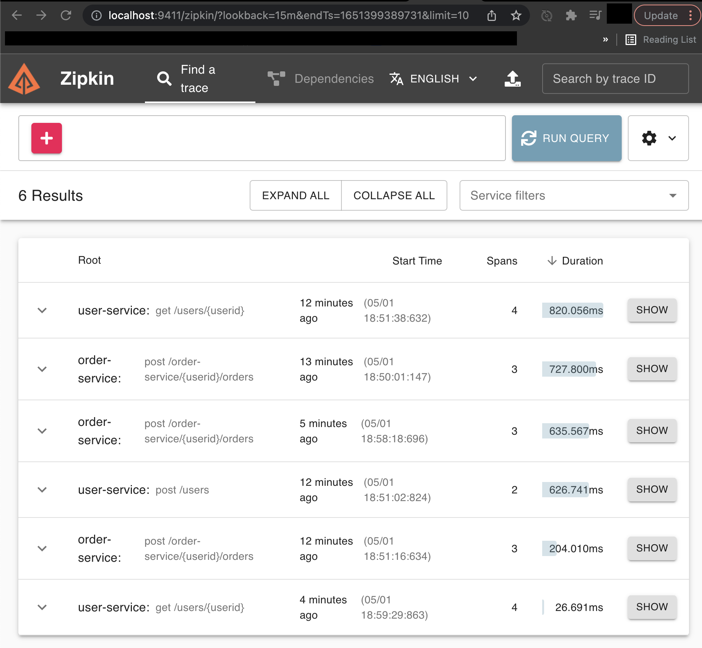
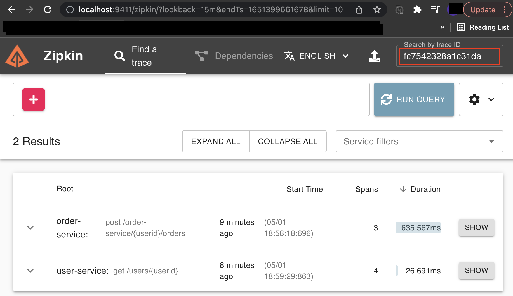

[이전 장(링크)](https://imprint.tistory.com/242?category=1069520) 에서는 장애 처리를 위한 `CircuitBreaker`와 `Resilience4J`에 대해서 알아보았다.
이번 장에서는 분산 환경에서의 추적을 위한 `Zipkin`과 `Spring Cloud Sleuth`에 대해서 알아본다.
모든 소스 코드는 [깃 허브 (링크)](https://github.com/roy-zz/spring-cloud) 에 올려두었다.

---

### 개요

`Zipkin`은 오픈소스로써 Twitter에서 사용하는 분산 환경의 Timing 데이터 수집, 추적을 위한 시스템이다.
Google Drapper에서 발전하였으며 분산 서비스 환경에서 시스템 병목 현상을 파악하기 위해 사용된다.
아래의 그림처럼 Collector, Query Service, Databasem WebUI로 구성되어 있다.



`Span`은 하나의 요청에 사용되는 작업의 단위로 64bit의 고유한 ID다.
`Trace`는 트리 구조로 이루어진 `Span`의 모여서 이뤄진 형태다. 하나의 요청에 대해 `Span`들은 동일한 Trace ID를 발급받는다.

`Spring Cloud Sleuth`는 스프링 부트 애플리케이션을 `Zipkin`과 연동시켜 주는 기능이다.
요청 값에 따른 `Trace ID`와 `Span ID`를 부여하고 아래와 같이 로그에 추가할 수 있다.

- Servlet Filter
- Rest Template
- Scheduled Actions
- Message Channels
- Feign Client

요청의 흐름과 `TraceID`와 `SpanID`를 살펴보면 아래와 같다.



`A -> B -> C -> E` 의 흐름을 살펴보면 A에서 B를 호출할 때 TraceID: AA와 SpanID: AA가 발급된다.
B에서 C를 호출할 때는 TraceID: AA라는 하나의 요청으로 묶이기 때문에 TraceID는 AA로 동일하고 SpanID는 BB로 새로 발급된다.

`A -> B -> D`의 흐름을 살펴보면 A에서 B를 호출할 때 TraceID: DDD와 SpanID: DDD가 발급된다.
B에서 D를 호출할 때는 TraceID: DDD라는 하나의 요청으로 묶이기 때문에 TraceID는 DDD로 동일하고 SpanID는 EEE로 새로 발급된다.

여기서 알 수 있는 것은 첫 요청의 TraceID와 SpanID는 동일하며 하나의 요청에 TraceID는 고유하다는 점이다.
우리는 이후에 TraceID로 요청을 추적할 것이기 때문에 `TraceID`를 이해하는 것이 중요하다.

---

### 적용

#### Zipkin 설치

1. 다운로드 

아래의 커맨드를 입력하여 적당한 경로 `Zipkin`을 설치한다.

```bash 
$ curl -sSL https://zipkin.io/quickstart.sh | bash -s
```

정상적으로 설치되면 아래와 같은 화면이 출력될 것이다.



2. 실행

아래의 커맨드를 입력하여 `Zipkin`을 실행시킨다.

```bash
$ java -jar zipkin.jar
```

정상적으로 설치가 완료되면 아래와 같은 화면이 출력될 것이다.



3. 정상작동 확인

`localhost:9411` 로 접속하여 `Zipkin` 페이지에 접속이 가능한지 확인해본다.


---

#### Users Service 수정

1. 의존성 추가

유저 서비스의 `build.gradle` 파일에 `Sleuth`와 `Zipkin`을 사용하기 위해 아래와 같이 의존성을 추가한다.

```bash
implementation 'org.springframework.cloud:spring-cloud-starter-sleuth'
implementation 'org.springframework.cloud:spring-cloud-starter-zipkin'
```

2. application.yml 수정

`application.yml` 파일에 아래와 같이 `Zipkin`과 `Sleuth` 설정을 추가한다.

```yaml
spring:
  application:
    name: user-service
  # 생략...
  zipkin:
    base-url: http://localhost:9411
    enabled: true
  sleuth:
    sampler:
      probability: 1.0
  # 생략...
```

3. 로그 추가

정상 작동 확인을 위해 `CircuitBreaker`관련 코드 앞과 뒤에 로그를 출력하는 코드를 추가한다.

```java
@Slf4j
@Service
@RequiredArgsConstructor
public class MyUserServiceImpl implements MyUserService {
    private final Environment environment;
    private final RestTemplate restTemplate;
    private final MyUserRepository userRepository;
    private final BCryptPasswordEncoder passwordEncoder;
    private final OrderServiceClient orderServiceClient;
    private final CircuitBreakerFactory circuitBreakerFactory;
    // 생략...
    @Override
    public MyUserDto getUserByUserId(String userId) {
        MyUser savedUser = userRepository.findByUserId(userId)
                .orElseThrow(() -> new UsernameNotFoundException("User not found"));
        log.info("Before call orders microservice");
        CircuitBreaker circuitBreaker = circuitBreakerFactory.create("circuitbreaker");
        List<OrderResponse> orderListResponse = circuitBreaker.run(
                () -> orderServiceClient.getOrders(userId),
                throwable -> Collections.emptyList());
        MyUserDto response = toObject(savedUser, MyUserDto.class);
        response.setOrders(orderListResponse);
        log.info("After called orders microservice");
        return response;
    }
    // 생략...
}
```

---

#### Orders Service 수정

1. 의존성 추가

주문 서비스의 `build.gradle` 파일에 `Sleuth`와 `Zipkin`을 사용하기 위해 아래와 같이 의존성을 추가한다.

```bash
implementation 'org.springframework.cloud:spring-cloud-starter-sleuth'
implementation 'org.springframework.cloud:spring-cloud-starter-zipkin'
```

2. application.yml 수정

`application.yml` 파일에 아래와 같이 `Zipkin`과 `Sleuth` 설정을 추가한다.

```yaml
spring:
  application:
    name: order-service
  # 생략...
  zipkin:
    base-url: http://localhost:9411
    enabled: true
  sleuth:
    sampler:
      probability: 1.0
  # 생략...
```

---

#### 테스트

`Slueth`와 `Zipkin` 연동은 완료되었다.
정상적으로 분산 추적이 가능한지 API요청을 통해 테스트를 진행한다.

1. 사용자 등록

아래의 이미지와 같이 테스트에 사용될 사용자를 추가한다.



2. 주문 등록

1단계에서 저장된 사용자의 `userId`를 사용하여 새로운 주문정보를 등록한다.



3. 사용자 정보 조회

1단계에서 저장된 사용자의 `userId`의 사용자 정보를 조회한다.



4. 로그 출력확인

`CircuitBreaker` 앞뒤로 추가한 로그를 출력하는 코드가 정상적으로 작동하였는지 확인한다.

```bash
2022-05-01 [user-service,825c1eb0946af900,825c1eb0946af900] Before call orders microservice
2022-05-01 [user-service,825c1eb0946af900,fc7542328a1c31da] [OrderServiceClient#getOrders] ---> GET http://order-service/order-service/8387dca2-41e2-45df-9330-6c51e759d7ac/orders HTTP/1.1
2022-05-01 [user-service,825c1eb0946af900,fc7542328a1c31da] [OrderServiceClient#getOrders] ---> END HTTP (0-byte body)
2022-05-01 [user-service,825c1eb0946af900,fc7542328a1c31da] [OrderServiceClient#getOrders] <--- HTTP/1.1 200 (14ms)
2022-05-01 [user-service,825c1eb0946af900,fc7542328a1c31da] [OrderServiceClient#getOrders] connection: keep-alive
2022-05-01 [user-service,825c1eb0946af900,fc7542328a1c31da] [OrderServiceClient#getOrders] content-type: application/json
2022-05-01 [user-service,825c1eb0946af900,fc7542328a1c31da] [OrderServiceClient#getOrders] date: Sun, 01 May 2022 09:59:29 GMT
2022-05-01 [user-service,825c1eb0946af900,fc7542328a1c31da] [OrderServiceClient#getOrders] keep-alive: timeout=60
2022-05-01 [user-service,825c1eb0946af900,fc7542328a1c31da] [OrderServiceClient#getOrders] transfer-encoding: chunked
2022-05-01 [user-service,825c1eb0946af900,fc7542328a1c31da] [OrderServiceClient#getOrders] 
2022-05-01 [user-service,825c1eb0946af900,fc7542328a1c31da] [OrderServiceClient#getOrders] [{"productId":"CATALOG-0001","quantity":10,"unitPrice":1000,"totalPrice":10000,"orderId":"229f645d-4f0f-4fae-bdef-be9fc1ec1690"},{"productId":"CATALOG-0001","quantity":10,"unitPrice":1000,"totalPrice":10000,"orderId":"6a1bd75a-f766-47d5-9eef-8fb86ccf07a2"}]
2022-05-01 [user-service,825c1eb0946af900,fc7542328a1c31da] [OrderServiceClient#getOrders] <--- END HTTP (257-byte body)
2022-05-01 [user-service,825c1eb0946af900,825c1eb0946af900] After called orders microservice
```

출력 결과를 확인해보면 정상적으로 출력된 것을 확인할 수 있다.
우리는 로그를 통해 `TraceId`와 `SpanId`를 확인할 수 있다.
두번 째 줄로 예를 들면 `825c1eb0946af900`는 `TraceId`가 되고 `fc7542328a1c31da`는 `SpanId`가 된다.

5. Zipkin 페이지 확인

`localhostL:9411`에 접속하여 `Zipkin` 페이지에 요청에 대한 정보가 출력되는지 확인한다.



4번 단계에서 확인한 `TraceId`로 원하는 결과만 출력할 수 있다.



---

이번 장에서는 `Sleuth`와 `Zipkin`을 사용하여 분산 추적하는 방법에 대해서 알아보았다.

---

**참고한 강의:**

- https://www.inflearn.com/course/%EC%8A%A4%ED%94%84%EB%A7%81-%ED%81%B4%EB%9D%BC%EC%9A%B0%EB%93%9C-%EB%A7%88%EC%9D%B4%ED%81%AC%EB%A1%9C%EC%84%9C%EB%B9%84%EC%8A%A4

**참고한 자료:**

- [Zipkin 공식문서](https://zipkin.io)
- [Sleuth 공식문서](https://docs.spring.io/spring-cloud-sleuth/docs/current-SNAPSHOT/reference/html/)