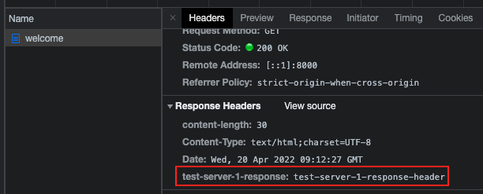

이번 장에서는 [Spring Cloud Gateway - 구성](https://imprint.tistory.com/215) 에 이어 직접 API Gateway에 Filter를 적용하는 방법들에 대해서 알아본다.
모든 소스 코드는 [깃허브 (링크)](https://github.com/roy-zz/spring-cloud) 에 올려두었다.

---

### 자바 코드로 적용

1. Gateway 모듈에 구성을 위한 FilterConfig 클래스 파일을 생성한다.

"/test-server-1/**" 경로로 들어오는 요청의 헤더에 "test-server-1-request" 키와 "test-server-1-request-header" 값을 가지는 헤더를 추가하고 TEST-SERVER-1 이라는 이름을 가진 애플리케이션에 리다이렉트 한다.
"/test-server-2/**" 경로로 들어오는 요청의 헤더에 "test-server-2-request" 키와 "test-server-2-request-header" 값을 가지는 헤더를 추가하고 TEST-SERVER-2 라는 이름을 가진 애플리케이션에 리다이렉트 한다.

```java
@Configuration
public class FilterConfig {
    @Bean
    public RouteLocator gatewayRoutes(RouteLocatorBuilder builder) {
        return builder.routes()
                .route(r -> r.path("/test-server-1/**")
                            .filters(f -> f.addRequestHeader("test-server-1-request", "test-server-1-request-header")
                                            .addResponseHeader("test-server-1-response", "test-server-1-response-header"))
                        .uri("lb://TEST-SERVER-1"))
                .route(r -> r.path("/test-server-2/**")
                            .filters(f -> f.addRequestHeader("test-server-2-request", "test-server-2-request-header")
                                            .addResponseHeader("test-server-2-response", "test-server-2-response-header"))
                        .uri("lb://TEST-SERVER-2"))
                .build();
    }
}
```

2. Eureka Client의 컨트롤러를 수정한다.

헤더의 정보를 출력하도록 test-server1, test-server2 모듈의 컨트롤러를 수정한다.

**test-server1**
```java
@Slf4j
@RestController
@RequestMapping(value = "/test-server-1")
public class TestController {
    @GetMapping("/welcome")
    public String welcome(@RequestHeader("test-server-1-request") String requestHeader) {
        log.info("{}", requestHeader);
        return "Welcome to the Test Server - 1";
    }
}
```

**test-server2**
```java
@Slf4j
@RestController
@RequestMapping(value = "/test-server-2")
public class TestController {
    @GetMapping("/welcome")
    public String welcome(@RequestHeader("test-server-2-request") String requestHeader) {
        log.info("{}", requestHeader);
        return "Welcome to the Test Server - 2";
    }
}
```

브라우저를 켜고 localhost:8000/test-server-1/welcome과 localhost:8000/test-server-2/welcome에 접속해본다.
각 모듈의 출력 결과는 아래와 같다.
**test-server1**
```bash
INFO 85192 --- [o-auto-1-exec-1] c.r.s.t.controller.TestController        : test-server-1-request-header
```
**test-server2**
```bash
INFO 85202 --- [o-auto-1-exec-1] c.r.s.t.controller.TestController        : test-server-2-request-header
```

Response 헤더에도 정상적으로 입력되었는지 브라우저에서 개발자 모드를 실행시키고 확인해본다.



만약 자바 코드로 filter를 적용하고 싶지 않다면?!
아래와 같이 application.yml 파일을 수정해서 필터를 적용해도 동일하게 작동한다.

```yaml
spring:
  application:
    name: gateway-service
  cloud:
    gateway:
      routes:
        - id: test-server-1
          uri: lb://TEST-SERVER-1
          predicates:
            - Path=/test-server-1/**
          filters:
            - AddRequestHeader=test-server-1-request, test-server-1-request-header
            - AddResponseHeader=test-server-1-response, test-server-1-response-header
        - id: test-server-2
          uri: lb://TEST-SERVER-2
          predicates:
            - Path=/test-server-2/**
          filters:
            - AddRequestHeader=test-server-2-request, test-server-2-request-header
            - AddResponseHeader=test-server-2-response, test-server-2-response-header
```

---

### Custom Filter

1. CustomFilter 클래스를 생성한다.

AbstractGatewayFilterFactory를 상속받은 클래스를 생성한다.
apply메서드를 확인해보면 요청처리 전에 필터를 처리하는 부분과 요청처리 후에 필터를 처리하는 부분이 나뉘어 있는 것을 확인할 수 있다.

```java
@Slf4j
@Component
public class CustomFilter extends AbstractGatewayFilterFactory<CustomFilter.Config> {
    public CustomFilter() {
        super(Config.class);
    }
    @Override
    public GatewayFilter apply(Config config) {
        return (exchange, chain) -> {
            // Pre process start ====================================================
            ServerHttpRequest request = exchange.getRequest();
            ServerHttpResponse response = exchange.getResponse();
            log.info("Custom pre process filter: request uri -> {}", request.getId());
            // Pre process end =======================================================
            // Post process start =======================================================
            return chain.filter(exchange).then(Mono.fromRunnable(() -> {
                log.info("Custom post process filter: response code -> {}", response.getStatusCode());
            }));
            // Post process end =======================================================
        };
    }
    public static class Config {
        // Put the configuration properties
    }
}
```

2. application.yml 수정

우리가 생성한 CustomFilter로 등록될 수 있도록 filters 항목에 CustomFilter를 등록한다.

```yaml
spring:
  application:
    name: gateway-service
  cloud:
    gateway:
      routes:
        - id: test-server-1
          uri: lb://TEST-SERVER-1
          predicates:
            - Path=/test-server-1/**
          filters:
            - CustomFilter
        - id: test-server-2
          uri: lb://TEST-SERVER-2
          predicates:
            - Path=/test-server-2/**
          filters:
            - CustomFilter
```

3. 유레카 클라이언트의 컨트롤러를 수정한다.

Filter 연동을 위해 수정한 부분은 없으며 단지 이전 테스트와 컨트롤러가 겹치는 것을 방지하기 위함이다.

**test-server-1**
```java
@Slf4j
@RestController
@RequestMapping(value = "/test-server-1")
public class TestController {
    @GetMapping("/custom-filter")
    public String customFilter() {
        return "Custom filter with test server 1";
    }
}
```

**test-server-2**
```java
@Slf4j
@RestController
@RequestMapping(value = "/test-server-2")
public class TestController {
    @GetMapping("/custom-filter")
    public String customFilter() {
        return "Custom filter with test server 2";
    }
}
```

4. 정상작동 확인

브라우저를 켜고 localhost:8000/test-server-1/custom-filter와 localhost:8000/test-server-2/custom-filter에 접속해본다.
출력된 결과는 아래와 같다.

```bash
c.r.s.gateway.filter.CustomFilter        : Custom pre process filter: request uri -> baf12948-2
c.r.s.gateway.filter.CustomFilter        : Custom post process filter: response code -> 200 OK
c.r.s.gateway.filter.CustomFilter        : Custom pre process filter: request uri -> baf12948-3
c.r.s.gateway.filter.CustomFilter        : Custom post process filter: response code -> 200 OK
```

정상적으로 우리가 원하는 결과가 출력되는 것을 확인할 수 있다.
~~(설마 c.r.s가 com.roy.springcloud의 약자인가...왜 처음알았지)~~

---

### Global Filter

라우터 정보마다 일일히 필터를 적용하는 것이 아니라 전역으로 Global Filter를 설정하는 방법을 알아본다.

1. Filter 역할을 하게될 클래스 파일을 작성한다.

CustomFilter와 크게 다른 점은 없다. 단지 application.yml의 properties값을 가져오기 위해서 Config 클래스의 필드가 생겼다.
만약 application.yml 파일에서 showPreLogger의 값이 true라면 요청처리 전에 필터에서 전처리가 일어난다.
showPostLogger의 값이 true라면 요청처리 후에 필터에서 후처리가 일어난다.

```java
@Slf4j
@Component
public class GlobalFilter extends AbstractGatewayFilterFactory<GlobalFilter.Config> {
    public GlobalFilter() {
        super(Config.class);
    }
    @Override
    public GatewayFilter apply(Config config) {
        return (exchange, chain) -> {
            ServerHttpRequest request = exchange.getRequest();
            ServerHttpResponse response = exchange.getResponse();
            log.info("Global Filter Message: {}", config.getMessage());
            if (config.isShowPreLogger()) {
                log.info("Global Filter Start: request id -> {}", request.getId());
            }
            return chain.filter(exchange).then(Mono.fromRunnable(() -> {
                if (config.isShowPostLogger()) {
                    log.info("Global Filter End: response code -> {}", response.getStatusCode());
                }
            }));
        };
    }

    @Data
    public static class Config {
        private String message;
        private boolean showPreLogger;
        private boolean showPostLogger;
    }
}
```

2. application.yml 파일을 수정한다.

default-filters가 추가되었으며 우리가 새로 작성한 GlobalFilter 클래스를 등록시켜두었다.

```yaml
spring:
  application:
    name: gateway-service
  cloud:
    gateway:
      default-filters:
        - name: GlobalFilter
          args:
            message: Spring Cloud Gateway GlobalFilter Message
            showPreLogger: true
            showPostLogger: true
      routes:
        - id: test-server-1
          uri: lb://TEST-SERVER-1
          predicates:
            - Path=/test-server-1/**
          filters:
            # - AddRequestHeader=test-server-1-request, test-server-1-request-header
            # - AddResponseHeader=test-server-1-response, test-server-1-response-header
            - CustomFilter
        - id: test-server-2
          uri: lb://TEST-SERVER-2
          predicates:
            - Path=/test-server-2/**
          filters:
            # - AddRequestHeader=test-server-2-request, test-server-2-request-header
            # - AddResponseHeader=test-server-2-response, test-server-2-response-header
            - CustomFilter
```

3. 정상작동 확인

1, 2단계를 완료하였다면 Gateway를 재실행시키고 localhost:8000/test-server-1/custom-filter와 localhost:8000/test-server-2/custom-filter에 접속해본다.
우리가 예상한 것과 같이 출력 결과는 아래와 같다.

**test-server-1 접속**
```bash
c.r.s.gateway.filter.GlobalFilter        : Global Filter Message: Spring Cloud Gateway GlobalFilter Message
c.r.s.gateway.filter.GlobalFilter        : Global Filter Start: request id -> 1178a759-3
c.r.s.gateway.filter.CustomFilter        : Custom pre process filter: request uri -> 1178a759-3
c.r.s.gateway.filter.CustomFilter        : Custom post process filter: response code -> 200 OK
c.r.s.gateway.filter.GlobalFilter        : Global Filter End: response code -> 200 OK
```
**test-server-2 접속**
```bash
c.r.s.gateway.filter.GlobalFilter        : Global Filter Message: Spring Cloud Gateway GlobalFilter Message
c.r.s.gateway.filter.GlobalFilter        : Global Filter Start: request id -> 1178a759-4
c.r.s.gateway.filter.CustomFilter        : Custom pre process filter: request uri -> 1178a759-4
c.r.s.gateway.filter.CustomFilter        : Custom post process filter: response code -> 200 OK
c.r.s.gateway.filter.GlobalFilter        : Global Filter End: response code -> 200 OK
```

이전에 생성한 CustomFilter도 여전히 filter로 등록되어 있기 때문에 GlobalFilter의 내용과 같이 출력되는 것을 확인할 수 있다.

---

### Logging Filter

이번에는 Logging Filter를 만드는 방법에 대해서 다뤄본다.
Custom Filter와 거의 동일한 방식으로 진행되며 추가로 Filter가 적용되는 순서를 지정하는 방법에 대해서 알아본다.

1. Filter 역할을 하게 될 클래스 파일을 작성한다.

이전과 다르게 apply에서 반환하는 타입이 OrderedGatewayFilter로 구체화 되었다.
또한 파라미터로 Ordered.LOWEST_PRECEDENCE를 전달받아서 적용되어 있는 Filter 중 가장 낮은 우선권을 가지도록 구현하였다.

```java
@Slf4j
@Component
public class LoggingFilter extends AbstractGatewayFilterFactory<LoggingFilter.Config> {
    public LoggingFilter() {
        super(Config.class);
    }
    @Override
    public GatewayFilter apply(LoggingFilter.Config config) {
        return new OrderedGatewayFilter((exchange, chain) -> {
            ServerHttpRequest request = exchange.getRequest();
            ServerHttpResponse response = exchange.getResponse();

            log.info("Logging filter message: {}", config.getMessage());
            if (config.isShowPreLogger()) {
                log.info("Logging filter pre process: request uri -> {}", request.getURI());
            }
            return chain.filter(exchange).then(Mono.fromRunnable(() -> {
                if (config.isShowPostLogger()) {
                    log.info("Logging filter post process: response code -> {}", response.getStatusCode());
                }
            }));
        }, Ordered.LOWEST_PRECEDENCE);
    }
    @Data
    public static class Config {
        private String message;
        private boolean showPreLogger;
        private boolean showPostLogger;
    }
}
```

2. application.yml 수정

filters 부분에 LoggingFilter가 추가되어 CustomFilter와 함께 총 두 개의 필터가 적용되었다.

```yaml
spring:
  application:
    name: gateway-service
  cloud:
    gateway:
      default-filters:
        - name: GlobalFilter
          args:
            message: Spring Cloud Gateway GlobalFilter Message
            showPreLogger: true
            showPostLogger: true
      routes:
        - id: test-server-1
          uri: lb://TEST-SERVER-1
          predicates:
            - Path=/test-server-1/**
          filters:
            - name: CustomFilter
            - name: LoggingFilter
              args:
                message: TEST-SERVER-1
                showPreLogger: true
                showPostLogger: true
        - id: test-server-2
          uri: lb://TEST-SERVER-2
          predicates:
            - Path=/test-server-2/**
          filters:
            - name: CustomFilter
            - name: LoggingFilter
              args:
                message: TEST-SERVER-2
                showPreLogger: true
                showPostLogger: true
```

3. 정상작동 확인

Discovery, Gateway, test-server1, test-server2 모든 서비스를 실행시키고 브라우저에 아래의 주소를 입력하고 접속해본다.

- localhost:8000/test-server-1/custom-filter
- localhost:8000/test-server-2/custom-filter

출력되는 결과는 아래와 같다.
가장 낮은 우선순위를 가지고 있던 Logging Filter가 가장 늦게 출력된 것을 확인할 수 있다.

```bash
c.r.s.gateway.filter.GlobalFilter        : Global Filter Message: Spring Cloud Gateway GlobalFilter Message
c.r.s.gateway.filter.GlobalFilter        : Global Filter Start: request id -> 87b06d4e-1
c.r.s.gateway.filter.CustomFilter        : Custom pre process filter: request uri -> 87b06d4e-1
c.r.s.gateway.filter.LoggingFilter       : Logging filter message: TEST-SERVER-1
c.r.s.gateway.filter.LoggingFilter       : Logging filter pre process: request uri -> http://localhost:8000/test-server-1/custom-filter
c.r.s.gateway.filter.LoggingFilter       : Logging filter post process: response code -> 200 OK
c.r.s.gateway.filter.CustomFilter        : Custom post process filter: response code -> 200 OK
c.r.s.gateway.filter.GlobalFilter        : Global Filter End: response code -> 200 OK
```

---

참고한 강의: https://www.inflearn.com/course/%EC%8A%A4%ED%94%84%EB%A7%81-%ED%81%B4%EB%9D%BC%EC%9A%B0%EB%93%9C-%EB%A7%88%EC%9D%B4%ED%81%AC%EB%A1%9C%EC%84%9C%EB%B9%84%EC%8A%A4