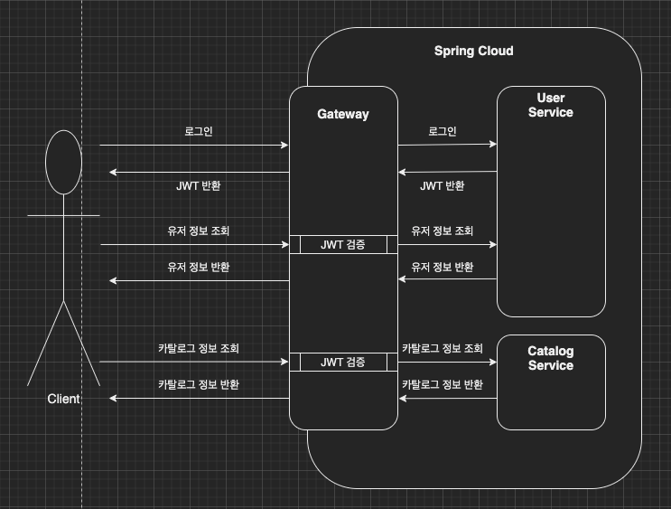

이번 장에서는 [Spring Cloud Gateway - 필터](https://imprint.tistory.com/216) 에 이어 Gateway에 Spring Security를 적용시키는 방법에 대해서 알아본다.
모든 소스 코드는 [깃허브 (링크)](https://github.com/roy-zz/spring-cloud) 에 올려두었다.

---

### Flow

게이트웨이에 스프링 시큐리티를 적용시키기 위하여 전체적으로 어떠한 흐름으로 요청이 처리되는지 알아본다.
JWT를 통한 인증을 처리할 예정이며 JWT에 대해서는 다루지 않으며 적용하는 방법에 대한 내용만 진행한다.
혹시 JWT를 처음 접한다면 글의 가장 하단부에 첨부한 JWT 공식 홈페이지와 인프런 JWT 관련 무료 강의를 첨부하므로 참고하도록 한다.

게이트웨이에 JWT를 검증하는 필터를 적용하면 아래와 같은 프로세스로 처리된다.



최초에 사용자가 로그인하면 유저 서비스에서 JWT 토큰을 발급한다.
사용자가 로그인을 하는 시점에는 JWT 토큰이 없기 때문에 게이트웨이에서 JWT를 검증하지 않는다.
이후 사용자는 서버의 API를 호출하기 위해서 헤더에 JWT 정보를 입력한다.
각각의 마이크로서비스들이 JWT 토큰을 검증하는 것이 아니라 게이트웨이에서 검증을 마치고 검증된 요청만 마이크로서비스로 전달한다.

이번 예시에서 사용자 등록 API 또한 로그인 API와 같이 토큰을 검증하지 않는다.
실제 서비스라면 사용자 등록 또한 토큰을 검증해야하지만 진행 중인 샘플 프로젝트에서는 프로젝트를 새로 실행시키면 데이터가 휘발(H2 Embedded 모드 사용으로 인한)하기 때문에 검증을 생략한다.

---

### User Service

이전 게이트웨이 필터까지는 사용자 엔티티의 이름이 User였지만 이번 장부터는 스프링 시큐리티의 클래스명과 겹치는 관계로 MyUser로 변경하였다.

**build.gradle**

1. 스프링부트의 Security와 JWT 관련 의존성을 추가한다.

```bash
implementation 'org.springframework.boot:spring-boot-starter-security'
implementation 'io.jsonwebtoken:jjwt:0.9.1'
```

2. application.yml 파일 수정

application.yml 파일에 아래의 내용을 추가한다.
expiration_time은 토큰의 유효 기간을 의미하며 secret는 JWT 토큰을 생성하고 JWT 토큰을 검증하는 단계에서 필요하다.

```yaml
token:
  expiration_time: 864000000
  secret: user_token
```

3. main 클래스 수정

사용자의 비밀번호를 암호화 및 복호화하는 객체를 스프링 빈으로 등록하기 위해 BCryptPasswordEncoder 부분을 추가한다.

```java
@EnableEurekaClient
@SpringBootApplication
public class UserServiceApplication {
    public static void main(String[] args) {
        SpringApplication.run(UserServiceApplication.class, args);
    }
    @Bean
    public BCryptPasswordEncoder bCryptPasswordEncoder() {
        return new BCryptPasswordEncoder();
    }
}
```

4. MyUserRepository 수정

로그인과 JWT를 검증 시 사용자 조회를 위한 메서드를 추가한다.
필자의 경우 Optional을 선호하여 리턴타입을 Optional으로 지정하였지만 익숙치 않다면 엔티티 자체인 MyUser로 지정하여도 상관없다.
다만, 다음 서비스의 코드를 수정할 때 필자의 경우 Optional의 orElseThrow로 엔티티의 유무를 검증하게 되지만 MyUser 엔티티로 리턴받은 경우 직접 null 체크를 해주어야한다.

```java
public interface MyUserRepository extends CrudRepository<MyUser, Long> {
    // 생략
    Optional<MyUser> findByEmail(String email);
    // 생략
}
```

5. MyUserService 인터페이스 수정

우리가 작성한 MyUserService 인터페이스가 UserDetailsService를 상속받도록 수정하고 메서드 하나를 추가한다.
수정하면 MyUserService의 구현체가 새로운 메서드인 getUserDetailsByEmail()을 구현하고 있지 않다는 안내가 나오게 된다.
바로 MyUserServiceImpl로 이동하여 새로운 메서드를 구현한다. 

```java
public interface MyUserService extends UserDetailsService {
    // 생략
    MyUserDto getUserDetailsByEmail(String email);
    // 생략
}
```

6. MyUserServiceImpl 수정

MyUserServiceImpl의 세 개의 메서드가 추가되었다.

- getUserDetailsByEmail: 파라미터의 email값을 통해서 MyUser 엔티티를 조회하고 MyUserDto로 변환하여 반환한다.
- loadUserByUsername: 파라미터의 email값을 통해서 스프링 시큐리티 객체인 UserDetails를 반환한다.
- getMyUserByEmail: 공통되는 로직을 처리하기 위한 메서드로 큰 의미는 없다.

```java
@Service
@RequiredArgsConstructor
public class MyUserServiceImpl implements MyUserService {
    private final MyUserRepository userRepository;
    private final BCryptPasswordEncoder passwordEncoder;
    // 중략
    @Override
    public MyUserDto getUserDetailsByEmail(String email) {
        MyUser savedUser = getMyUserByEmail(email);
        return toObject(savedUser, MyUserDto.class);
    }
    @Override
    public UserDetails loadUserByUsername(String email) throws UsernameNotFoundException {
        MyUser savedUser = getMyUserByEmail(email);
        return new User(savedUser.getEmail(), savedUser.getEncryptedPassword(),
                true, true, true, true,
                Collections.emptyList()
        );
    }
    private MyUser getMyUserByEmail(String email) {
        return userRepository.findByEmail(email)
                .orElseThrow(() -> new UsernameNotFoundException("User not found"));
    }
}
```

7. AuthenticationFilter 추가

인증을 처리하는 AuthenticationFilter 클래스를 추가하고 UsernamePasswordAuthenticationFilter를 상속받게 한다.

- attemptAuthentication: 로그인 요청이 들어오면 상위 클래스의 getAuthenticationManager()를 호출하여 사용자가 전달한 파라미터를 전달하여 로그인을 시도한다.
- successfulAuthentication: 로그인이 성공하면 DB에서 사용자의 userId를 조회하여 JWT를 생성하고 Response의 헤더에 넣는 역할을 한다.

```java
@Slf4j
public class AuthenticationFilter extends UsernamePasswordAuthenticationFilter {
    private final MyUserService userService;
    private final Environment environment;
    public AuthenticationFilter(AuthenticationManager authenticationManager,
                                MyUserService userService,
                                Environment environment) {
        super(authenticationManager);
        this.userService = userService;
        this.environment = environment;
    }
    @Override
    public Authentication attemptAuthentication(HttpServletRequest request, HttpServletResponse response) throws AuthenticationException {
        try {
            LoginRequest loginRequest = new ObjectMapper().readValue(request.getInputStream(), LoginRequest.class);
            return getAuthenticationManager().authenticate(
                    new UsernamePasswordAuthenticationToken(
                            loginRequest.getEmail(),
                            loginRequest.getPassword(),
                            Collections.emptyList()
                    )
            );
        } catch (IOException e) {
            throw new RuntimeException(e);
        }
    }
    @Override
    protected void successfulAuthentication(HttpServletRequest request, HttpServletResponse response, FilterChain chain, Authentication authResult) throws IOException, ServletException {
        String userName = ((User) authResult.getPrincipal()).getUsername();
        MyUserDto userDto = userService.getUserDetailsByEmail(userName);
        String token = Jwts.builder()
                .setSubject(userDto.getUserId())
                .setExpiration(new Date(System.currentTimeMillis() + Long.parseLong(Objects.requireNonNull(environment.getProperty("token.expiration_time")))))
                .signWith(SignatureAlgorithm.HS512, environment.getProperty("token.secret"))
                .compact();
        response.addHeader("token", token);
        response.addHeader("userId", userDto.getUserId());
    }
}
```

---

8. WebSecurity 수정

actuator, health-check 부분은 다음 장을 위한 부분으로 무시한다.
모든 요청("/**", 0.0.0.0/0)을 바로 위에서 만들었던 AuthenticationFilter를 거쳐서 들어오도록 한다. 
0.0.0.0/0과 같은 CIDR 표기법이 익숙치 않다면 글의 하단부에 참고할 만한 자료를 추가하였으니 참고하도록 한다.

AuthenticationManagerBuilder에게 사용자가 정의한 userService(UserDetailsService를 구현한 클래스)가 무엇인지 passwordEncoder(BCryptPasswordEncoder와 같이 사용자가 지정한)는 무엇인지 전달한다.

```java
@Configuration
@EnableWebSecurity
@RequiredArgsConstructor
public class WebSecurity extends WebSecurityConfigurerAdapter {
    private final MyUserService userService;
    private final BCryptPasswordEncoder passwordEncoder;
    private final Environment environment;

    @Override
    protected void configure(HttpSecurity http) throws Exception {
        http.csrf().disable();
        http.authorizeRequests().antMatchers("/actuator/**").permitAll();
        http.authorizeRequests().antMatchers("/health-check/**").permitAll();
        http.authorizeRequests().antMatchers("/**")
                .hasIpAddress("0.0.0.0/0")
                .and()
                .addFilter(getAuthenticationFilter());

        http.headers().frameOptions().disable();
    }
    private AuthenticationFilter getAuthenticationFilter() throws Exception {
        AuthenticationFilter authenticationFilter = new AuthenticationFilter(authenticationManager(), userService, environment);
        authenticationFilter.setAuthenticationManager(authenticationManager());
        return authenticationFilter;
    }
    @Override
    protected void configure(AuthenticationManagerBuilder auth) throws Exception {
        auth.userDetailsService(userService).passwordEncoder(passwordEncoder);
    }
}
```

---

### Gateway

1. build.gradle 수정

유저 서비스와 동일하게 스프링 시큐리티와 JWT 관련 의존성을 추가한다.

```bash
dependencies {
    implementation 'org.springframework.boot:spring-boot-starter-security'
    implementation 'io.jsonwebtoken:jjwt:0.9.1'
}
```

2. main 클래스 수정

게이트웨이를 통한 요청도 csrf를 비활성화 시키기 위해서 SecurityWebFilterChain 빈을 등록한다.
(물론 실제 서비스에서는 활성화 시켜야하겠지만 우리의 목표는 스프링 클라우드 정복이므로 생략한다.)
필자가 참고한 강의에는 없는 내용이며 스프링 버전이 올라가면서 추가된 부분이다.

```java
@SpringBootApplication
public class GatewayApplication {
    public static void main(String[] args) {
        SpringApplication.run(GatewayApplication.class, args);
    }
    @Bean
    public SecurityWebFilterChain securityWebFilterChain(ServerHttpSecurity security) {
        return security.csrf().disable().build();
    }
}
```

3. AuthorizationHeaderFilter 추가

사용자의 헤더의 토큰을 통하여 인증처리를 진행하는 클래스를 추가한다.

- apply: 사용자의 헤더에 Authorization 값이 없거나 유효한 토큰이 아니라면 사용자에게 권한이 없다는 401 Unauthorized 코드를 반환한다.
- isJwtValid: JWT를 파싱하여 유효한 토큰인지 확인한다. 여기서 사용되는 token.secret는 다음 단계에서 입력하겠지만 유저 서비스에서 사용하는 토큰과 동일하다.

```java
@Slf4j
@Component
public class AuthorizationHeaderFilter extends AbstractGatewayFilterFactory<AuthorizationHeaderFilter.Config> {
    private final Environment environment;
    public AuthorizationHeaderFilter(Environment environment) {
        super(Config.class);
        this.environment = environment;
    }
    @Override
    public GatewayFilter apply(AuthorizationHeaderFilter.Config config) {
        return (exchange, chain) -> {
            ServerHttpRequest request = exchange.getRequest();
            if (!request.getHeaders().containsKey(HttpHeaders.AUTHORIZATION)) return onError(exchange, "No authorization header", HttpStatus.UNAUTHORIZED);
            String authorizationHeader = request.getHeaders().get(HttpHeaders.AUTHORIZATION).get(0);
            String jwt = authorizationHeader.replace("Bearer", "");
            if (!isJwtValid(jwt)) return onError(exchange, "JWT token is not valid", HttpStatus.UNAUTHORIZED);
            return chain.filter(exchange);
        };
    }
    private Mono<Void> onError(ServerWebExchange exchange, String err, HttpStatus httpStatus) {
        ServerHttpResponse response = exchange.getResponse();
        response.setStatusCode(httpStatus);
        log.error(err);
        return response.setComplete();
    }
    private boolean isJwtValid(String jwt) {
        String subject = null;
        try {
            subject = Jwts.parser().setSigningKey(environment.getProperty("token.secret"))
                    .parseClaimsJws(jwt).getBody()
                    .getSubject();
        } catch (Exception ex) {
            ex.printStackTrace();
        }
        return !Strings.isBlank(subject);
    }
    public static class Config {}
}
```

4. application.yml 파일 수정

JWT 토큰을 검증하기 위해 유저 서비스에서 사용하는 secret와 동일한 값을 가지고 있다.
/user-service/(?<segment>.*), /$\{segment} 부분은 사용자로부터 /user-service/aaabbb와 같은 요청이 들어오면 유저 서비스에게 /user-service는 제거하고 /aaabbb만 전달하겠다는 의미이다.

GET메서드와 함께 들어오는 모든 요청(user-service/**)은 AuthorizationHeaderFilter를 통하도록 되어있다.
POST메서드의 /user-service/login과 /user-service/users는 인증 절차없이 진행되어야 하므로 filters 부분에 AuthorizationHeaderFilter가 생략되어 있다.

```yaml
# 생략
token:
  secret: user_token
# 생략
      routes:
        - id: user-service
          uri: lb://USER-SERVICE
          predicates:
            - Path=/user-service/login
            - Method=POST
          filters:
            - RemoveRequestHeader=Cookie
            - RewritePath=/user-service/(?<segment>.*), /$\{segment}
        - id: user-service
          uri: lb://USER-SERVICE
          predicates:
            - Path=/user-service/users
            - Method=POST
          filters:
            - RemoveRequestHeader=Cookie
            - RewritePath=/user-service/(?<segment>.*), /$\{segment}
        - id: user-service
          uri: lb://USER-SERVICE
          predicates:
            - Path=/user-service/**
            - Method=GET
          filters:
            - RemoveRequestHeader=Cookie
            - RewritePath=/user-service/(?<segment>.*), /$\{segment}
            - AuthorizationHeaderFilter
# 생략
```

---

지금까지 유저 서비스를 통해서 로그인을 통해 JWT를 발급하고 게이트웨이에서 JWT를 검증하는 방법에 대해서 알아보았다.
이번 장을 작성하기 전에는 한 번에 테스트까지 진행할 예정이었으나 글이 너무 길어지는 관계로 로그인을 통해 JWT를 발급받고 게이트웨이를 통해 JWT를 검증하는 테스트는 다음 장에서 알아보도록 한다.

---

**참고한 강의**:

- https://www.inflearn.com/course/%EC%8A%A4%ED%94%84%EB%A7%81-%ED%81%B4%EB%9D%BC%EC%9A%B0%EB%93%9C-%EB%A7%88%EC%9D%B4%ED%81%AC%EB%A1%9C%EC%84%9C%EB%B9%84%EC%8A%A4

**JWT 관련**:

- [Spring Security 무료 강의](https://www.inflearn.com/course/%EC%8A%A4%ED%94%84%EB%A7%81%EB%B6%80%ED%8A%B8-%EC%8B%9C%ED%81%90%EB%A6%AC%ED%8B%B0)
- [Spring Security 공식 홈페이지](https://docs.spring.io/spring-security/reference/index.html)
- [JWT 공식 홈페이지](https://jwt.io/)

**CIDR 표기법**: https://kibua20.tistory.com/132