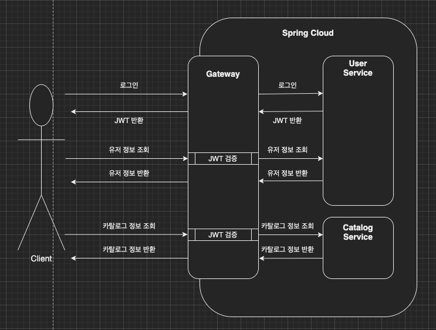
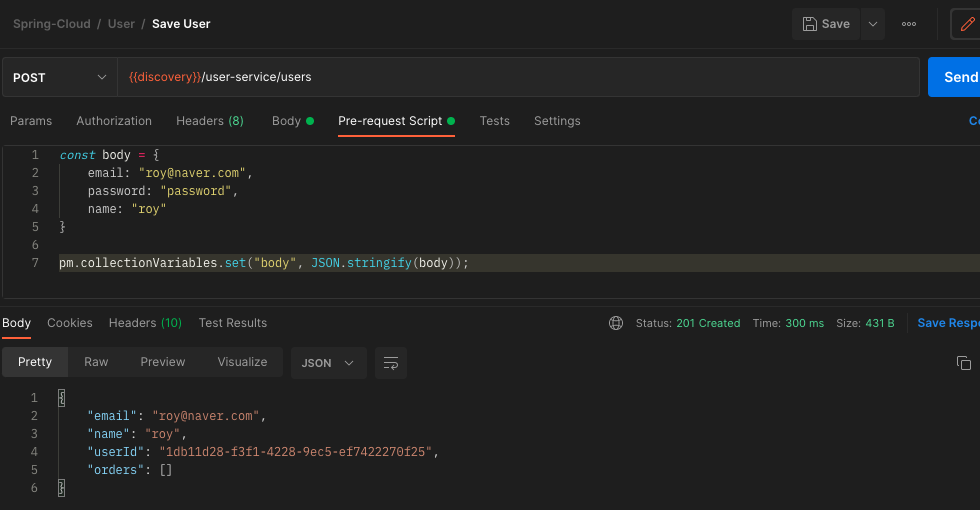
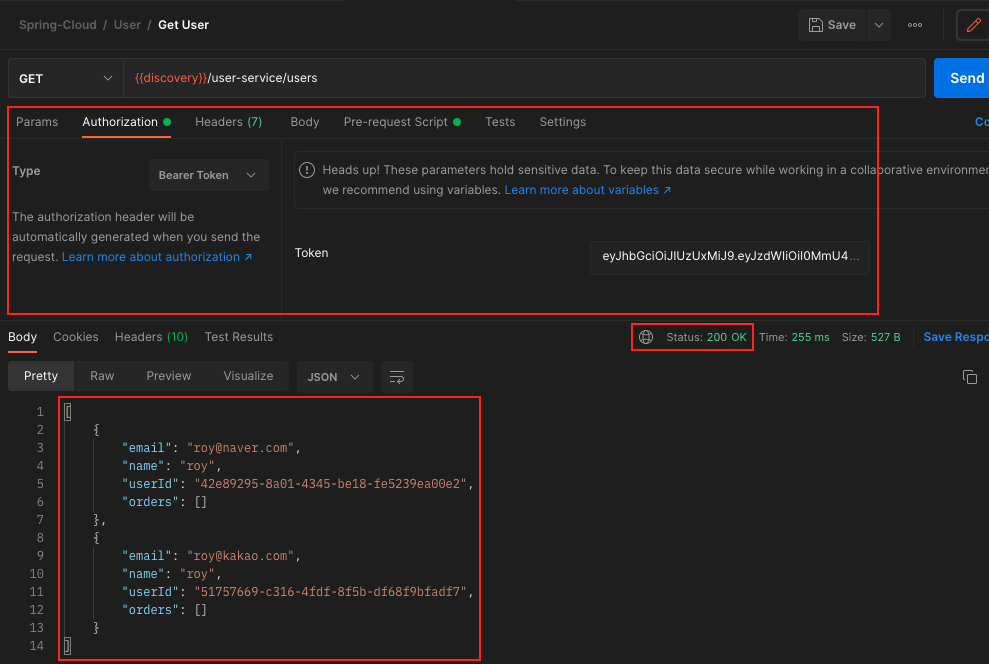

이번 장에서는 [Spring Cloud Gateway - Security 적용](https://imprint.tistory.com/219) 에 이어 적용한 사항이 정상적으로 작동하는지 확인해본다.
모든 소스 코드는 [깃허브 (링크)](https://github.com/roy-zz/spring-cloud) 에 올려두었다.

---

### Flow

이전 장에서 살펴본 것과 같이 유저 서비스에서 JWT를 발급받고 게이트웨이에서 JWT를 검증하는 프로세스는 아래와 같다.

클래스들 간의 호출 관계는 아래와 같다.

유저 서비스의 AuthenticationFilter는 사용자의 로그인 요청이 들어오면 사용자가 전달한 로그인 정보로 UsernamePasswordAuthenticationToken 객체를 생성한다.
AuthenticationFilter 생성한 객체를 통해서 상위 클래스의 AuthenticationManager의 authenticate 메서드를 호출하여 인증 절차를 진행한다.
이때 스프링 시큐리티는 UserDetailsService를 상속하고 있는 MyUserService의 getUserDetailsByEmail메서드를 호출하여 DB에서 사용자를 조회하여 검증한다.
만약 검증에 성공한다면 AuthenticationFilter의 successfulAuthentication메서드를 호출하며 인증에 성공하였으니 로직을 수행하게 한다.
successfulAuthentication메서드에서는 MyUserService의 getUserDetailsByEmail을 호출하여 MyUserDto를 조회하고 조회된 데이터를 바탕으로 JWT를 생성하여 Response 헤더에 집어넣는다.

---

### 테스트

지금부터 우리가 작성한 시큐리티 관련 코드가 우리가 예상한 것과 같이 작동하는지 확인해보도록 한다.
만약 스프링 시큐리티를 처음 접한다면 위에 나와있는 그림과 같은 순서로 작동하는지 IDE의 디버거를 통해 확인해보는 것을 추천한다.
문서가 길어지는 것을 방지하기 위해 본 문서에서는 테스트 케이스와 테스트 결과만을 다룬다.

**용어정리**

- 로그인되어 있는 상태: 요청 헤더에 Authentication: Bearer asdfqwer~~~ 와 같이 JWT 값이 들어있는 상태
- 로그인되어 있지 않은 상태: 요청 헤더에 JWT 정보가 없거나 무효한 정보가 들어있는 상태

1. 로그인되어 있지 않은 상태에서 회원 목록 조회

유저 서비스로 전달되는 모든 GET 요청은 토큰을 검증하는 필터를 통과해야한다.
우리가 예상한 것과 같이 토큰 정보가 없기 때문에 401 Unauthorized 오류가 발생한다.
401 Unauthorized는 응답 메시지로 인해 마치 인증은 되었지만 인가되지 않아서 발생하는 코드같지만 인증이 되지 않았을 때 발생하는 코드다.~~(누가 만든거야;;)~~

2. 로그인되어 있지 않은 상태에서 회원 저장

회원 저장의 경우 샘플 프로젝트 특성상 토큰을 검증하는 필터를 통과하지 않는다.
우리가 예상한 것과 같이 새로운 사용자 정보 등록에 성공하며 201 Created 코드가 반환된다.

3. 로그인되어 있지 않은 상태에서 로그인

2번 테스트에서 생성한 회원 정보로 로그인을 진행한다.

로그인하는 사용자의 경우 JWT를 가지고 있을 수 없으므로 토큰을 검증하는 필터를 통과하지 않는다.
우리가 예상한 것과 같이 로그인에 성공하고 200 코드를 응답받았다.
또한 Response 헤더에는 이후 요청에 사용해야하는 토큰 정보가 담겨있다.

4. 로그인되어 있는 상태에서 회원 목록 조회

실패한 1번 테스트를 3번 테스트에서 획득한 JWT를 헤더에 넣고 다시 시도해본다.

이번에는 정상적으로 회원 목록조회를 성공하며 2번 테스트에서 등록한 회원 정보가 조회되는 것을 확인할 수 있다.

---

**참고한 강의**:

- https://www.inflearn.com/course/%EC%8A%A4%ED%94%84%EB%A7%81-%ED%81%B4%EB%9D%BC%EC%9A%B0%EB%93%9C-%EB%A7%88%EC%9D%B4%ED%81%AC%EB%A1%9C%EC%84%9C%EB%B9%84%EC%8A%A4