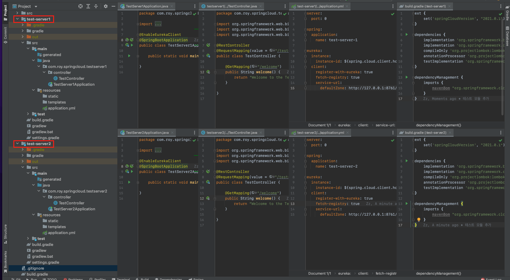
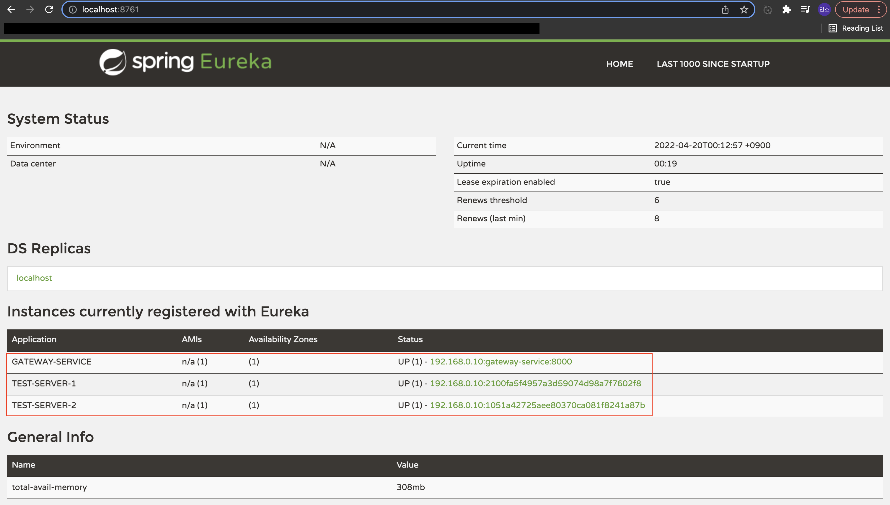
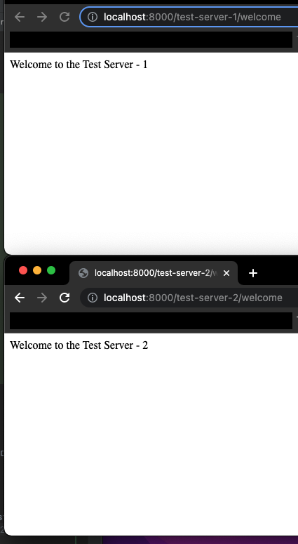
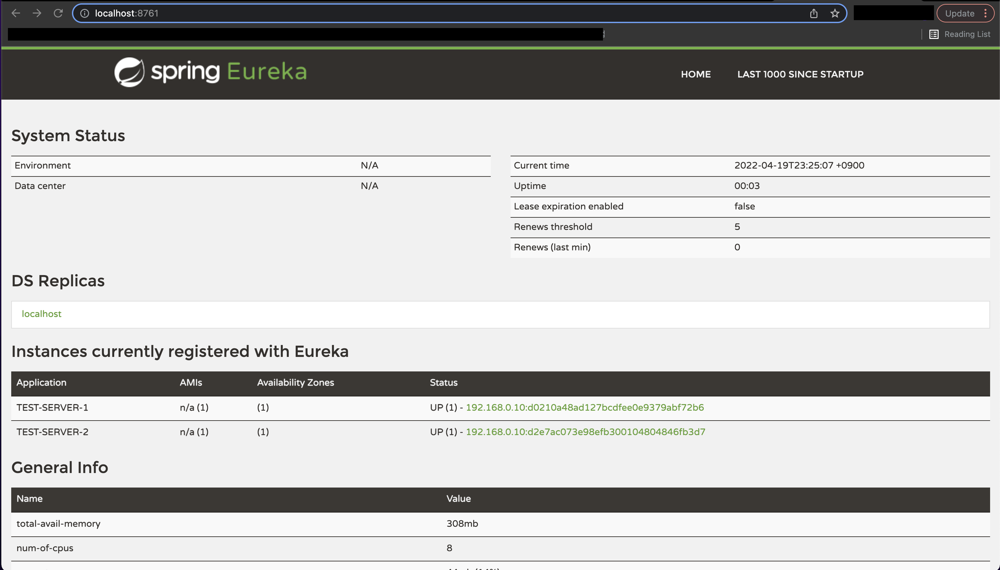

이번 장에서는 [API Gateway Pattern- 이론](https://imprint.tistory.com/214) 에 이어 직접 Spring Gateway 서버를 구축해본다.
모든 소스 코드는 [깃허브 (링크)](https://github.com/roy-zz/spring-cloud) 에 올려두었다.

---

### 프로젝트 구성

Spring Gateway 서버를 구축하기 위해서는 Discovery 서버가 실행되어 있어야한다.
만약 실행되지 않은 상태라면 필자가 [이전에 작성한 글 (링크)](https://imprint.tistory.com/213) 를 참고하도록 한다.

---

**1. 테스트 모듈 추가**

Spring Gateway 서버를 구축하고 정상적으로 작동하는지 확인하기 위해서는 아래의 이미지와 같이 테스트를 위한 서비스가 필요하다.



테스트 모듈을 생성하는 방법은 Gateway 서버를 구축하는 방법과는 거리가 있으므로 글의 하단부에서 따로 다루도록 한다.
만약 테스트 모듈이 없다면 하단부의 글을 확인하고 테스트 모듈을 먼저 생성하고 Spring Gateway 서버 구축을 진행하도록 한다.

**2. 의존성 추가**

다시 Spring Gateway 프로젝트로 돌아와서 Spring Gateway 서버를 구축하기 위해 필요한 의존성이므로 전부 추가하도록 한다.

```bash
ext {
    set('springCloudVersion', "2021.0.1")
}
dependencies {
    implementation 'org.springframework.cloud:spring-cloud-starter-gateway'
    testImplementation 'org.springframework.boot:spring-boot-starter-test'
}
dependencyManagement {
    imports {
        mavenBom "org.springframework.cloud:spring-cloud-dependencies:${springCloudVersion}"
    }
}
```

**3. application.yml**

Spring Gateway 서버를 유레카 서버에 등록하였다.
1단계에서 만들었던 테스트 서버 두 대를 라우팅 정보에 추가하였다.
uri에서 lb는 로드밸런싱을 하겠다는 의미이며 TEST-SERVER-*는 유레카 서버에 등록되어 있는 이름이다.

```yaml
server:
  port: 8000

eureka:
  client:
    register-with-eureka: true
    fetch-registry: true
    service-url:
      defaultZone: http://localhost:8761/eureka

spring:
  application:
    name: gateway-service
  cloud:
    gateway:
      routes:
        - id: test-server-1
          uri: lb://TEST-SERVER-1
          predicates:
            - Path=/test-server-1/**
        - id: test-server-2
          uri: lb://TEST-SERVER-2
          predicates:
            - Path=/test-server-2/**
```

**4. 정상작동 확인**

유레카, 게이트웨이, 테스트 프로젝트 1,2 총 네 개의 프로젝트를 전부 실행시키고 유레카 페이지에 접속해본다.
아래의 이미지와 같이 등록된 서비스들이 나온다면 일단 1단계는 성공이다.



새로운 브라우저를 켜고 localhost:8000/test-server-1/welcome 주소와 localhost:8000/test-server-2/welcome 주소로 접속해본다.
아래와 같이 우리가 정해놓은 문구가 표시된다면 정상적으로 Spring Gateway가 연동된 것이다.



---

### 테스트 모듈

테스트 모듈은 test-server1과 test-server2가 있다.

**build.gradle**

build.gradle은 두 모듈이 동일하다.

```bash
ext {
    set('springCloudVersion', "2021.0.1")
}

dependencies {
    implementation 'org.springframework.boot:spring-boot-starter-web'
    implementation 'org.springframework.cloud:spring-cloud-starter-netflix-eureka-client'
    compileOnly 'org.projectlombok:lombok'
    annotationProcessor 'org.projectlombok:lombok'
    testImplementation 'org.springframework.boot:spring-boot-starter-test'
}

dependencyManagement {
    imports {
        mavenBom "org.springframework.cloud:spring-cloud-dependencies:${springCloudVersion}"
    }
}
```

**MainClass**

따로 수정할 필요없이 클래스 레벨에 @EnableEurekaClient 애노테이션만 달아준다.

* test-server1
```java
@EnableEurekaClient
@SpringBootApplication
public class TestServer1Application {
    public static void main(String[] args) {
        SpringApplication.run(TestServer1Application.class, args);
    }
}
```

* test-server2
```java
@EnableEurekaClient
@SpringBootApplication
public class TestServer2Application {
    public static void main(String[] args) {
        SpringApplication.run(TestServer1Application.class, args);
    }
}
```

**application.yml**

server port는 둘 다 랜덤(0)으로 지정하였다.
애플리케이션의 이름만 서로 다르게 지정하였다.

* test-server1
```yaml
server:
  port: 0
spring:
  application:
    name: test-server-1
eureka:
  instance:
    instance-id: ${spring.cloud.client.hostname}:${spring.application.instance_id:${random.value}}
  client:
    register-with-eureka: true
    fetch-registry: true
    service-url:
      defaultZone: http://127.0.0.1:8761/eureka
```

* test-server2

```yaml
server:
  port: 0
spring:
  application:
    name: test-server-2
eureka:
  instance:
    instance-id: ${spring.cloud.client.hostname}:${spring.application.instance_id:${random.value}}
  client:
    register-with-eureka: true
    fetch-registry: true
    service-url:
      defaultZone: http://127.0.0.1:8761/eureka
```

**TestController**

컨트롤러의 코드도 거의 유사하며 출력되는 내용과 url 경로만 다르게 구성되어 있다.

* test-server1
```java
@RestController
@RequestMapping(value = "/test-server-1")
public class TestController {
    @GetMapping("/welcome")
    public String welcome() {
        return "Welcome to the Test Server - 1";
    }
}
```

* test-server2
```java
@RestController
@RequestMapping(value = "/test-server-2")
public class TestController {
    @GetMapping("/welcome")
    public String welcome() {
        return "Welcome to the Test Server - 2";
    }
}
```

위와 같이 설정하고 테스트 모듈들을 실행하였을 때 아래의 이미지와 같이 유레카 페이지에 출력된다면 정상적으로 연동이 완료된 것이다.



---

참고한 강의: https://www.inflearn.com/course/%EC%8A%A4%ED%94%84%EB%A7%81-%ED%81%B4%EB%9D%BC%EC%9A%B0%EB%93%9C-%EB%A7%88%EC%9D%B4%ED%81%AC%EB%A1%9C%EC%84%9C%EB%B9%84%EC%8A%A4