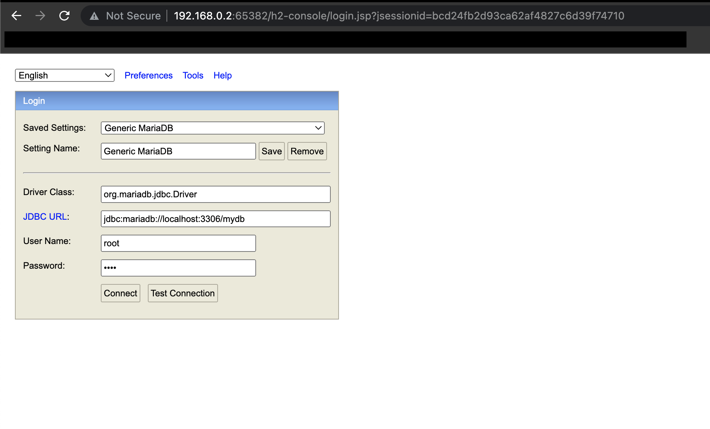

[이전 장(링크)](https://imprint.tistory.com/232) 에서는 `Kafka`의 Producer와 Consumer를 활용하여 데이터를 전송하는 방법에 대해서 알아보았다.
이번 장에서는 `Kafka`의 `Connect`를 사용하기 위해 설정하는 방법에 대해서 알아본다.
모든 소스 코드는 [깃 허브 (링크)](https://github.com/roy-zz/spring-cloud) 에 올려두었다.

---

### Kafka Connect

우리는 일반적으로 데이터를 어느 한 쪽에서 다른 쪽으로 이동시키기 위해 코드를 작성해서 하나씩 전달한다.
하지만 `Kafka Connect`를 사용하면 코드 작성없이 Configuration 정보를 통해서 데이터의 Import와 Export가 가능해진다.
단일 클러스터를 위한 `Standalone mode`와 다중 클러스터를 위한 `Distribution mode`를 지원한다.
RESTful API를 통해 이러한 기능들을 지원하며 Stream 또는 Batch 형태로 데이터의 전송이 가능하다.
여러 Plugin을 통해서 S3, Hive 등과 같이 다양한 엔드포인트를 제공하고 있다.


우리는 이러한 Connect 기능을 사용하기 위해 주문 서비스에 MariaDB를 설치하고 Connect를 연동해 볼 것이다.

---

### Order Service

#### MariaDB 설치

프로젝트를 실행시키는 macOS 환경에 MariaDB를 설치해본다.

1. MariaDB 설치

아래의 커맨드를 입력하여 `Brew`를 통해 MariaDB를 설치해본다.

```bash
$ brew install mariadb
```

아래의 이미지와 같이 출력된다면 정상적으로 설치가 완료된 것이다.


2. MariaDB 실행

MariaDB를 실행시키는 방법은 여러가지가 있지만 `Brew`를 통해 설치하였기 때문에 실행 또한 `Brew`를 통해서 진행한다.

```bash 
$ brew services start mariadb
```


**MariaDB 종료**: ```bash $ brew services stop mariadb```
**MariaDB 상태 조회**: ```bash $ brew services info mariadb```

3. 접속

아래의 커맨드를 입력하여 정상적으로 접속되는지 확인해본다.

```bash
$ mysql -uroot
```

만약 필자와 같이 `Access denied` 오류가 발생한다면 아래와 같이 해결한다.

```bash
$ sudo mysql -u root
$ select user, host, plugin FROM mysql.user;
$ set password for 'root'@'localhost'=password('root');
$ flush privileges;
$ exit
```

비밀번호를 지정하는 부분은 편한 비밀번호를 지정하면 된다.
아래와 같이 비밀번호를 -p를 추가로 입력하고 다시 접속하면 비밀번호를 입력하라는 화면이 나온다.
위에서 지정한 비밀번호를 입력하고 접속한다.


4. database 생성

아래의 커맨드를 입력하여 주문 서비스에서 사용할 `mydb`라는 데이터베이스를 생성한다.

```bash
$ create database mydb;
```

---

### 주문 서비스

기존에 주문 서비스는 임베디드 형식의 H2 DB를 사용하고 있었다.
Kafka의 Connect 기능을 사용하기 위해 위에서 설치한 MariaDB를 사용하도록 수정한다.

1. 의존성 추가

build.gradle 파일에 아래와 같이 MariaDB 클라이언트 의존성을 추가한다.

```bash
implementation 'org.mariadb.jdbc:mariadb-java-client:3.0.4'
```

2. application.yml 파일 수정

우리는 이전 단계에서 MariaDB를 생성하고 mydb라는 데이터베이스를 생성하였다.
관리자 계정의 비밀번호도 `root`로 변경해두었다.
주문 서비스에서도 같은 정보로 접속할 수 있도록 `application.yml` 파일을 수정한다.

```yaml
# 생략
  h2:
    console:
      enabled: true
      settings:
        web-allow-others: true
      path: /h2-console
  jpa:
    hibernate:
      ddl-auto: update
  datasource:
    driver-class-name: org.mariadb.jdbc.Driver
    url: jdbc:mariadb://localhost:3306/mydb
    username: root
    password: root
# 생략
```

수정이 완료되었으면 주문 서비스를 재기동한다.

3. h2-console 접속

이름은 h2-console이지만 우리는 이제 h2-console을 통해서 MariaDB에 접속할 것이다.
아래의 이미지와 같이 설정값을 수정한다. 비밀번호는 각자 설정한 비밀번호를 입력한다.



---

### Connect 설치

필자는 본 문서 작성일 기준 최신 버전인 7.1.1 버전을 설치한다.
최신 버전에 대한 정보가 궁금하다면 [여기](https://docs.confluent.io/platform/current/release-notes/index.html) 로 이동하여 정보를 확인한다.

1. confluent-community 다운로드

웹 브라우저에 아래의 주소를 입력하여 confluent-community를 다운로드 받는다.

`https://packages.confluent.io/archive/6.1/confluent-community-7.1.1.tar.gz`

2. confluent 다운로드 파일 압축 해제

다운로드한 파일의 압축을 풀어준다.
필자는 `Kafka`를 설치한 경로에 같이 압축을 풀었으며 해당 파일은 필자의 [깃 리포지토리](https://github.com/roy-zz/spring-cloud) 에 올려두었다.


3. connect 실행

confluent를 설치하고 압축 해제한 경로로 이동하여 아래의 커맨드를 입력하여 `connect`를 실행시킨다.

```bash
$ ./bin/connect-distributed ./etc/kafka/connect-distributed.properties
```


4. connect 정상 실행 확인

`connect`가 정상적으로 실행되었다면 `Kafka` 토픽에 우리가 보지 못했던 정보가 추가되어야 한다.
아래의 커맨드를 입력하여 Kafka의 `Topic`목록을 확인해본다.

```bash
$ ./bin/kafka-topics.sh --bootstrap-server localhost:9092 --list
```

정상적으로 실행되었다면 아래와 같이 `connect` 관련 토픽이 추가되어야 한다.


5. JDBC Connector 다운로드

웹 브라우저에 아래의 주소를 입력하여 최신 kafka-connect-jdbc 파일을 다운로드 받는다.

`https://www.confluent.io/hub/confluentinc/kafka-connect-jdbc?_ga=2.191287913.2138291622.1650982991-168732119.1650982991&_gac=1.155404745.1650983004.CjwKCAjwsJ6TBhAIEiwAfl4TWMy4ml6lIbqaD-wfx8ub7GcZj_UMeqdqO2G0s-RU4-dARlahsLcySBoC9oAQAvD_BwE`

6. JDBC Connector 압축 해제

다운로드한 파일의 압축을 풀어준다.
confluent와 동일한 경로에 압축을 풀어주었으며 같은 방식으로 관리된다.


7. JDBC lib 경로 지정

아래의 이미지와 같이 `confluentinc-kafka-connect-jdbc` 경로의 `lib` 디렉토리 경로를 확인한다.


{confluent 설치경로}/etc/kafka/ 경로의 connect-distributed.properties 파일을 아래와 같이 수정한다.


8. MariaDB Java Client 다운로드

브라우저에서 아래의 경로로 이동하여 MariaDB Java Client jar파일을 다운로드 받는다.

`https://mvnrepository.com/artifact/org.mariadb.jdbc/mariadb-java-client/3.0.4`

다운로드한 jar 파일을 아래의 이미지와 같이 ${Confluent 설치경로}/share/java/kafka 경로로 이동시킨다.


---

지금까지 Kafka의 Connect를 사용하기 위한 모든 준비가 완료되었다.
다음 장에서는 본격적으로 `Source Connect`와 `Sink Connect`를 사용하는 방법에 대해서 알아본다.

---

**참고한 강의:**

- https://www.inflearn.com/course/%EC%8A%A4%ED%94%84%EB%A7%81-%ED%81%B4%EB%9D%BC%EC%9A%B0%EB%93%9C-%EB%A7%88%EC%9D%B4%ED%81%AC%EB%A1%9C%EC%84%9C%EB%B9%84%EC%8A%A4