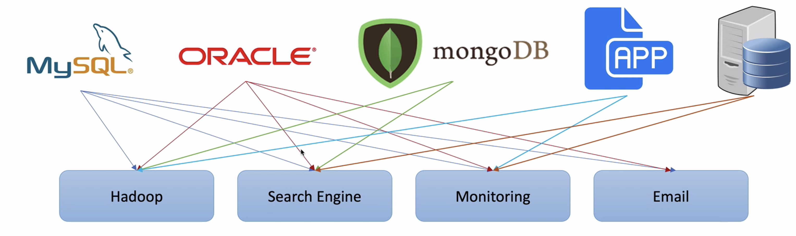
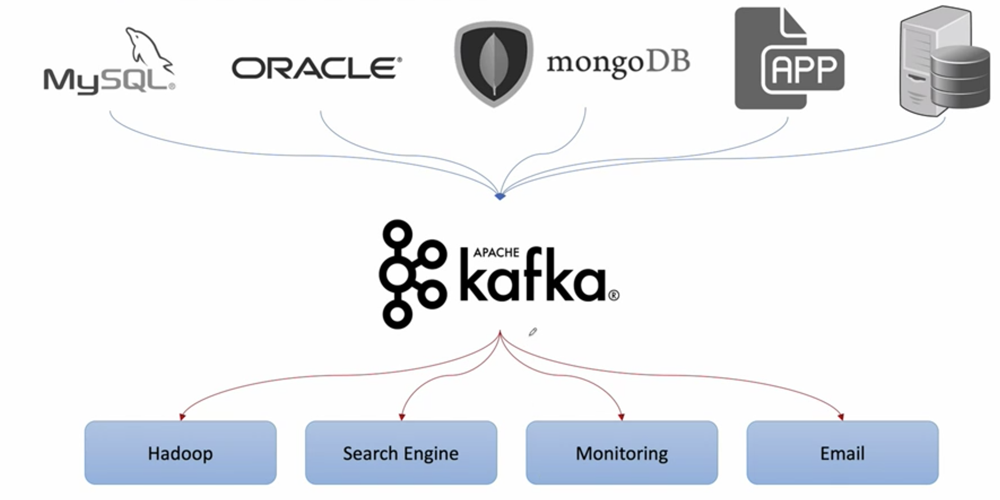
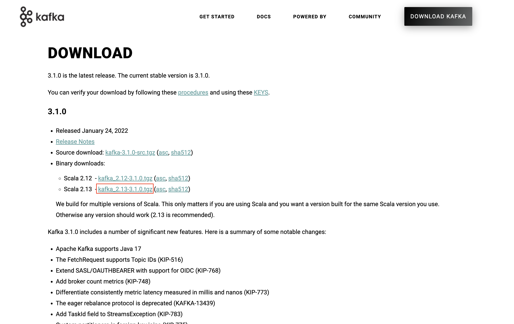
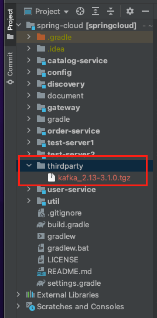
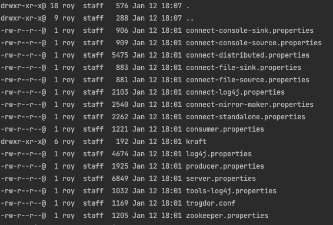
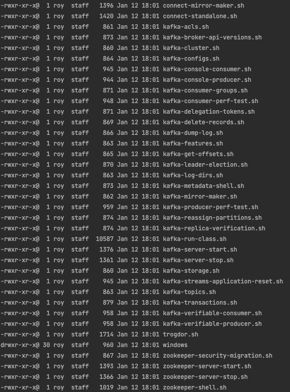

[이전 장(링크)](https://imprint.tistory.com/228) 에서는 마이크로서비스 간의 통신을 다루면서 데이터 동기화의 한계에 대해서 알아보았다.
이번 장에서는 이런 한계를 돌파하기 위해 사용할 기술인 Apache Kafka가 무엇인지 알아보고 설치하는 방법에 대해서 알아본다.
모든 소스 코드는 [깃 허브 (링크)](https://github.com/roy-zz/spring-cloud) 에 올려두었다.

---

### Intro

`Kafka`는 Apache Software Foundation에서 Scalar 언어로 된 오픈 소스 메시지 브로커 프로젝트다.
`링크드인`에서 개발하였으며 2011년 오픈 소스화 하였으며 이후 Kafka를 개발하던 엔지니어들이 2014년 11월 `Confluent`라는 회사를 창립하였다.
`Kafka`는 실시간 데이터 피드를 관리하기 위해 통일된 높은 처리량, 낮은 지연 시간을 지닌 플랫폼을 제공하는 장점이 인정되어 많은 글로벌 기업들에게 채택되어 사용되고 있다.

기존의 서비스들은 서비스와 서비스가 중개자없이 직접 연결되는 `End-to-End` 연결방식의 아키텍처를 사용하였다.



`End-to-End` 아키텍처로 서비스를 구축하게 되면 데이터 연동이 복잡해지고 연결마다 서로 다른 데이터 파이프라인을 구축해야한다.
이로인해 서비스의 확장이 어려워졌고 이러한 문제를 해결하기 위해 모든 시스템으로 데이터를 실시간으로 정송하여 처리할 수 있는 시스템, 데이터가 많아지더라도 확장이 용이한 시스템을 구축하기 위해 `Kafka`가 탄생하였다.

기존의 `End-to-End`의 구조에 `Kafka`가 녹아들면 더 이상 서비스들은 자신이 데이터를 전송해야하는 서비스 또는 자신이 데이터를 받아와야하는 서비스와 직접 연결될 필요없다.
단지 `Kafka`에게 구독을 걸고 자신이 원하는 데이터를 기다리기만 하면 되는 것이다.



만약 이러한 구조에서 Monitoring 구조를 확장한다고 가정해보면 새로운 Monitoring 서비스를 확장할 때 기존처럼 필요한 저장소에 직접 연결할 필요가 없어진다.
단지 기존의 Monitoring 서버와 동일한 `Topic`으로 `구독(Subscribe)`을 걸고 유입되는 데이터를 화면에 표시하면 된다.
물론 이러한 장점은 `Kafka`가 Produce와 Consumer를 분리하였고 하나의 메시지를 여러 Consumer가 가져갈 수 있도록 구현되어 있기 때문이다.
언제든지 Scale-out 가능하며 높은 처리량을 위한 메시지 최적화가 되어 있기 때문에 다른 메시지큐 서비스에 비해 좋은 성능을 제공한다.

`Kafka` 서버를 구축할 때는 3대 이상의 Broker Cluster를 구성해야한다.
Broker Cluster는 항상 `Zookeeper`와 함께 구축되어야 하는데 `Zookeeper`는 메타데이터(Broker ID, Controller ID 등)를 저장하고 Controller의 정보를 저장하는 역할을 한다.
만약 우리가 세 개의 Broker Cluster를 구축하면 한 대는 Controller의 기능을 수행하게 된다. 여기서 Controller는 각 Broker에게 담당 파티션을 할당하는 임무를 수행하고 Broker들의 정상 동작을 모니터링하는 역할을 한다.

---

### Kafka 설치

1. [Kafka 공식 페이지](http://kafka.apache.org) 에 접속하여 최신버전을 다운받는다.



설치에 필요한 모든 설치파일을 필자의 깃 리포지토리의 루트 디렉토리의 `thirdparty` 경로에 위치시킬 예정이다.



2. 다운받은 파일의 압축을 해제한다.

macOS 환경에서는 단순히 압축파일을 더블클릭 하는 것 만으로 압축이 풀릴 것이다.
굳이 커맨드를 입력하여 압축을 풀고 싶다면 다운로드 받은 경로로 이동하여 아래의 커맨드를 입력한다.

```bash
$ tar xvf kafka_2.13-3.1.0.tgz
```

3. config 디렉토리 확인

압축을 풀고 config 디렉토리로 이동하면 이미 많은 설정 파일들이 위치하고 있다.
server.properties는 `Kafka`서버를 구축할 때 사용되는 설정이며 zookeeper.properties는 `Zookeper`를 기동할 때 사용되는 설정파일이다.



4. bin 디렉토리 확인

`Kafka`의 경우 macOS와 windows 환경에서 하나의 압축파일을 받아서 실행시킬 수 있다.
확장자가 `.sh`인 쉘 스크립트와 windows에서 사용할 수 있는 확장자가 `.bat`인 배치파일을 포함하고 있다.



---

### 기타 명령어

**Zookeeper 실행**
```bash 
$ {Kafka 설치경로}/bin/zookeeper-server-start.sh {Kafka 설치경로}/config/zookeeper.propreties
``` 

**Kafka 실행**
```bash 
$ {Kafka 설치경로}/bin/kafka-server-start.sh ${Kafka 설치경로}/config/server.properties
```

**Topic 생성**
```bash 
$ {Kafka 설치경로}/bin/kafka-topic.sh --create --topic quickstart-events --bootstrap-server localhost:9092 --partition 1
```

**Topic 목록 확인**
```bash 
$ {Kafka 설치경로}/bin/kafka-topic.sh --bootstrap-server localhost:9092 --list
```

**Topic 정보 확인**
```bash 
$ {Kafka 설치경로}/bin/kafka-topics.sh --describe --topic quickstart-events --bootstrap-server localhost:9092
```

---

**참고한 강의:**

- https://www.inflearn.com/course/%EC%8A%A4%ED%94%84%EB%A7%81-%ED%81%B4%EB%9D%BC%EC%9A%B0%EB%93%9C-%EB%A7%88%EC%9D%B4%ED%81%AC%EB%A1%9C%EC%84%9C%EB%B9%84%EC%8A%A4