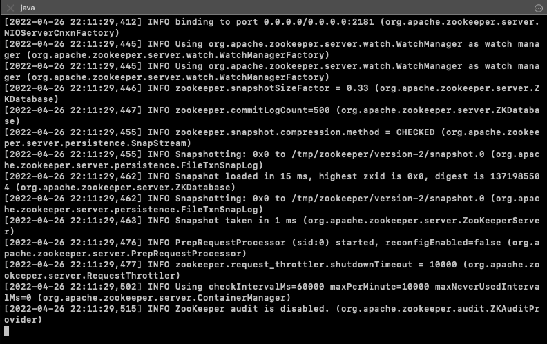
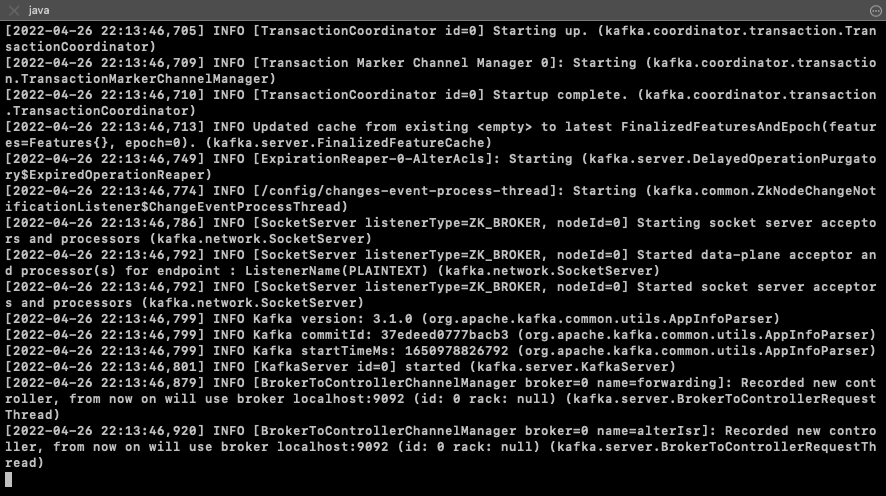
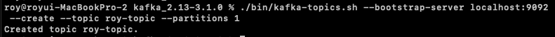
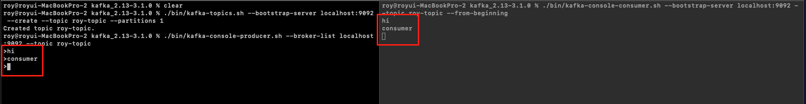
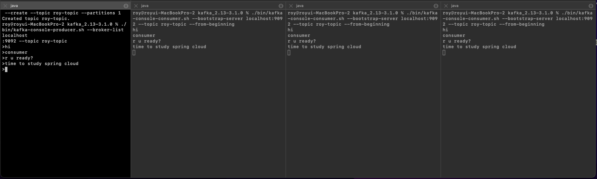

[이전 장(링크)](https://imprint.tistory.com/231) 에서는 `Kafka`를 소개하고 설치해보는 시간을 가졌다.
이번 장에서는 `Kafka`의 Producer와 Consumer를 사용하여 통신하는 방법에 대해서 알아본다.
모든 소스 코드는 [깃 허브 (링크)](https://github.com/roy-zz/spring-cloud) 에 올려두었다.

---

### Producer & Consumer

1. Zoopeeker 실행

Kafka를 설치하기 위해 다운받은 압축파일의 압축이 풀린 경로로 이동하여 아래의 커맨드를 입력한다.

```bash
$ ./bin/zookeeper-server-start.sh ./config/zookeeper.properties
```

아래의 이미지와 같이 출력된다면 정상적으로 `Zookeeper`가 실행된 것이다.



2. Kafka 실행

Zookeeper를 실행시킨 경로에서 아래의 커맨드를 입력한다.

```bash 
./bin/kafka-server-start.sh ./config/server.properties
```

아래의 이미지와 같이 출력된다면 정상적으로 `Kafka`가 실행된 것이다.



3. Topic 생성

아래의 커맨드와 같이 원하는 토픽 이름으로 토픽을 생성한다.
필자의 경우 roy-topic이라는 이름을 사용하였다.

```bash 
$ ./bin/kafka-topics.sh --bootstrap-server localhost:9092 --create --topic roy-topic --partitions 1
```

아래의 이미지와 같이 출력된다면 정상적으로 토픽이 생성된 것이다.



4. Producer 생성

Topic을 생성한 경로와 동일한 경로에서 아래의 커맨드를 입력하여 `Producer`를 생성한다.
주의할 점은 3단계에서 생성한 토픽을 지정해야한다.

```bash 
$ ./bin/kafka-console-producer.sh --broker-list localhost:9092 --topic roy-topic
```

5. Consumer 생성

Producer와 동일하게 아래의 커맨드를 사용하여 `Consumer`를 생성한다.
여기서 옵션으로 사용된 `--from-beginning`는 데이터의 처음부터 읽어 오겠다는 의미다. 

```bash 
$ ./bin/kafka-console-consumer.sh --bootstrap-server localhost:9092 --topic roy-topic --from-beginning
```

6. 데이터 전달

Producer에서 원하는 데이터를 전달해본다.



정상적으로 데이터가 전달되는 것을 확인할 수 있다.

7. 복수 Consumers 테스트

우리는 `Kafka`를 소개할 때 `Consumer`가 여러개 있더라도 모두 같은 데이터를 받을 수 있다고 학습하였다.
직접 여러개의 Conusmer를 생성하여 동일한 데이터를 받을 수 있는지 확인해본다.



이미지에서 가장 좌측은 `Producer`이며 우측의 세 개의 창은 모두 다른 `Consumer`다.
여러개의 `Consumer`가 존재하더라도 동일한 데이터를 받아오는 것을 확인할 수 있다.

---

**참고한 강의:**

- https://www.inflearn.com/course/%EC%8A%A4%ED%94%84%EB%A7%81-%ED%81%B4%EB%9D%BC%EC%9A%B0%EB%93%9C-%EB%A7%88%EC%9D%B4%ED%81%AC%EB%A1%9C%EC%84%9C%EB%B9%84%EC%8A%A4