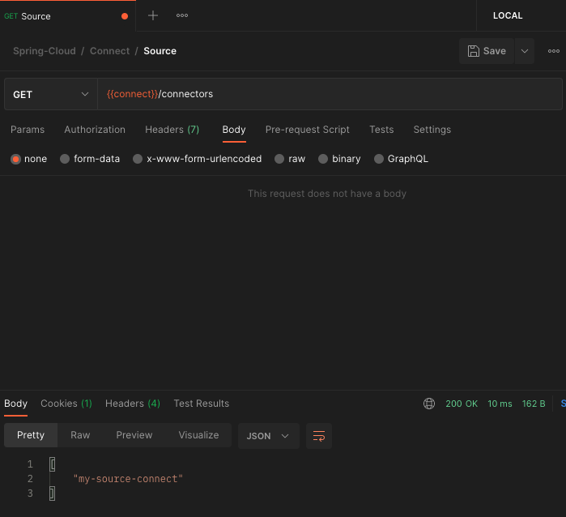
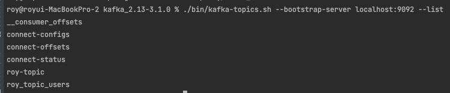
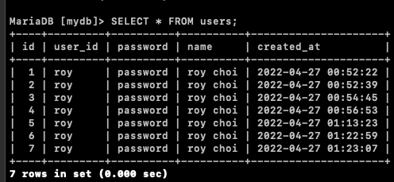
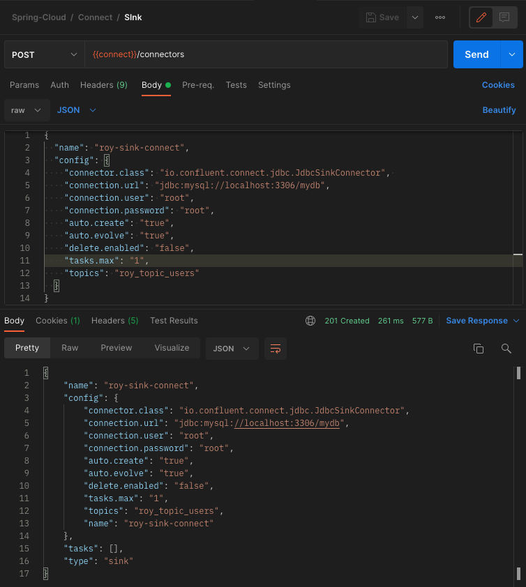
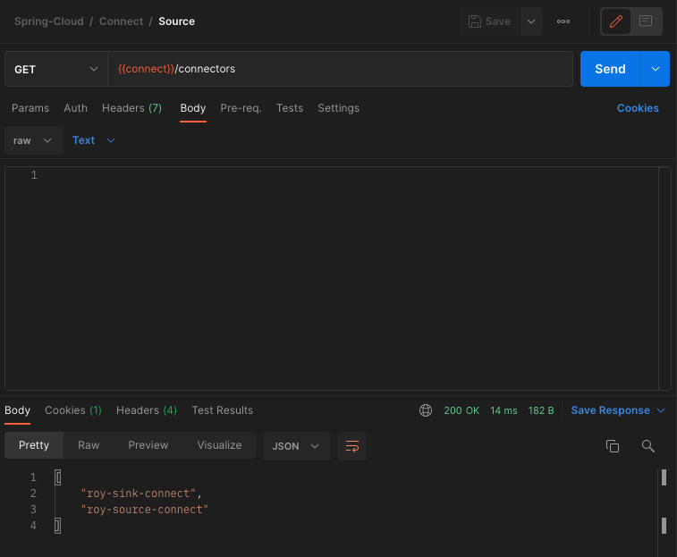
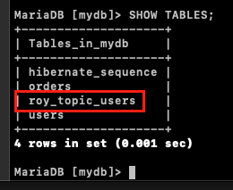
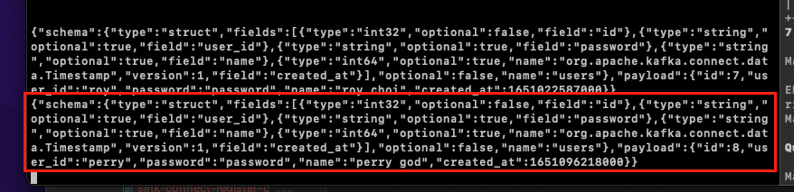
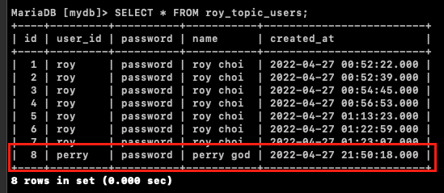

[이전 장(링크)](https://imprint.tistory.com/233) 에서는 `Kafka의 Connect`를 설치하는 방법에 대해서 알아보았다.
이번 장에서는 `Source Connect`와 `Sink Connect`를 사용하는 방법에 대해서 알아본다.
모든 소스 코드는 [깃 허브 (링크)](https://github.com/roy-zz/spring-cloud) 에 올려두었다.

---

우리는 MariaDB의 `Connect Source`와 `Connect Sink`를 사용하여 아래와 같은 구조를 구축할 것이다.


`Connect Source`는 데이터를 제공하는 쪽으로부터 데이터를 전달받아 Kafka Cluster로 전달하는 역할을 하고 `Connect Sink`는 Kafka Cluster를 대상 저장소에 전달하는 역할을 한다.
이전에 Producer와 Consumer를 사용하여 Kafka Cluster를 통해서 데이터를 제공하고 소비하는 작업을 진행했었다.
이번에는 Connect Source와 Connect Sink를 사용하여 데이터를 제공하고 소비하는 작업을 진행해본다.

---

### Source Connect

우리는 Postman을 사용하여 `connect`의 connectors API를 호출하여 새로운 정보를 등록할 것이다. 

Postman에 전달하는 데이터 중에서 `table.whitelist`라는 항목에 우리가 원하는 테이블의 이름을 지정한다.
`connect`는 평소에 대기하고 있다가 우리가 지정한 테이블에 새로운 데이터가 입력되면 새로 입력된 데이터를 가져오는 역할을 한다.
`topic.prefix`는 `table.whitelist`에서 지정한 테이블에 새로운 데이터가 들어왔을 때 데이터를 전달하기 위해 사용되는 토픽의 Prefix이며 데이터가 전달되는 토픽의 이름은 우리가 지정한 테이블의 이름과 합쳐져서 `roy_topic_users`가 될 것이다.
결국 `Source Connect`는 우리가 지정한 테이블의 변경을 감지하고 있다가 변경이 감지되면 우리가 지정한 토픽으로 데이터를 전달해주는 역할을 한다.

1. POST /connectors API 호출

아래의 JSON 파일을 HTTP Body에 넣어서 `connect`의 /connectors API를 호출한다.

```json
{
    "name": "my-source-connect",
    "config": {
        "connector.class": "io.confluent.connect.jdbc.JdbcSourceConnector",
        "connection.url": "jdbc:mysql://localhost:3306/mydb",
        "connection.user": "root",
        "connection.password": "root",
        "mode": "incrementing",
        "incrementing.column.name": "id",
        "table.whitelist": "users",
        "topic.prefix": "roy_topic_",
        "tasks.max" : "1"
    }
}
```

아래와 같이 201 코드가 반환된다면 정상적으로 `Source Connect`가 등록된 것이다.
혹시라도 500 오류가 발생한다면 이전 장에서 설정을 완료하고 나서 Connect를 재실행시키지 않아서 발생하는 오류일 수 있으므로 Connect를 재실행시켜본다.


**참고**

GET http://localhost:8083/connectors 를 호출하면 등록되어 있는 connect 목록을 확인할 수 있다.



GET http://localhost:8083/connectors/my-source-connect 를 호출하면 connect의 상세정보를 확인할 수 있다.


2. Consumer 등록

`Source Connect`가 produce하는 데이터를 확인하는 Consumer를 실행시킨다.

```bash
$ ./bin/kafka-console-consumer.sh --bootstrap-server localhost:9092 --topic roy_topic_users --from-beginning
```


3. 사용자 정보 Insert

새로운 사용자 정보가 Insert 되었을 때 우리가 예상한 데이터가 전달되는지 확인하기 위해 MariaDB 콘솔로 접속하여 새로운 사용자를 등록해본다.

```sql
INSERT INTO users (user_id, password, name) VALUES ('roy', 'password', 'roy choi');
```

Consumer가 정상적으로 데이터를 수신하고 있다.
좌측 창이 Consumer이며 우측 창에서 데이터를 INSERT하고 있다.


**참고**

1, 2, 3 단계를 진행하여도 Consumer가 데이터를 수신하지 못하는 경우가 발생하였다.
필자의 경우 아래와 같은 방법으로 해결하였으니 혹시라도 같은 문제가 발생한다면 참고하도록 한다.

문제상황: Consumer에서 데이터를 수신하지 못하며 connect 로그에서 SQL Exception이 발생하는 상황.
해결방법:
- 아래의 이미지와 같이 mariadb-connector.jar 파일을 추가한 디렉토리에 myslq-connector.jar파일을 추가한다. (mysql.jar 파일은 [여기](https://dev.mysql.com/downloads/file/?id=510648)에서 다운로드 한다.)


- connect의 API를 호출하여 `Source Connect`를 추가할 때 접속주소를 mariadb가 아닌 mysql로 수정한다.

```json
{
    "name": "roy-source-connect",
    "config": {
        "connector.class": "io.confluent.connect.jdbc.JdbcSourceConnector",
        "connection.url": "jdbc:mysql://localhost:3306/mydb",
        "connection.user": "root",
        "connection.password": "root",
        "mode": "incrementing",
        "incrementing.column.name": "id",
        "table.whitelist": "users",
        "topic.prefix": "roy_topic_",
        "tasks.max" : "1"
    }
}
```

아마 문제가 발생하였다면 같은 방식으로 해결될 것으로 예상된다.

---

### Sink Connect

이번에는 `Source Connect`를 추가한 것과 유사하게 `Sink Connect`를 추가해본다.

`Sink Connect`의 역할을 알아보면 어떠한 `Source Connect`가 데이터를 Kafka의 토픽에 쌓으면 쌓인 데이터를 가져와서 처리하는 역할을 한다.
우리는 `connect`의 connectors API를 호출할 때 HTTP Body에 아래와 같은 정보를 전달할 것이다.

```json
{
  "name": "roy-sink-connect",
  "config": {
    "connector.class": "io.confluent.connect.jdbc.JdbcSinkConnector", 
    "connection.url": "jdbc:mysql://localhost:3306/mydb",
    "connection.user": "root",
    "connection.password": "root",
    "auto.create": "true",
    "auto.evolve": "true",
    "delete.enabled": "false",
    "tasks.max": "1",
    "topics": "roy_topic_users"
  }
}
```

JSON 데이터에 MariaDB의 접속 정보와 접속 클라이언트를 지정하면서 `Sink Connect`가 DB와 연동되는 것을 알리는 옵션이다.
`topics`는 `Sink Connect`가 어떠한 토픽에 데이터가 들어오기를 대기하는지를 지정하는 옵션이며 `auto.create`라는 옵션에 의해서 토픽과 이름이 동일한 테이블이 없으면 토픽과 이름이 동일한 테이블을 생성하여 데이터를 저장한다.
쉽게 정리하면 `Source Connect`는 자신이 관찰하는 데이터 소스에 새로운 데이터가 추가되면 토픽으로 데이터를 전달하고 `Sink Connect`는 자신이 관찰하는 토픽에 새로운 데이터가 추가되면 데이터를 전달해야하는 곳에 데이터를 전달한다.

`Source Connect`를 사용하였을 때 DB에 새로운 데이터가 들어가면 새로운 데이터 뿐만 아니라 아래와 같이 DB 스키마 정보까지 같이 토픽으로 전달되었다.

```json
{
  "schema": { 
    "type": "struct",
    "fields": [
      { "type": "int32", "optional": false, "field": "id" },
      { "type": "string", "optional": true, "field": "user_id" },
      { "type": "string", "optional": true, "field": "password" },
      { "type": "string", "optional": true, "field": "name" },
      { "type": "int64", "optional": true, "name": "org.apache.kafka.connect.data.Timestamp","version": 1,"field": "created_at"}
    ],
    "optional": false,
    "name": "users" },
  "payload": { 
    "id": 7, 
    "user_id": "roy", 
    "password": "password", 
    "name": "roy choi", 
    "created_at":1651022587000
  }
}
```

1. 토픽 확인

아래의 커맨드를 입력하여 현재 존재하는 토픽을 확인한다. 정상작동을 단순히 확인 과정이므로 큰 의미를 두는 단계는 아니다.

```bash
$ ./bin/kafka-topics.sh --bootstrap-server localhost:9092 --list
```



2. 테이블 데이터 확인

아래의 SQL을 실행하여 users 테이블에 들어있는 데이터를 확인한다. 정상작동을 위한 단순 확인 과정이므로 큰 의미를 두는 단계는 아니다.

```sql
SELECT * FROM users;
```



3. `Sink Connect` 등록

POST /connectors API를 호출하여 `Sink Connect`를 등록한다.



4. `Connect` 정상 등록 확인

GET /connectors API를 호출하여 정상적으로 `Sink Connect`가 등록되었는지 확인한다.



5. 테이블 확인

정상적으로 `Sink Connect`가 등록되었다는 것은 DB에 토픽이름과 동일한 테이블이 생성되었다는 것을 의미한다.
아래의 SQL을 사용하여 정상적으로 테이블이 생성되었는지 확인한다.

```sql
SHOW TABLES;
```


6. 데이터 정상 전송 확인.

우리는 아래와 같은 구조로 데이터가 전달되도록 전체적인 구조를 잡았다.
`users Table` -> `Source Connect` -> `Kafka Topic` -> `Sink Connect` -> `roy_topic_users Table`
users 테이블에 아래의 쿼리를 사용하여 `Perry`라는 사용자를 Insert하고 `roy_topic_users` 테이블에 정상적으로 데이터가 들어가는지 확인해본다.

```sql
INSERT INTO users (user_id, password, name) VALUES ('perry', 'password', 'perry god');
```

데이터를 Insert하는 것과 동시에 `Consumer`를 실행 중인 터미널에 데이터가 출력되는 것을 확인할 수 있다.



`roy_topic_users`에 데이터가 정상적으로 Insert되었는지 확인해본다.



정상적으로 데이터가 Insert된 것을 확인할 수 있다.

물론 `Source Connect`가 토픽에 데이터를 집어넣은 것과 동일한 형식으로 직접 토픽에 데이터를 집어넣어도 `Sink Connect`는 동일하게 반응한다.

---

**참고한 강의:**

- https://www.inflearn.com/course/%EC%8A%A4%ED%94%84%EB%A7%81-%ED%81%B4%EB%9D%BC%EC%9A%B0%EB%93%9C-%EB%A7%88%EC%9D%B4%ED%81%AC%EB%A1%9C%EC%84%9C%EB%B9%84%EC%8A%A4