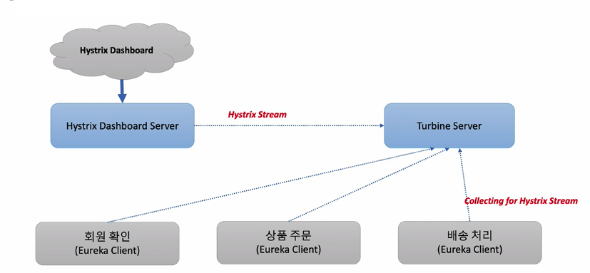

이번 장에서는 우리의 서비스를 모니터링하기 위한 툴인 `Micrometer`에 대해서 알아본다.
모든 소스 코드는 [깃 허브 (링크)](https://github.com/roy-zz/spring-cloud) 에 올려두었다.

---

### Turbine Server

`Turbine Server`는 마이크로서비스에 설치된 `Hystrix` 클라이언트의 스트림 메시지를 아래와 같이 통합한다.


`Turbine Server`는 설정 파일에 정의되어 있는 `msa-service-order`, `msa-service-member`, `msa-service-delivery`와 같은 `Hystrix` 클라이언트들의 스트림 메시지를 수집한다.
이후 `Hystrix Dashboard`를 통해 클라이언트로 부터 전달받은 스트림을 시각화한다.



하지만 `Hystrix`와 `Turbine Server`는 스프링 클라우드 최신 버전에는 더 이상 쓰이지 않다.
최근에는 `Micrometer`와 `Monitoring System`으로 대체되었고 우리의 마이크로서비스에도 새로운 기술을 적용시켜 본다.

---

### [Micrometer](https://micrometer.io)

`Micrometer`는 JVM 기반의 애플리케이션의 Metrics를 제공한다.
`Spring Framework 5.*`와 `Spring Boot 2.*` 버전의 스프링의 Metrics를 처리한다.
`Prometheus`와 같은 다양한 모니터링 시스템을 지원한다.

`Timer`는 `@Timed` 애노테이션을 제공하며 짧은 지연 시간과, 이벤트의 사용 빈도를 측정하기 위해 사용되며 시계열로 이벤트의 시간, 호출 빈도등을 제공한다.

---

### Users Service

유저 서비스에 위에서 알아본 `Prometheus`를 적용시켜본다.

1. build.gradle 수정

의존성 주입을 위하여 유저 서비스의 `build.gradle` 파일에 아래의 의존성을 추가한다.

```bash
implementation 'io.micrometer:micrometer-registry-prometheus'
```

2. application.yml 수정

`application.yml` 파일에 prometheus, metrics를 추가한다.

```yaml
management:
  endpoints:
    web:
      exposure:
        include: refresh,health,beans,httptrace,busrefresh,prometheus,metrics
```

3. @Timed 애노테이션 추가

테스트를 위한 `GET /health-check` API와 `GET /welcome` API에 @Timed 애노테이션을 추가한다.

```java
public class MyUserController {
    private final Environment environment;
    @GetMapping("/health-check")
    @Timed(value = "users.status", longTask = true)
    public String healthCheck() {
        return String.format("expiration_time: %s, secret: %s, password: %s",
                environment.getProperty("token.expiration_time"),
                environment.getProperty("token.secret"),
                environment.getProperty("spring.datasource.password")
        );
    }
    @GetMapping("/welcome")
    @Timed(value = "users.welcome", longTask = true)
    public String welcome() {
        return environment.getProperty("greeting.message");
    }
    // 생략...
}
```

4. 정상작동 확인

유저 서비스를 재실행 시키고 아래의 접속주소로 접속하여 `metrics` 정보가 나오는지 확인해본다.

```bash
localhost:8000/user-service/actuator/metrics
```


```bash
localhost:8000/user-service/actuator/prometheus
```


---

### Prometheus & Grafana

#### 개요

`Prometheus`는 Metrics를 수집하고 모니터링 및 알람에 사용되는 오픈소스 애플리케이션이다.
2016년부터 `CNCF`에서 관리되는 2번째 공식 프로젝트이며 Pull 방식의 구조와 다양한 Metric Exporter를 제공한다.
기존 Level DB에서 최근에는 Time Series Database(TSDB)로 변경되어 시계열 DB에 Metrics를 저장하고 조회가 가능하다.

`Grafana`는 데이터 시각화와 모니터링 및 분석을 위한 오픈소스 애플리케이션이다.
`Prometheus`와 같이 시계열 데이터를 시각화하기 위한 대시보드를 제공한다.

정리하면 `Prometheus`는 Metric 데이터를 시계열 DB에 저장, `Grafana`는 Metric 데이터를 시계열 DB에서 조회.

---

#### Prometheus 적용

1. prometheus 다운로드

아래의 주소로 접속하여 darwin OS 전용 파일을 다운로드 받는다.~~(본 문서에서는 windows를 다루지 않는다.)~~

```bash
https://prometheus.io/download/
```


2. prometheus.yml 수정

아래와 같이 `prometheus.yml` 파일에 유저 서비스를 등록한다.

```yaml
# 이전 생략
scrape_configs:
  - job_name: "prometheus"
    static_configs:
      - targets: ["localhost:9090"]
  - job_name: "user-service"
    scrape_interval: 15s
    metrics_path: "/user-service/actuator/prometheus"
    static_configs:
      - targets: ["localhost:8000"]
```

3. prometheus 실행

`prometheus`가 설치되어 있는 경로로 이동하여 아래의 커맨드를 입력하여 실행시킨다.

```bash
$ ./prometheus --config.file=prometheus.yml
```

아래와 같이 출력된다면 정상적으로 `prometheus`가 실행된 것이다.


4. prometheus 접속

아래의 주소로 접속하여 정상적으로 접속되는지 확인한다.

```bash
$ localhost:9090
```

**Table**


**Graph**


---

#### Grafana 적용

1. grafana 다운로드

아래의 주소로 접속하여 최신 파일 다운로드 커맨드를 확인하고 적당한 경로에 다운로드 받는다.

```bash
grafana.com/grafana/download?platform=mac
```


2. grafana 실행

`grafana`가 설치된 경로로 이동하여 아래의 커맨드를 입력하여 실행시킨다.

```bash
$ ./bin/grafana-server web
```

3. grafana 접속

아래의 주소로 접속하여 `grafana`가 정상적으로 실행되었는지 확인한다.
ID: admin, PW: admin

```bash
localhost:3000
```

`configuration` -> `Data sources` -> `Prometheus` 로 접속하여 위에서 실행시킨 `prometheus`의 정보를 입력한다.


---

지금까지 마이크로서비스 모니터링을 위해 `Prometheus`와 `Grafana`를 적용하는 방법에 대해서 알아보았다.
다음 장에서는 `Grafana`에 `Dashboard`를 추가하여 보기 편하게 Metric을 확인하는 방법에 대해서 알아본다.

---

**참고한 강의:**

- https://www.inflearn.com/course/%EC%8A%A4%ED%94%84%EB%A7%81-%ED%81%B4%EB%9D%BC%EC%9A%B0%EB%93%9C-%EB%A7%88%EC%9D%B4%ED%81%AC%EB%A1%9C%EC%84%9C%EB%B9%84%EC%8A%A4