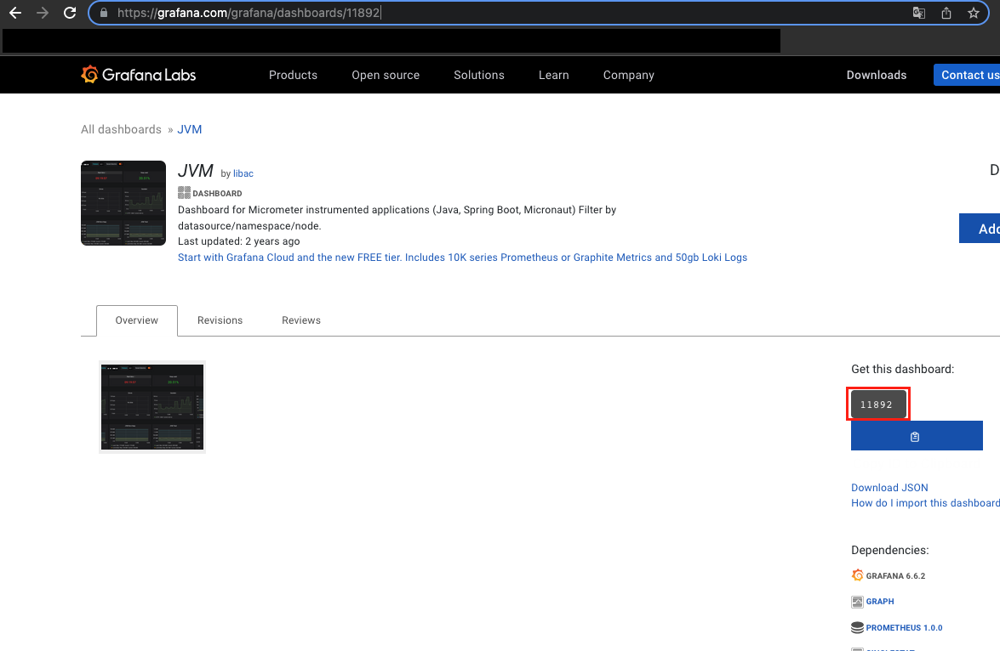
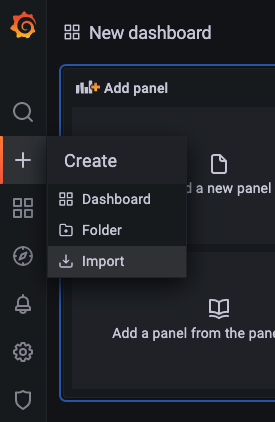
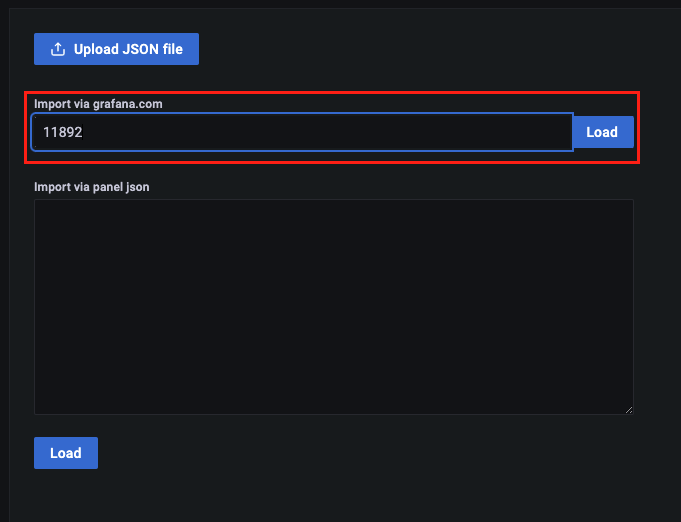
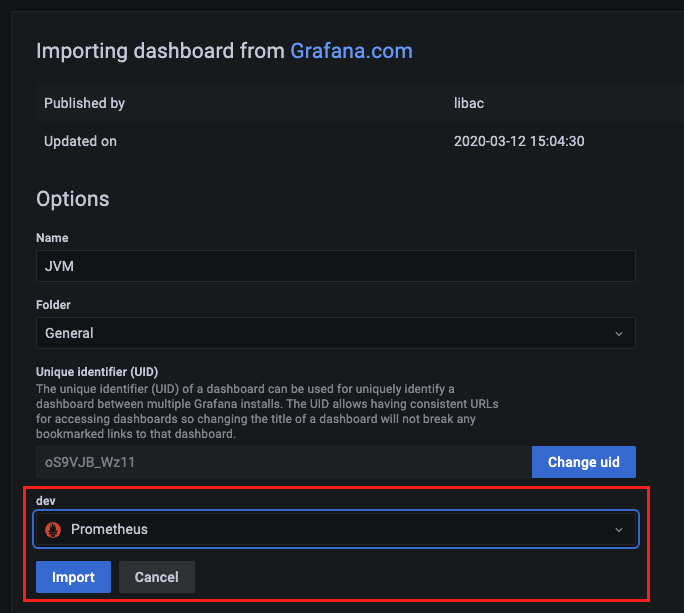
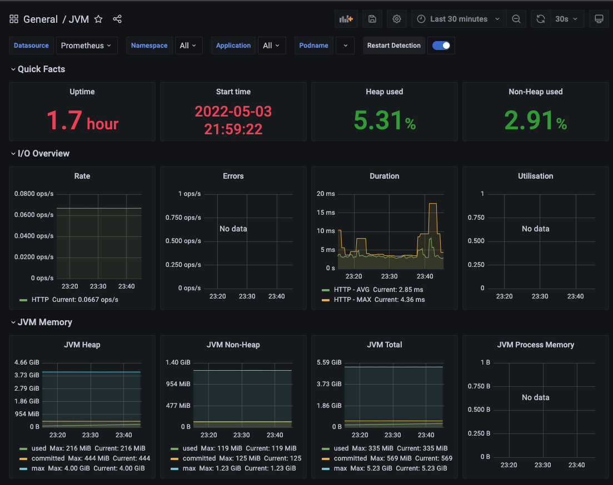
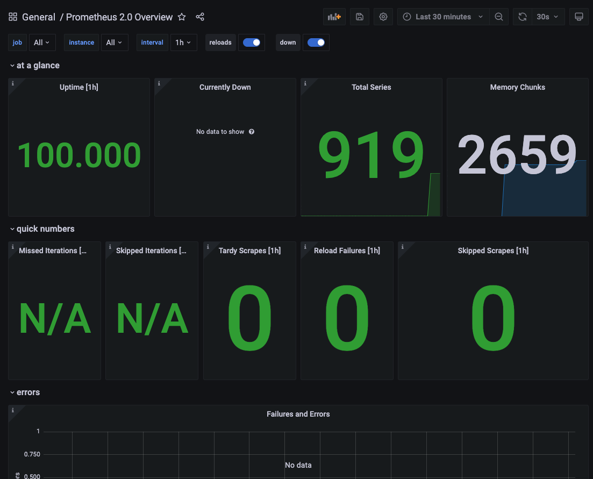
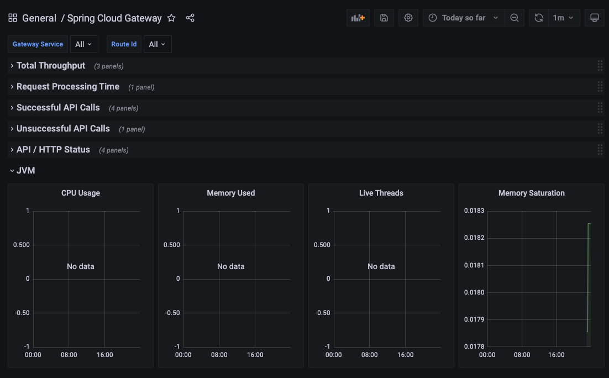

[이전 장(링크)](https://imprint.tistory.com/246) 에서는 `Prometheus`와 `Grafana`를 설치하는 방법에 대해서 알아보았다.
이번 장에서는 `Grafana`에 `Dashboard`를 추가하여 이전보다 데이터를 더 편리하게 확인할 수 있도록 수정해본다.
모든 소스 코드는 [깃 허브 (링크)](https://github.com/roy-zz/spring-cloud) 에 올려두었다.

---

### Grafana Dashboard

우리는 `Grafana`에 `JVM(Micrometer)`, `Prometheus`, `Spring Cloud Gateway` 세 개의 Dashboard를 추가할 것이다.
`JVM(Micrometer)` 부터 하나씩 추가해보도록 한다.

---

#### JVM(Micrometer)

1. Get this dashboard 확인

아래의 주소로 접속하여 Dashboard를 추가하기 위해 `Get this dashboard`에 나와있는 코드 번호를 확인하도록 한다.

```bash
https://grafana.com/grafana/dashboards/11892
```



2. import

좌측 탭에서 `create` -> `import`를 선택한다.



3. load

1번 단계에서 확인한 코드 번호를 입력하고 `Load`를 클릭한다.



이후 `Import` 버튼이 활성화되면  선택해서 `JVM Dashboard`를 추가한다.



4. 정상작동 확인

`Dashboard` -> `JVM` 을 선택하여 정상적으로 `dashboard`가 표시되는지 확인한다.



---

#### Prometheus

1. Get this dashboard 확인

아래의 주소로 접속하여 Dashboard를 추가하기 위해 `Get this dashboard`에 나와있는 코드 번호를 확인하도록 한다.

```bash
https://grafana.com/grafana/dashboards/3662
```

2. JVM(Micrometer)과 동일

이후의 단계는 `JVM(Micrometer)`를 추가하는 과정과 동일하며 아래와 같은 화면이 나온다면 정상적으로 연동이 완료된 것이다.



---

#### Spring Cloud Gateway

1. Get this dashboard 확인

아래의 주소로 접속하여 Dashboard를 추가하기 위해 `Get this dashboard`에 나와있는 코드 번호를 확인하도록 한다.

```bash
https://grafana.com/grafana/dashboards/11506
```

2. JVM(Micrometer)과 동일

이후의 단계는 `JVM(Micrometer)`를 추가하는 과정과 동일하며 아래와 같은 화면이 나온다면 정상적으로 연동이 완료된 것이다.



---

**참고한 강의:**

- https://www.inflearn.com/course/%EC%8A%A4%ED%94%84%EB%A7%81-%ED%81%B4%EB%9D%BC%EC%9A%B0%EB%93%9C-%EB%A7%88%EC%9D%B4%ED%81%AC%EB%A1%9C%EC%84%9C%EB%B9%84%EC%8A%A4