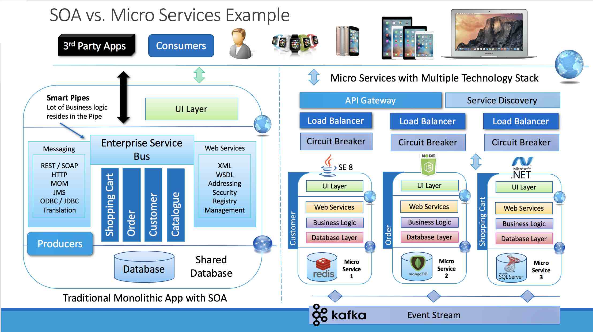

[이전 장(링크)](https://imprint.tistory.com/260) 에서는 `Software Architecture`에 대해서 알아보았다.
이번 장에서는 `Microservice Architecture`에 대해서 알아보도록 한다.

---

### Monolith vs Microservice

`Monolith`방식은 애플리케이션을 구성하기 위한 모든 구성요소를 하나의 서비스로 개발하는 방법이다. 구성요소에는 `DB 접근기술`, `비지니스 로직`, `프론트엔드`등이 포함된다.
이러한 서비스들이 서로 의존성을 가지고 패키징되고 운영서버에 배포되는 방식을 의미한다.
`Microservice`방식은 애플리케이션을 구성하는 구성요소를 분리하여 개발하고 운영하는 방식을 의미한다. 하나의 큰 형태로 개발되는 `Monolithic` 방식에 비해 유지보수나 변경사항을 적용하는데 유리하다.  
어떠한 비즈니스 로직이 수정되어야 하는 상황을 가정했을 때 필요한 부분만 개발을 하고 다른 서비스와 영향을 주지 않은 상태에서 독립적으로 배포가 가능하다.  
따라서 애플리케이션 전체가 다운되는 현상을 없앨 수 있다. 

#### Monolith

서비스를 구성하는 모든 업무 로직이 하나의 애플리케이션 형태로 패키징되어 서비스되며 데이터베이스 또한 하나의 저장소에 집중된다.  

**장점**:
- 하나의 프로젝트이기 때문에 빌드 -> 테스트 -> 배포 -> 문제 해결 -> 확장이 매우 간단한 프로세스로 진행될 수 있다.
- 초기 프로젝트의 경우 더 `Monolithic`방식이 더 빠르게 반복 가능하다.
- `Microservice`에 비해 상대적으로 쉽고 간단하게 개발할 수 있다.

**단점**:
- 시간이 지나면서 하나의 프로젝트가 관리하기 힘들 정도로 거대해진다.
- 작은 변경에도 전체 애플리케이션을 재배포해야 한다.
- 응용 프로그램의 크기가 증가함에 따라 시작 및 배포 시간도 늘어난다.
- 트래픽이 증가하여 분산을 해야할 때 트래픽이 증가하지 않은 부분까지 동시에 분산해야한다. 따라서 수평적 스케일링이 거의 불가능하다.
- 단일 모듈의 오류가 전체 서비스에 영향을 줄 수 있다.

`Monolith`방식에는 프론트엔드와 백엔드가 분리되어 있는 방식도 존재한다.

---

#### Microservice

> 함께 작동하는 작은 규모의 서비스들이다. - Sam Newman

모든 기능이 각각의 애플리케이션으로 분리되어 서로 `HTTP`와 같은 경량 프로토콜을 사용하여 직접 통신하는 서비스로 구축되어 있다.
애플리케이션과 데이터베이스에 상당한 영향을 미치며 마이크로서비스간에 데이터베이스를 공유하는 대신 자체 데이터베이스를 가지고 있다.
마이크로서비스들은 각각 **단일 책임**을 가지고 있어야하며 하나의 마이크로서비스가 다운되는 경우에도 다른 애플리케이션은 다운되지 않고 사용자의 요청을 처리할 수 있어야 한다.

**장점**
- 크기가 상대적으로 작기 때문에 관리하기 쉽다.
- 업데이트가 필요한 경우 업데이트 대상이되는 서비스만 재배포되면 된다.
- 트래픽이 증가하는 경우 대상 서비스만 수평적 확장을 하면 된다.
- 비즈니스 요구 사항에 따라 독립적으로 서로다른 기술 스택을 사용할 수 있다.

**단점**
- 분산되어있기 때문에 `Monolith` 방식에 비해 훨씬 더 복잡하며 마이크로서비스의 수가 증가할수록 복잡성이 증가한다.
- 서비스간에 API로 통신하기 때문에 네트워크 대기 시간이 발생하고 네트워카 사용 비용이 발생한다.
- 마이크로서비스 간에 통신을 통해 데이터를 동기화하기 때문에 `Monolith`방식보다 덜 안전하다.

대표적인 `Monolithic`구조와 `Microservice`구조의 서버 구성도는 아래와 같다.
`Microservice`환경의 경우 어떠한 서비스는 `Java`, 어떠한 서비스는 `.Net`과 같이 자신에게 필요한 기술 스택을 선택하여 개발되어 있다.

---

### Microservice Architecture

다음은 마이크로서비스를 잘 구축한 것으로 유명한 `Amazon`과 `Netflix`의 서비스 구성도다.

2002년 Amazon CEO인 `Jeff Bezos's`는 직원들에게 메일 한 통을 전달한다.
아래는 해당 메일의 원본과 번역된 내용이며 이미 2002년부터 마이크로서비스를 위한 기반을 구축하기 시작했음을 알 수 있다.

> 1. All teams will henceforth expose their data and functionality through service interfaces.
> 2. Teams must communicate with each other through these interfaces.
> 3. There will be no other form of interprocess communication allowed: no direct linking, no direct reads of another team’s data store, no shared-memory model, no back-doors whatsoever. The only communication allowed is via service interface calls over the network.
> 4. It doesn’t matter what technology they use. HTTP, Corba, Pubsub, custom protocols — doesn’t matter.
> 5. All service interfaces, without exception, must be designed from the ground up to be externalizable. That is to say, the team must plan and design to be able to expose the interface to developers in the outside world. No exceptions.
> 6. Anyone who doesn’t do this will be fired.
> 7. Thank you; have a nice day!

1. 모든 팀은 서비스 인터페이스를 통해 자신의 데이터와 기능을 노출해야한다.  
2. 팀은 이러한 인터페이스를 통해 서로 통신해야 한다.  
3. 다른 형태의 프로세스 간 통신은 허용되지 않는다. 예를 들어 직접 연결, 다른 팀의 데이터 저장소 직접 읽기, 공유 메모리 모델, 백도어 등. 허용된 유일한 통신은 네트워크를 통한 서비스 인터페이스 호출을 통한 것이다.  
4. 그들이 어떤 기술을 사용하는지는 중요하지 않다. HTTP, Corba, Pubsub 사용자 지정 프로토콜은 중요하지 않다.  
5. 모든 서비스 인터페이스는 예외 없이 처음부터 외부화가 가능하도록 설계해야 한다. 즉, 팀은 외부 세계의 개발자들에게 인터페이스를 노출할 수 있도록 계획하고 설계해야 하며 예외는 없다.  
6. 이것을 지키지 않는 사람은 누구든지 해고될 것이다.  
7. 감사합니다. 좋은 하루 되세요.  

#### Microservice Architecture의 특징

1. Challenges: 기존의 개발방식과 패러다임을 상당히 많은 부분을 바꿔야한다.
2. Small Well Chosen Deployable Units: 독립적으로 단위 배포 가능하도록 선택되어야 한다.
3. Bounded Context: 각각의 서비스들은 애플리케이션을 구축하는 도메인 지식에 따라 경계를 잘 구분해야한다.
4. RESTful: 각각의 서비스들은 서로 상태에 대해서 RESTful API 방식으로 통신해야한다.
5. Configuration management: 애플리케이션의 구성정보는 코드내에 있어서는 안되며 외부 서비스에 의해 관리되어야 한다.
6. Cloud enabled: Cloud Native 기능을 최대한 활용하여 구현해야 한다.
7. Dynamic scale up and down: 애플리케이션을 실행시키는 인스턴스들은 부하 분산을 위해 동적으로 Scale Up 과 Down될 수 있어야한다.
8. CI/CD: 마이크로서비스들은 CI/CD 파이프라인에 의해서 자동화되어 통합되고 배포되어야 한다.
9. Visibility: 마이크로서비스 기술을 시각화 할 수 있는 관리도구를 가지고 있어야 한다.

#### Microservice 도입 기준

모든 프로젝트에 무조건 `Microservice Architecture`를 적용시키는 것은 맞지 않으며 정말 이러한 구조가 필요한지 고민해봐야 한다.

**Q1) Multiple Rates of Change**: 변화로 인해 생기는 이익이 어느 정도 이상이 되어야 전환을 할 것인지 계산해보아야 한다. 
물론 기존 대비 충분한 시간이 필요한 것은 맞지만 우리가 어느정도의 리소스를 할당할 수 있을 것인가에 대한 고민을 해보아야 한다.

**Q2) Independent Life Cycles**: 각각의 서비스들이 분리될 수 있도록 경계가 잘 만들어져 있는가 고민해보아야 한다.

**Q3) Independent Scalability**: 서비스 유지보수 및 확장이 가능한가에 대해서 고민해보아야 한다.

**Q4) Isolated Failure**: 서비스간에 발생하는 오류들이 독립적으로 발생하는 오류인지 검토해야한다.

**Q5) Simplify interactions with external dependencies**: 외부 종속성과의 상호 작용을 단순화 시키고 응집력을 높일 수 있는지 확인해야 한다.

**Q6) Polyglot Technology**: 여러 프레임워크나 기술 스택을 지원할 수 있는지 확인해야 한다.

우리가 처한 상황이 이러한 기준에 부합한다면 마이크로서비스로의 전환을 고려해볼 수 있을 것이다.

**Microservice Team Structure**

Amazon의 DevOps팀에서는 점심식사를 할 때 피자 두 판을 나눠먹을 수 있을 정도의 인원이 가장 좋은 구성원의 수라고 얘기하고 있다.
이러한 기준은 팀원들간의 커뮤니케이션과 개발, 테스트를 각각 독립적으로 진행할 수 기준이다.

---

### SOA vs MSA

`SOA(Service Oriented Architecture)`와 `MSA(Microservice Architecture)`의 차이에 대해서 알아본다.

**서비스의 공유 지향**

`SOA`: 서비스 공유를 최대화하여 재사용을 통한 비용 절감을 목표로 한다.
`MSA`: 서비스 공유를 최소화하여 서비스 간의 결합도를 낮추어 변화에 능동적으로 대응하는 것을 목표로 한다.

**기술 방식**

`SOA`: 공통의 서비스를 `ESB`에 모아서 사업 측면에서 공통 서비스 형식으로 서비스 제공
`MSA`: 각 독립된 서비스가 노출된 `REST API`를 사용하여 서비스를 제공

`ESB`는 Enterprise Service Bus로 서비스들을 컴포넌트화된 논리적 집합으로 묶는 미들웨어로 이벤트 및 서비스에 대한 요청과 처리를 중개하여 인프라 전체 스트럭쳐에 분포되게 한다.
서비스는 기업의 업무에 따라 나뉘어진 하나의 소프트웨어를 뜻한다

**RESTful API의 성숙도 모델**

- LEVEL 0: `REST` 방식으로 설계가 되었다고 보기보다는 리소스를 단순하게 웹 서비스 상태로서 제공하기 위해서 `URL`만 매핑한 형태
  - http://server/getPosts
  - http://server/deletePosts
  - http://server/doThis

- LEVEL 1: 외부로 제공하려는 리소스를 의미있고 적절한 URL로 표현하기 시작하였다. 적절한 패턴을 가지고 구분하였지만 `HTTP Methods`를 사용하고 있지 않다.
  - http://server/accounts
  - http://server/accounts/10

- LEVEL 2: LEVEL 1에 `HTTP Methods`가 추가된 형태다. 같은 URL을 가지고 있더라도 `HTTP Method`에 의해 다른 서비스를 제공할 수 있게 된다.

- LEVEL 3: LEVEL 2 단계에 `HATEOAS`가 추가된 형태다. `HATEOAS`는 데이터와 함께 다음으로 가능한 행위를 전달하는 것을 의미한다.

**RESTful API를 설계할 때 고려해야하는 사항**

- Consumer first: API를 설계하는 개발자입장이 아니라 API를 사용하는 클라이언트 입장에서 간단명로하고 직관적으로 보이도록 설계해야 한다.
- Make best use of HTTP: `Content-Type`, `Header`와 같은 HTTP의 장점들을 살려서 개발해야 한다.
- Request methods: 최소한 LEVEL 2를 적용하여 `HTTP Method`를 적용하여 설계해야 한다.
- Response Status: 각각의 API 요청에 따라서 상황에 맞는 `HTTP Status Code`가 전달되어야 한다.
- No secure info in URI: 보안에 민감한 정보는 URI에 포함되지 않도록 설계해야 한다.
- Use Plurals: 제공하는 데이터에 대해서 URL은 복수형태로 설계해야 한다. 만약 특정 리소스에 대한 값이 궁금하다면 경로에 리소스의 `id`를 포함하여 요청해야 한다.
- User nouns for resources: 모든 리소스는 가능하면 명사형태로 표시하도록 설계해야 한다.
- For exceptions: 진입점을 단일화하도록 설계해야 한다.

`MSA`의 경우 `Kafka`를 통하여 `DB`간의 동기화를 이루어낸다.

---

### Microservices Architecture Components

#### MSA 표준 구성

클라이언트 인 `Mobile App`, `Browser App`, `Other Services`는 `API Gateway`를 통해서 서비스 요청을 한다. 
요청을 받은 `API Gateway`는 `Service Router`에게 어디로 요청을 보내야하는지 질의한다.  
질의를 받은 `Service Router`는 서비스가 등록되어 있는 `Service Discovery`에게 어느 서비스에게 전달해야하며 등록되어 있는지 물어보게 된다.
이후 로드밸런서는 서비스의 상태를 확인하고 어떤 인스턴스로 요청 할 지 결정하게 된다.  
마이크로서비스를 배포/관리하기 위해서 `CI/CD Automation`이라는 기능을 사용하게 되며 `DevOps`나 `Ops`에게 제공하는 API가 제공되어야 한다.
`Backing Services`는 마이크로서비스들의 스토리지들을 모아서 관리하는 방법들을 얘기하고 있다.  
`Monitoring`과 `Diagnostics(진단)` 기능을 통한 `Telemetry`기능을 구현하고 있다.
  
환경설정 정보는 `Config. Store`와 같은 구성 정보를 위한 서비스를 통해 관리한다.
마이크로서비스들은 그림에 나와 있는 `Container Management`를 통해서 관리하게 된다.

#### Service Mesh

`Service Mesh`는 `Service Discovery`, `Service Router`, `Load Balancing`과 같은 기능을 하는 부분을 의미한다.

`Service Mesh`를 통해서 서비스간에 안전하고 빠르게 통신할 수 있게 해주는 인프라 스트럭쳐의 레이어라고 할 수 있다.
추상화를 통해서 복잡한 내부 네트워크를 제어/추적하고 내부 네트워크 관련된 로직을 추가하면서 안정성, 신뢰성 등을 확보할 수 있게 해준다.
구체적인 경량화 프록시를 통해서 다양한 라우팅 기능과 서킷브레이커와 같은 공통기능을 설정할 수 있다.
서비스 간의 통신뿐만 아니라 서비스 배포 전략에도 도움이 된다.
  
`Service Mesh`는 하나의 제품이나 하나의 서비스를 지칭하는 것이 아니라 추상적인 개념이다.
`Service Mesh`에서 그림에서 보이는 것과 같은 공통적인 기능들을 제공함으로써 안정적이고 효율적인 마이크로서비스 운영을 지원하는데 목적이 있다.

[CNCF(Cloud Native Computing Foundation)](https://landscape.cncf.io/) 을 통해서 어떠한 방식으로 마이크로서비스 아키텍쳐를 구축할 것인지 살펴볼 수 있다.
`Cloud Native`를 구축하면서 상호 연관되는 서비스들이 어떤 것들이 있는지 표시하고 있다.

가트너에서 발표한 자료에 따르면 `MSA`를 기반으로 하는 기술은 수없이 많은 것을 알 수 있다.

---

**참고한 자료:**

- https://www.inflearn.com/course/%EC%8A%A4%ED%94%84%EB%A7%81-%ED%81%B4%EB%9D%BC%EC%9A%B0%EB%93%9C-%EB%A7%88%EC%9D%B4%ED%81%AC%EB%A1%9C%EC%84%9C%EB%B9%84%EC%8A%A4
- https://medium.com/geekculture/monolithic-vs-microservice-which-one-to-chose-in-app-development-446646718d0