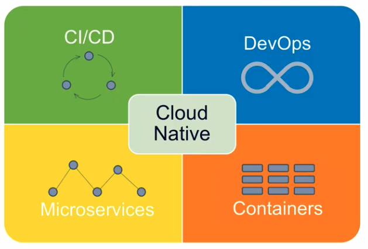

이번 장에서는 마이크로서비스 아키텍쳐를 알아보기 위해 `IT System`이 어떻게 발전해왔는지 알아보도록 한다.

### 소프트웨어 아키텍쳐

- 1960 ~ 1980s(Fragile, Cowboys): 소프트웨어보다 하드웨어 사양에 맞춰서 개발하던 시절이다. 하드웨어나 시스템이 고가였기 때문이다.
  이 때는 `Fragile`이라는 "깨지기 쉬운"이라는 뜻을 가지고 있다.
- 1990 ~ 2000s(Robust, Distributed): **안정화**되고 **분산화**된 시스템 덕분에 안정성있고 성능이 높은 서비스를 유지할 수 있게 되었다.
- 2010s ~ (Resilient/Anti-Fragile, Cloud Native): 안정화되고 `Fragile`과 반대되는 `Anti-Fragile` 성향과 `Cloud Native`라는 키워드가 등장한다.
  지속적인 변경과 개선이 발생하더라도 시스템이 안정적으로 운영되도록 변경되었다.

`Anti-Fragile` 키워드부터 `DevOps`라는 문화가 생겨났고 아키텍쳐에 있어서는 `Cloud Native`로 전환된 시기로 볼 수 있다.
`Anti-Fragile`의 경우 변화가 적고 비용이 적다는 특징이 있다.

---

### Anti-Fragile

`Anti-Fragile`에는 크게 `Auto scaling`, `Microservices`, `Chaos engineering`, `Continuous deployments`라는 특징이 있다.
하나씩 어떠한 특징인지 알아보도록 한다.

#### Auto scaling 

`Auto Scaling`은 자동 확장성을 갖는 특징을 갖는다.
시스템을 구성하고 있는 인스턴스를 하나의 `Auto Scaling Group`으로 묶어서 유지되어야 하는 최소한의 인스턴스를 지정한다.
또한 최대로 늘어날 수 있는 인스턴스의 갯수도 지정할 수 있다.  
고객의 요청이 늘어나는 특별한 시점에만 인스턴스가 늘어나서 많아진 트래픽을 처리하도록 할 수 있다.
이러한 자동화된 확장이 관리자에 의해 수동으로 작동하는 것이 아니라 시스템이 리소스 사용량을 확인하고 자동으로 작동하도록 설정이 가능하다.

---

#### Microservices

위의 그림은 `Netflix`사의 마이크로서비스 구성도다.
복잡하게 나뉘어진 서비스의 구성이 마이크로서비스라고 할 수 있다.
연두색 노드는 각각의 마이크로서비스를 의미하며 파란색 간선은 마이크로서비스 간의 통신을 의미하고 있다.
`Netflix`의 마이크로서비스를 구축하는 많은 기술들이 초창기 `Spring Cloud`에 많은 부분 기부되었다.
`Microservices`는 `Cloud Native` 서비스의 핵심이라고 볼 수 있다.

---

#### Chaos engineering

`Chaos engineering`이란 시스템이 급격하고 예측하지 못한 상황이라도 견딜 수 있고 신뢰성을 쌓기 위해 소프트웨어 시스템의 규칙이라고 생각하면 된다.  
시스템의 변동이나 예견된 불확실성에 대해서도 안정적인 서비스를 제공할 수 있도록 구축해야하는 것을 의미한다.

---

#### Continuous deployments

`Continuous deployments`는 `CI/CD`와 같은 배포 파이프라인을 예로 들 수 있다.
`CI/CD`는 지속적인 통합, 지속적인 배포로 해석할 수 있으며 `Cloud Native` 시스템의 경우 많으면 수백개 이상의 도메인으로 분리되어 동작하는게 일반적이다.  
이렇게 하나의 서비스를 구성하는 수없이 많은 서비스를 수작업으로 빌드하고 배포하는 것은 하나의 커다란 작업이 되어버리며 사실상 불가능하다.
`Cintinuous deployments`를 통해서 우리가 만든 코드들이 자동으로 통합되고 지속적으로 마이크로서비스 형태로 배포되게 된다.

---

### Cloud Native Architecture

2010s부터 `IT System`은 `Cloud Native` 형태로 발전되어 왔다.
이러한 `Cloud Native Architecture`는 어떠한 특징을 가지고 있는지 알아보도록 한다.

- 확장 가능한 아키텍처
  - 시스템의 수평적인 확장에 유연하다.
  - 확장된 서버로 시스템의 부하 분산이 가능하며 고가용성 유지가 용이하다.
  - 컨테이너를 기반으로 시스템이나 애플리케이션 단위로 패키징이 가능하다.
  - 하나의 모니터링 시스템에서 수많은 서비스를 모니터링 할 수 있다.
  
- 탄력적 아키텍처
  - 서비스의 생성 -> 통합 -> 배포가 자동화되면서 비즈니스 환경 변화에 대응 시간이 단축된다.
  - 서비스의 특성별로 분할된 서비스 구조로 설계가 가능하다.
  - 상태를 갖지 않는 서비스를 구축하도록 노력해야 한다.
  - 분산된 마이크로서비스들은 자신이 추가될 때 어디에서 실행 중인지 등록하여 다른 서비스에서 동적으로 찾을 수 있도록 해야한다.
  - 서비스가 변경되더라도 사용자의 요청을 동적으로 처리할 수 있어야 한다.
  
- 장애 격리(Fault Isolation)
  - 특정 서비스에 오류가 발생하더라도 다른 서비스에 영향을 주지 않아야한다.

---

### Cloud Native Application

`Cloud Native Architecture`에 의해 구현되고 설계된 애플리케이션을 `Cloud Native Application`이라고 한다.
`Cloud Native Application`은 `Anti-Fragile`이나 `Cloud Native Architecture`의 특성을 가지고 아래와 같이 구성된다.

1. 마이크로서비스로 개발된다.
2. CI/CD 파이프라인에 의해 통합되고 배포하는 과정을 반복할 수 있는 상태가 된다.
3. DevOps에 의해 서비스가 구현, 테스트, 배포되는 과정을 시스템이 종료될 때까지 무한 반복한다.
4. 마이크로서비스를 실행시키기 위해서 컨테이너 가상화라는 기술이 사용된다.

#### CI/CD

**CI(Continuous Integration)**: 통합 서버를 여러 팀에서 관리할 때 하나의 프로젝트로 지속적으로 통합되고 빌드 및 테스트되는 과정을 의미한다.
대표적인 툴로는 `Jenkins`, `Team CI`, `Travis CI`가 있다.

**CD(Continuous Delivery or Deployment)**: 지속적인 전달과 지속적인 배포로 볼 수 있으며 `CI`된 결과물이 목적지에 정상적으로 전달되어 배포됨을 의미한다. 
대표적인 배포 방식으로는 `카나리 배포`와 `블루그린 배포`가 있다.

---

#### DevOps

`DevOps`는 개발을 뜻하는 `Development`와 운영을 의미하는 `Operations`이 합쳐진 의미로 개발조직과 운영조직의 통합을 의미한다.
고객의 요구사항을 빠르게 반영하고 높은 만족도를 제공하는 것에 의미를 두고 있다.
기존에는 고객의 니즈에 맞게 시스템을 구현 -> 서비스 구축 -> 배포과정을 거쳐서 시스템 구현을 마무리하게 되며 이러한 방식은 오랜 기간이 필요하며 요구사항과 변경사항에 대처하기 어렵다는 단점이 있다.
고객의 요구사항은 언제든 변경될 수 있기 때문에 필요할 때 언제든 변경되고 성공적으로 배포할 수 있도록 많은 회사들에서 `DevOps`를 도입하고 있다.

---

#### Container 가상화

가상화는 `Container Architecture`의 핵심이다.
로컬 환경에서 개발된 시스템을 클라우드 환경으로 이전하여 탄력성있는 시스템을 구축하게 된 배경에는 `Container 가상화`기술이 있다.
`Container` 가상화 기술은 `하드웨어 가상화` 또는 `서버 가상화`에 비해 적은 리소스를 사용한다는 장점이 있다.

---

### 12 Factors

`Cloud Native Application`을 구축함에 있어서 고려해야하는 `12 Factors`에 대해서 알아본다.

1. 코드베이스: 버전 관리되는 하나의 코드베이스와 다양한 배포
`12 Factors`를 따르는 애플리케이션은 `Git`과 같은 버전 컨트롤 시스템 저장소에 의해 변화를 추적해야한다.
하나의 애플리케이션의 코드베이스는 한개여야 하지만 여러개의 환경(Production, Development 등)에 맞게 실행될 수 있어야 한다.

2. 종속성: 명시적으로 선언되고 분리된 종속성
각 마이크로서비스는 자체 종속성을 가지고 패키징되어 전체 시스템에 영향을 주지 않는 상태에서 변경될 수 있어야한다.

3. 설정: 환경(environment)에 저장된 설정
코드 외부에서 구성 관리도구를 통해서 마이크로서비스의 구성정보를 입력할 수 있어야 한다.

4. 백엔드 서비스: 백엔드 서비스를 연결된 리소스로 취급
DB와 캐싱, MQ와 같은 서비스를 이용하여 마이크로서비스가 가져야 할 추가기능을 연동할 수 있어야한다.

5. 빌드, 릴리즈, 실행: 코드베이스는 3단계에 거쳐 배포로 변환되어야 한다.

- **빌드**: 코드 저장소를 빌드라는 실행 가능한 번들로 변환시키는 단계. 빌드 단계에서는 커밋된 코드 중 배포 프로세스에서 지정된 버전을 사용하며, 종속성을 가져와 바이너리와 에셋들을 컴파일한다.
- **릴리즈**: 빌드 단계에서 만들어진 빌드와 배포의 현재 설정을 결합한다. 완성된 릴리즈는 빌드와 설정을 모두 포함하며 실행 환경에서 바로 실행될 수 있도록 준비된다.
- **실행(Runtime)**: 선택된 릴리즈에 대한 애플리케이션 프로세스의 집합을 시작하여, 애플리케이션을 실행 환경에서 돌아가도록 한다.

6. 프로세스: 애플리케이션을 하나 혹은 여러개의 무상태(stateless) 프로세스로 실행
각각의 마이크로서비스들은 동시에 실행중인 다른 마이크로서비스와 독립적으로 운영될 수 있어야한다. 필요한 자원이 있다면 데이터 저장소를 통해서 동기화를 진행해야 한다.

7. 포트 바인딩: 포트 바인딩을 사용해서 서비스를 공개
각각의 마이크로서비스는 자체 포트에서 노출되는 인터페이스 및 기능과 함께 노출된 포트로 들어오는 요청을 기다려야 한다.

8. 동시성(Concurrency): 프로세스 모델을 통한 확장. 
동일한 마이크로서비스가 여러 인스턴스로 부하 분산되어 동시성을 가지고 동일하게 작동해야 한다.

9. 폐기 가능(Disposability): 빠른 시작과 `graceful shutdown`을 통한 안정성 극대화.
마이크로서비스는 `SIGTERM` 신호를 받았을 때 `graceful shutdown`을 해야한다. 즉 서비스 포트의 수신을 중지하고 이전에 들어온 요청은 모두 처리가 가능해야 한다.

10. dev/prod 일치: Development, Staging, Production 환경을 최대한 비슷하게 유지.
`Development`환경과 `Production`환경에는 큰 차이가 있으며 이러한 차이를 줄이기 위해 노력해야 한다.

- **시간의 차이**: 개발자가 작업한 코드는 `Production`에 반영되기까지 며칠에서 때로는 몇개월까지 걸릴 수 있다.
- **담당자의 차이**: 개발자가 작성한 코드를 개발자가 아닌 시스템 엔지니어가 배포한다.
- **툴의 차이**: 예를 들어 `Production`이 배포되는 서버는 `Linux`환경이지만 개발자가 개발하는 환경은 `macOS`다.

11. 로그: 로그를 이벤트 스트림으로 취급
`Production`이나 `Staging`의 경우 각 프로세스의 로그 스트림은 수집된 후 보관을 위해 하나 이상의 쵲오 목적지로 전달되어야 한다.

12. Admin 프로세스: admin/maintenance 작업을 일회성 프로세스로 실행
현재 실행되고 있는 모든 마이크로서비스들을 어떠한 상태인지 파악하기 위한 관리도구가 필요하다.

---

최근에는 `Spring`을 개발하고 있는 `Pivotal Software`사에서 세 가지를 추가하였다. 

13. API first: 각각의 마이크로서비스들은 사용자가 원하는 것을 API 형태로 제공해야 한다.

14. Telemetry: 마이크로서비스들의 모든 지표는 시각화되어 관리되어야 한다.

15. Authentication & Authorization: API를 사용하기 위해 인증과 인가는 필수작업이 되어야 한다.

---

**참고한 강의:**

- https://www.inflearn.com/course/%EC%8A%A4%ED%94%84%EB%A7%81-%ED%81%B4%EB%9D%BC%EC%9A%B0%EB%93%9C-%EB%A7%88%EC%9D%B4%ED%81%AC%EB%A1%9C%EC%84%9C%EB%B9%84%EC%8A%A4