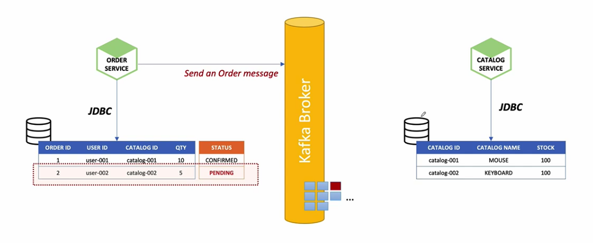

이번 장에서는 `Microservice`의 패턴에 대해서 알아본다.

### Event Sourcing

**Monolithic** 방식에서는 단일 데이터베이스를 사용한다.
단일 데이터베이스를 사용하고 있기 때문에 `Atomicity`, `Consistency`, `Isolation`, `Durable`라는 특징을 완벽하게 지원한다.
  
**Microservice**는 서비스마다 독립적인 프레임워크, 언어, 데이터베이스등을 선택할 수 있다.(Polyglot)  
다른 서비스들이 제공하는 정보를 위해서는 API를 통해서 통신해야 한다.
`Microservice`에서는 `Monolithic`방식에서 지원하는 `ACID`라는 속성을 완벽하게 지원하기는 쉽지 않으며 다른 방식으로 우회하여 비슷하게 동작하도록 유도한다.

#### Commit Transaction

예를 들어 **Commit Transaction**은 어떤 작업단위가 완벽하게 정상적으로 끝났음을 의미한다.

1. `Order Service`는 주문 데이터를 데이터베이스에 저장하고 상태를 `Pending`상태로 만든다.
  

  
2. 주문 메시지를 카프카 브로커에 전달하고 `Catalog Service`는 메시지를 전달받는다.

3. 전달받은 주문 메시지의 수량만큼을 감소시켜도 재고가 남기 때문에 재고를 감소시키고 성공 메시지를 카프카 브로커로 전달한다.

4. 카프카 브로커에서 성공 메시지를 전달받은 `Order Service`는 `Pending` 상태의 주문 데이터 상태를 성공했다는 의미의 `Confirmed`으로 변경한다.

---

#### Rollback Transaction

1. `Order Service`는 주문 데이터를 생성하고 상태를 `Pending` 상태로 만든다.
2. 주문 메시지를 카프카 브로커에 전달하여 `Catalog Service`가 주문 메시지를 받을 수 있도록 한다.

3. `Catalog Service`는 충분한 재고가 없기 때문에 거절 메시지를 카프카 브로커로 전달한다.

4. `Order Service`는 거절 메시지를 전달받게 되고 주문 데이터의 상태를 `Canceled`상태로 변경한다.

---

#### Event Sourcing

`Event Sourcing` 방식은 데이터의 마지막 숭간만 저장하는 것이 아닌 해당 데이터에 수행된 **전체 이력을 기록**하는 방식이다.
전체 데이터 이력을 같이 저장하게 되면서 데이터의 구조가 단순해진다. 일반적으로 `Update`, `Delete`의 사용없이 `Insert`와 `Read`만 사용된다.  
데이터의 `Update`가 없기 때문에 동시성에 대한 충돌 문제도 해결할 수 있다.

주문에 대한 정보가 `ACCEPTED`라는 상태만 저장되는 것이 아니라 `주문 생성(OrderCreated)`, `주문 승인(Order Approved)`, `주문 배송(Order Shipped)`과 같이 모든 기록이 전부 기록된다. 
카프카를 통한 메시지 중심의 비동기 작업을 처리가 가능하다. 상태 값뿐만 아니라 모든 이벤트에 대한 복원에 많은 시간이 필요하기 때문에 데이터를 잘라서 저장하는 `스냅샷`이라는 개념을 사용해야한다.
다양한 데이터가 여러번 조회되었을 경우를 대비하여 `CQRS`라는 방식을 통해서 해결한다.

---

### CQRS pattern

`CQRS(Command and Query Responsibility Segregation)`은 명령과 조회의 책임을 분리하는 것을 의미한다.  
상대를 변경하는 `Command`와 조회를 담당하는 `Query`의 두 기능을 분리한다는 의미다.

데이터 읽기 전용 애플리케이션과 데이터 쓰기 전용 애플리케이션을 분리하여 개발하였다고 가정한다.
이때 데이터 쓰기 전용 애플리케이션은 데이터 변경사항을 `Event Store`를 통해 `Event Handler`인 `Kafka`에 전달하고 상태를 저장하는 `Application State`에 상태를 반영한다.
이렇게 변경된 데이터를 사용하는 애플리케이션은 바로 `Application State`를 조회하여 마지막으로 저장된 상태만 조회할 수 있다.

**E-Commerce 애플리케이션에 적용 예시**

사용자가 `POST /orders`를 호출하여 주문 데이터를 생성한다.

`Command Model`을 사용하여 주문 데이터를 `Create`를 하게된다.

`Create`한 이벤트에 대한 정보를 `Kafka Event Store`에 저장한다.

`Kafka Event Store`에 저장된 데이터는 연동된 `Event Handlers`를 통해 `DB`에 반영된다.

반면 데이터를 조회하는 `Query Model`의 경우 카프카를 통하는 것이 아니라 바로 `DB`를 조회하여 마지막으로 저장된 상태 값을 조회한다.

---

### Saga pattern

`Application`에서 `Transaction`을 처리하는 방법을 의미하며 처리하는 방식에 따라서 `Choreography`와 `Orchestration`으로 나뉘어진다.
기존에는 `Database`에서 제공하는 `Transaction` 기능을 사용하였지만 `Saga Pattern`에서는 각각의 애플리케이션에서 `Transaction`을 구현하는 방식을 의미한다.  
`Saga Pattern`은 애플리케이션이 분리된 경우에는 각각의 트랜잭션이 로컬환경의 트랜잭션만 처리하면 된다는 의미이다.  
각각 애플리케이션에서 트랜잭션이 실패하는 경우 이전에 실행되었던 트랜잭션을 전부 `Rollback`처리가 필요하며 이러한 과정을 `보상 트랜잭션`이라고 말한다.  
데이터의 원자성을 보장하지는 않지만 데이터의 **일관성은 보장**한다.

좌측의 이미지는 기존 마이크로서비스의 분산된 트랜잭션을 의미하며 우측의 이미지는 `Saga Pattern`에 대한 프로세스를 나타낸다.

#### Choreography-based saga

1. `Order Service`에서 주문 요청을 수신하고 상태를 `Pending`상태로 한다.
2. 주문이 생성된 이벤트를 전달한다.
3. `Customer Service`의 `Event Handler`가 `Credit` 예약을 시도한다.
4. 처리된 결과를 별도의 이벤트 채널로 전달한다.
5. `Order Service`의 `Event Handler`는 전달된 결과를 확인하고 주문을 승인할 것인지 거부할 것인지 결정한다.

`Choreography`방식은 자신의 처리상태를 메시지로 전달하여 반대편의 `Event Handler`로 전달하는 방식을 말한다.

---

#### Orchestration-based saga

1. `Order Service`에서 주문 요청을 수신하고 `Create Order saga orchestrator`를 생성한다.
2. `Order saga orchestrator`가 상태가 `Pending`인 주문을 생성한다.
3. `Credit` 예약 명령을 메시지 브로커에 전달하면 `Customer Service`의 Command Handler가 해당 메시지를 수신한다.
4. `Customer Service`가 `Credit` 예약을 처리한다.
5. 처리된 결과를 메시지 브로커에게 전달한다.
6. 처리된 결과를 확인한 `Order Service`의 `Order saga orchestrator`는 주문의 승인과 거부 상태를 결정한다.

`Orchestration`방식은 `Choreography` 방식과 다르게 중앙의 메시지 브로커가 모든 것을 통제하는 방식으로 볼 수 있다.

---

**참고한 자료:**

- https://www.inflearn.com/course/%EC%8A%A4%ED%94%84%EB%A7%81-%ED%81%B4%EB%9D%BC%EC%9A%B0%EB%93%9C-%EB%A7%88%EC%9D%B4%ED%81%AC%EB%A1%9C%EC%84%9C%EB%B9%84%EC%8A%A4
- https://microservices.io/patterns/